# Intro {-}

Several analyses/investigations relating to the balance logical operators paper.

Loading libraries:

```r
library(xfun)
library(knitr)
library(dplyr)
library(tidyr)
library(tibble)
library(corrplot)
library(latex2exp)
library(ggpubr)
library(stringr)
library(ggplot2)
library(DT)
library(usefun)
library(emba)
library(forcats)
library(scales)
library(gtools)
suppressPackageStartupMessages(library(ComplexHeatmap))
suppressPackageStartupMessages(library(circlize))
library(glmnet)
library(randomForest)
library(ranger)
library(uwot)
library(Ckmeans.1d.dp)
```

# BBR Function Analysis {-}

## Balance Boolean Regulatory Functions (BBRs) {-#bbrs}

:::{.green-box}
- The **BBRs** (Balance Boolean Regulatory functions) functions have **two sets of regulators**: *activators* (on one side) and *inhibitors* (on the other).
- I have observed two main classes of these functions: one that uses logical rules to derive the *combinatorial* activity of the regulators and one that relies on the combined *additive* activity (via pseudo-boolean constrains).
:::

Let $f$ be a boolean function $f(x,y):\{0,1\}^n \rightarrow \{0,1\}$, with $m$ **activators** $x=\{x_i\}_{i=1}^{m}$ and $k$ **inhibitors** $y=\{y_i\}_{i=1}^{k}$, that is a total of $n=m+k$ regulators.
The BBRs have a (non-DNF) representation that puts the different category regulators in 2 separate groups and a *link boolean operator* between them.
As such, for a link operator to make sense, we have that $m,k \ge 1$ (at least one regulator in each category).
An example of such a function that has been used in the literature [@Mendoza2006] is the formula with the `AND-NOT` link operator: 

- `AND-NOT`: $$f(x,y) = \left(\bigvee_{i=1}^{m} x_i\right) \land \lnot \left(\bigvee_{i=1}^{k} y_i\right)$$

A **variant** of that one that shifts the balance in favor of the activators (as we will see the truth density significantly increases) is the function with the `OR-NOT` link operator:

- `OR-NOT`: $$f(x,y) = \left(\bigvee_{i=1}^{m} x_i\right) \lor \lnot \left(\bigvee_{i=1}^{k} y_i\right)$$

Another one of this type of functions is the next one:

- `BalanceOp1`: $$f(x,y) = \bigvee_{\forall (i,j)}^{m,k}(x_i\land \lnot y_j) = \left(\bigvee_{i=1}^{m} x_i\right) \land \left(\bigvee_{i=1}^{k} \lnot y_i\right)$$

Next, we introduce the **threshold functions** which can be classified as *pseudo-Boolean*:

- `exp_act_win`: $$f_{act-win}(x,y)=\begin{cases}
        1, & \text{for } \sum_{i=1}^{m} x_i \ge \sum_{i=1}^{k} y_i\\
        0, & \text{otherwise}
        \end{cases}$$
- `exp_inh_win`: $$f_{inh-win}(x,y)=\begin{cases}
        1, & \text{for } \sum_{i=1}^{m} x_i \gt \sum_{i=1}^{k} y_i\\
        0, & \text{otherwise}
        \end{cases}$$

Note that: $f_{inh-win}(x,y) = \lnot f_{act-win}(y,x)$.
These functions are still categorized as BBRs, since they balance the additive activity of the activators and the inhibitors.

I searched for an analytical formula for the two last functions. 
The equivalent boolean rule expressions become very large with more regulators but they **always exist** - which means that pretty much we are talking about the same kind of functions (the *combinatorial* vs *additive* distinction is a *sugar* for the theorists :))
More info and discussion about the last two formulas, see the [math.stackexchange question](https://math.stackexchange.com/questions/3767774/identify-boolean-function-that-satisfies-some-constrains/).

:::{.note}
Somewhat similar function notations and definitions have been used in the work by [@Cury2019], where they used the equivalent DNF forms.
:::

## Truth Density Data Analysis {-}

### Data {-}

:::{.blue-box}
*Truth Density (TD)* of a boolean equation/expression, given it's equivalent truth table, is the **number of rows that the expression is active** divided to **the total number of rows** $(2^n)$.
:::

I created every possible truth table for up to $20$ variables (variables here means *regulators* for us) and calculated the `AND-NOT`, `OR-NOT`, `BalanceOp1`, `exp_act_win`, `exp_inh_win` results for every possible configuration of the number of activators and inhibitors that added up to the number of regulators.
Then, from the truth tables I calculated the **truth density** of each operator in each particular configuration.
See part of the data below:

```r
stats = readRDS(file = "data/td_stats.rds")

DT::datatable(data = stats,
  caption = htmltools::tags$caption("Truth Density Data", style="color:#dd4814; font-size: 18px"),
  options = list(pageLength = 6, scrollX = TRUE, order = list(list(1, "asc")))) %>% 
  formatRound(4:8, digits = 2)
```

<!--html_preserve--><div id="htmlwidget-130ff33955f4b13ecba2" style="width:100%;height:auto;" class="datatables html-widget"></div>
<script type="application/json" data-for="htmlwidget-130ff33955f4b13ecba2">{"x":{"filter":"none","caption":"<caption style=\"color:#dd4814; font-size: 18px\">Truth Density Data<\/caption>","data":[["1","2","3","4","5","6","7","8","9","10","11","12","13","14","15","16","17","18","19","20","21","22","23","24","25","26","27","28","29","30","31","32","33","34","35","36","37","38","39","40","41","42","43","44","45","46","47","48","49","50","51","52","53","54","55","56","57","58","59","60","61","62","63","64","65","66","67","68","69","70","71","72","73","74","75","76","77","78","79","80","81","82","83","84","85","86","87","88","89","90","91","92","93","94","95","96","97","98","99","100","101","102","103","104","105","106","107","108","109","110","111","112","113","114","115","116","117","118","119","120","121","122","123","124","125","126","127","128","129","130","131","132","133","134","135","136","137","138","139","140","141","142","143","144","145","146","147","148","149","150","151","152","153","154","155","156","157","158","159","160","161","162","163","164","165","166","167","168","169","170","171","172","173","174","175","176","177","178","179","180","181","182","183","184","185","186","187","188","189","190"],[2,3,3,4,4,4,5,5,5,5,6,6,6,6,6,7,7,7,7,7,7,8,8,8,8,8,8,8,9,9,9,9,9,9,9,9,10,10,10,10,10,10,10,10,10,11,11,11,11,11,11,11,11,11,11,12,12,12,12,12,12,12,12,12,12,12,13,13,13,13,13,13,13,13,13,13,13,13,14,14,14,14,14,14,14,14,14,14,14,14,14,15,15,15,15,15,15,15,15,15,15,15,15,15,15,16,16,16,16,16,16,16,16,16,16,16,16,16,16,16,17,17,17,17,17,17,17,17,17,17,17,17,17,17,17,17,18,18,18,18,18,18,18,18,18,18,18,18,18,18,18,18,18,19,19,19,19,19,19,19,19,19,19,19,19,19,19,19,19,19,19,20,20,20,20,20,20,20,20,20,20,20,20,20,20,20,20,20,20,20],[1,1,2,1,2,3,1,2,3,4,1,2,3,4,5,1,2,3,4,5,6,1,2,3,4,5,6,7,1,2,3,4,5,6,7,8,1,2,3,4,5,6,7,8,9,1,2,3,4,5,6,7,8,9,10,1,2,3,4,5,6,7,8,9,10,11,1,2,3,4,5,6,7,8,9,10,11,12,1,2,3,4,5,6,7,8,9,10,11,12,13,1,2,3,4,5,6,7,8,9,10,11,12,13,14,1,2,3,4,5,6,7,8,9,10,11,12,13,14,15,1,2,3,4,5,6,7,8,9,10,11,12,13,14,15,16,1,2,3,4,5,6,7,8,9,10,11,12,13,14,15,16,17,1,2,3,4,5,6,7,8,9,10,11,12,13,14,15,16,17,18,1,2,3,4,5,6,7,8,9,10,11,12,13,14,15,16,17,18,19],[1,2,1,3,2,1,4,3,2,1,5,4,3,2,1,6,5,4,3,2,1,7,6,5,4,3,2,1,8,7,6,5,4,3,2,1,9,8,7,6,5,4,3,2,1,10,9,8,7,6,5,4,3,2,1,11,10,9,8,7,6,5,4,3,2,1,12,11,10,9,8,7,6,5,4,3,2,1,13,12,11,10,9,8,7,6,5,4,3,2,1,14,13,12,11,10,9,8,7,6,5,4,3,2,1,15,14,13,12,11,10,9,8,7,6,5,4,3,2,1,16,15,14,13,12,11,10,9,8,7,6,5,4,3,2,1,17,16,15,14,13,12,11,10,9,8,7,6,5,4,3,2,1,18,17,16,15,14,13,12,11,10,9,8,7,6,5,4,3,2,1,19,18,17,16,15,14,13,12,11,10,9,8,7,6,5,4,3,2,1],[0.25,0.125,0.375,0.0625,0.1875,0.4375,0.03125,0.09375,0.21875,0.46875,0.015625,0.046875,0.109375,0.234375,0.484375,0.0078125,0.0234375,0.0546875,0.1171875,0.2421875,0.4921875,0.00390625,0.01171875,0.02734375,0.05859375,0.12109375,0.24609375,0.49609375,0.001953125,0.005859375,0.013671875,0.029296875,0.060546875,0.123046875,0.248046875,0.498046875,0.0009765625,0.0029296875,0.0068359375,0.0146484375,0.0302734375,0.0615234375,0.1240234375,0.2490234375,0.4990234375,0.00048828125,0.00146484375,0.00341796875,0.00732421875,0.01513671875,0.03076171875,0.06201171875,0.12451171875,0.24951171875,0.49951171875,0.000244140625,0.000732421875,0.001708984375,0.003662109375,0.007568359375,0.015380859375,0.031005859375,0.062255859375,0.124755859375,0.249755859375,0.499755859375,0.0001220703125,0.0003662109375,0.0008544921875,0.0018310546875,0.0037841796875,0.0076904296875,0.0155029296875,0.0311279296875,0.0623779296875,0.1248779296875,0.2498779296875,0.4998779296875,6.103515625e-05,0.00018310546875,0.00042724609375,0.00091552734375,0.00189208984375,0.00384521484375,0.00775146484375,0.01556396484375,0.03118896484375,0.06243896484375,0.12493896484375,0.24993896484375,0.49993896484375,3.0517578125e-05,9.1552734375e-05,0.000213623046875,0.000457763671875,0.000946044921875,0.001922607421875,0.003875732421875,0.007781982421875,0.015594482421875,0.031219482421875,0.062469482421875,0.124969482421875,0.249969482421875,0.499969482421875,1.52587890625e-05,4.57763671875e-05,0.0001068115234375,0.0002288818359375,0.0004730224609375,0.0009613037109375,0.0019378662109375,0.0038909912109375,0.0077972412109375,0.0156097412109375,0.0312347412109375,0.0624847412109375,0.124984741210938,0.249984741210938,0.499984741210938,7.62939453125e-06,2.288818359375e-05,5.340576171875e-05,0.00011444091796875,0.00023651123046875,0.00048065185546875,0.00096893310546875,0.00194549560546875,0.00389862060546875,0.00780487060546875,0.0156173706054688,0.0312423706054688,0.0624923706054688,0.124992370605469,0.249992370605469,0.499992370605469,3.814697265625e-06,1.1444091796875e-05,2.6702880859375e-05,5.7220458984375e-05,0.000118255615234375,0.000240325927734375,0.000484466552734375,0.000972747802734375,0.00194931030273438,0.00390243530273438,0.00780868530273438,0.0156211853027344,0.0312461853027344,0.0624961853027344,0.124996185302734,0.249996185302734,0.499996185302734,1.9073486328125e-06,5.7220458984375e-06,1.33514404296875e-05,2.86102294921875e-05,5.91278076171875e-05,0.000120162963867188,0.000242233276367188,0.000486373901367188,0.000974655151367188,0.00195121765136719,0.00390434265136719,0.00781059265136719,0.0156230926513672,0.0312480926513672,0.0624980926513672,0.124998092651367,0.249998092651367,0.499998092651367,9.5367431640625e-07,2.86102294921875e-06,6.67572021484375e-06,1.43051147460938e-05,2.95639038085938e-05,6.00814819335938e-05,0.000121116638183594,0.000243186950683594,0.000487327575683594,0.000975608825683594,0.00195217132568359,0.00390529632568359,0.00781154632568359,0.0156240463256836,0.0312490463256836,0.0624990463256836,0.124999046325684,0.249999046325684,0.499999046325684],[0.75,0.625,0.875,0.5625,0.8125,0.9375,0.53125,0.78125,0.90625,0.96875,0.515625,0.765625,0.890625,0.953125,0.984375,0.5078125,0.7578125,0.8828125,0.9453125,0.9765625,0.9921875,0.50390625,0.75390625,0.87890625,0.94140625,0.97265625,0.98828125,0.99609375,0.501953125,0.751953125,0.876953125,0.939453125,0.970703125,0.986328125,0.994140625,0.998046875,0.5009765625,0.7509765625,0.8759765625,0.9384765625,0.9697265625,0.9853515625,0.9931640625,0.9970703125,0.9990234375,0.50048828125,0.75048828125,0.87548828125,0.93798828125,0.96923828125,0.98486328125,0.99267578125,0.99658203125,0.99853515625,0.99951171875,0.500244140625,0.750244140625,0.875244140625,0.937744140625,0.968994140625,0.984619140625,0.992431640625,0.996337890625,0.998291015625,0.999267578125,0.999755859375,0.5001220703125,0.7501220703125,0.8751220703125,0.9376220703125,0.9688720703125,0.9844970703125,0.9923095703125,0.9962158203125,0.9981689453125,0.9991455078125,0.9996337890625,0.9998779296875,0.50006103515625,0.75006103515625,0.87506103515625,0.93756103515625,0.96881103515625,0.98443603515625,0.99224853515625,0.99615478515625,0.99810791015625,0.99908447265625,0.99957275390625,0.99981689453125,0.99993896484375,0.500030517578125,0.750030517578125,0.875030517578125,0.937530517578125,0.968780517578125,0.984405517578125,0.992218017578125,0.996124267578125,0.998077392578125,0.999053955078125,0.999542236328125,0.999786376953125,0.999908447265625,0.999969482421875,0.500015258789062,0.750015258789062,0.875015258789062,0.937515258789062,0.968765258789062,0.984390258789062,0.992202758789062,0.996109008789062,0.998062133789062,0.999038696289062,0.999526977539062,0.999771118164062,0.999893188476562,0.999954223632812,0.999984741210938,0.500007629394531,0.750007629394531,0.875007629394531,0.937507629394531,0.968757629394531,0.984382629394531,0.992195129394531,0.996101379394531,0.998054504394531,0.999031066894531,0.999519348144531,0.999763488769531,0.999885559082031,0.999946594238281,0.999977111816406,0.999992370605469,0.500003814697266,0.750003814697266,0.875003814697266,0.937503814697266,0.968753814697266,0.984378814697266,0.992191314697266,0.996097564697266,0.998050689697266,0.999027252197266,0.999515533447266,0.999759674072266,0.999881744384766,0.999942779541016,0.999973297119141,0.999988555908203,0.999996185302734,0.500001907348633,0.750001907348633,0.875001907348633,0.937501907348633,0.968751907348633,0.984376907348633,0.992189407348633,0.996095657348633,0.998048782348633,0.999025344848633,0.999513626098633,0.999757766723633,0.999879837036133,0.999940872192383,0.999971389770508,0.99998664855957,0.999994277954102,0.999998092651367,0.500000953674316,0.750000953674316,0.875000953674316,0.937500953674316,0.968750953674316,0.984375953674316,0.992188453674316,0.996094703674316,0.998047828674316,0.999024391174316,0.999512672424316,0.999756813049316,0.999878883361816,0.999939918518066,0.999970436096191,0.999985694885254,0.999993324279785,0.999997138977051,0.999999046325684],[0.25,0.375,0.375,0.4375,0.5625,0.4375,0.46875,0.65625,0.65625,0.46875,0.484375,0.703125,0.765625,0.703125,0.484375,0.4921875,0.7265625,0.8203125,0.8203125,0.7265625,0.4921875,0.49609375,0.73828125,0.84765625,0.87890625,0.84765625,0.73828125,0.49609375,0.498046875,0.744140625,0.861328125,0.908203125,0.908203125,0.861328125,0.744140625,0.498046875,0.4990234375,0.7470703125,0.8681640625,0.9228515625,0.9384765625,0.9228515625,0.8681640625,0.7470703125,0.4990234375,0.49951171875,0.74853515625,0.87158203125,0.93017578125,0.95361328125,0.95361328125,0.93017578125,0.87158203125,0.74853515625,0.49951171875,0.499755859375,0.749267578125,0.873291015625,0.933837890625,0.961181640625,0.968994140625,0.961181640625,0.933837890625,0.873291015625,0.749267578125,0.499755859375,0.4998779296875,0.7496337890625,0.8741455078125,0.9356689453125,0.9649658203125,0.9766845703125,0.9766845703125,0.9649658203125,0.9356689453125,0.8741455078125,0.7496337890625,0.4998779296875,0.49993896484375,0.74981689453125,0.87457275390625,0.93658447265625,0.96685791015625,0.98052978515625,0.98443603515625,0.98052978515625,0.96685791015625,0.93658447265625,0.87457275390625,0.74981689453125,0.49993896484375,0.499969482421875,0.749908447265625,0.874786376953125,0.937042236328125,0.967803955078125,0.982452392578125,0.988311767578125,0.988311767578125,0.982452392578125,0.967803955078125,0.937042236328125,0.874786376953125,0.749908447265625,0.499969482421875,0.499984741210938,0.749954223632812,0.874893188476562,0.937271118164062,0.968276977539062,0.983413696289062,0.990249633789062,0.992202758789062,0.990249633789062,0.983413696289062,0.968276977539062,0.937271118164062,0.874893188476562,0.749954223632812,0.499984741210938,0.499992370605469,0.749977111816406,0.874946594238281,0.937385559082031,0.968513488769531,0.983894348144531,0.991218566894531,0.994148254394531,0.994148254394531,0.991218566894531,0.983894348144531,0.968513488769531,0.937385559082031,0.874946594238281,0.749977111816406,0.499992370605469,0.499996185302734,0.749988555908203,0.874973297119141,0.937442779541016,0.968631744384766,0.984134674072266,0.991703033447266,0.995121002197266,0.996097564697266,0.995121002197266,0.991703033447266,0.984134674072266,0.968631744384766,0.937442779541016,0.874973297119141,0.749988555908203,0.499996185302734,0.499998092651367,0.749994277954102,0.87498664855957,0.937471389770508,0.968690872192383,0.984254837036133,0.991945266723633,0.995607376098633,0.997072219848633,0.997072219848633,0.995607376098633,0.991945266723633,0.984254837036133,0.968690872192383,0.937471389770508,0.87498664855957,0.749994277954102,0.499998092651367,0.499999046325684,0.749997138977051,0.874993324279785,0.937485694885254,0.968720436096191,0.984314918518066,0.992066383361816,0.995850563049316,0.997559547424316,0.998047828674316,0.997559547424316,0.995850563049316,0.992066383361816,0.984314918518066,0.968720436096191,0.937485694885254,0.874993324279785,0.749997138977051,0.499999046325684],[0.75,0.5,0.875,0.3125,0.6875,0.9375,0.1875,0.5,0.8125,0.96875,0.109375,0.34375,0.65625,0.890625,0.984375,0.0625,0.2265625,0.5,0.7734375,0.9375,0.9921875,0.03515625,0.14453125,0.36328125,0.63671875,0.85546875,0.96484375,0.99609375,0.01953125,0.08984375,0.25390625,0.5,0.74609375,0.91015625,0.98046875,0.998046875,0.0107421875,0.0546875,0.171875,0.376953125,0.623046875,0.828125,0.9453125,0.9892578125,0.9990234375,0.005859375,0.03271484375,0.11328125,0.2744140625,0.5,0.7255859375,0.88671875,0.96728515625,0.994140625,0.99951171875,0.003173828125,0.019287109375,0.072998046875,0.19384765625,0.38720703125,0.61279296875,0.80615234375,0.927001953125,0.980712890625,0.996826171875,0.999755859375,0.001708984375,0.01123046875,0.046142578125,0.1334228515625,0.29052734375,0.5,0.70947265625,0.8665771484375,0.953857421875,0.98876953125,0.998291015625,0.9998779296875,0.00091552734375,0.0064697265625,0.0286865234375,0.08978271484375,0.21197509765625,0.395263671875,0.604736328125,0.78802490234375,0.91021728515625,0.9713134765625,0.9935302734375,0.99908447265625,0.99993896484375,0.00048828125,0.003692626953125,0.017578125,0.059234619140625,0.15087890625,0.303619384765625,0.5,0.696380615234375,0.84912109375,0.940765380859375,0.982421875,0.996307373046875,0.99951171875,0.999969482421875,0.0002593994140625,0.0020904541015625,0.0106353759765625,0.0384063720703125,0.105056762695312,0.227249145507812,0.401809692382812,0.598190307617188,0.772750854492188,0.894943237304688,0.961593627929688,0.989364624023438,0.997909545898438,0.999740600585938,0.999984741210938,0.0001373291015625,0.0011749267578125,0.0063629150390625,0.0245208740234375,0.0717315673828125,0.166152954101562,0.314529418945312,0.5,0.685470581054688,0.833847045898438,0.928268432617188,0.975479125976562,0.993637084960938,0.998825073242188,0.999862670898438,0.999992370605469,7.2479248046875e-05,0.0006561279296875,0.0037689208984375,0.01544189453125,0.048126220703125,0.118942260742188,0.240341186523438,0.407264709472656,0.592735290527344,0.759658813476562,0.881057739257812,0.951873779296875,0.98455810546875,0.996231079101562,0.999343872070312,0.999927520751953,0.999996185302734,3.814697265625e-05,0.000364303588867188,0.0022125244140625,0.00960540771484375,0.0317840576171875,0.0835342407226562,0.179641723632812,0.323802947998047,0.5,0.676197052001953,0.820358276367188,0.916465759277344,0.968215942382812,0.990394592285156,0.997787475585938,0.999635696411133,0.999961853027344,0.999998092651367,2.00271606445312e-05,0.000201225280761719,0.00128841400146484,0.00590896606445312,0.0206947326660156,0.0576591491699219,0.131587982177734,0.25172233581543,0.411901473999023,0.588098526000977,0.74827766418457,0.868412017822266,0.942340850830078,0.979305267333984,0.994091033935547,0.998711585998535,0.999798774719238,0.999979972839355,0.999999046325684],[0.25,0.125,0.5,0.0625,0.3125,0.6875,0.03125,0.1875,0.5,0.8125,0.015625,0.109375,0.34375,0.65625,0.890625,0.0078125,0.0625,0.2265625,0.5,0.7734375,0.9375,0.00390625,0.03515625,0.14453125,0.36328125,0.63671875,0.85546875,0.96484375,0.001953125,0.01953125,0.08984375,0.25390625,0.5,0.74609375,0.91015625,0.98046875,0.0009765625,0.0107421875,0.0546875,0.171875,0.376953125,0.623046875,0.828125,0.9453125,0.9892578125,0.00048828125,0.005859375,0.03271484375,0.11328125,0.2744140625,0.5,0.7255859375,0.88671875,0.96728515625,0.994140625,0.000244140625,0.003173828125,0.019287109375,0.072998046875,0.19384765625,0.38720703125,0.61279296875,0.80615234375,0.927001953125,0.980712890625,0.996826171875,0.0001220703125,0.001708984375,0.01123046875,0.046142578125,0.1334228515625,0.29052734375,0.5,0.70947265625,0.8665771484375,0.953857421875,0.98876953125,0.998291015625,6.103515625e-05,0.00091552734375,0.0064697265625,0.0286865234375,0.08978271484375,0.21197509765625,0.395263671875,0.604736328125,0.78802490234375,0.91021728515625,0.9713134765625,0.9935302734375,0.99908447265625,3.0517578125e-05,0.00048828125,0.003692626953125,0.017578125,0.059234619140625,0.15087890625,0.303619384765625,0.5,0.696380615234375,0.84912109375,0.940765380859375,0.982421875,0.996307373046875,0.99951171875,1.52587890625e-05,0.0002593994140625,0.0020904541015625,0.0106353759765625,0.0384063720703125,0.105056762695312,0.227249145507812,0.401809692382812,0.598190307617188,0.772750854492188,0.894943237304688,0.961593627929688,0.989364624023438,0.997909545898438,0.999740600585938,7.62939453125e-06,0.0001373291015625,0.0011749267578125,0.0063629150390625,0.0245208740234375,0.0717315673828125,0.166152954101562,0.314529418945312,0.5,0.685470581054688,0.833847045898438,0.928268432617188,0.975479125976562,0.993637084960938,0.998825073242188,0.999862670898438,3.814697265625e-06,7.2479248046875e-05,0.0006561279296875,0.0037689208984375,0.01544189453125,0.048126220703125,0.118942260742188,0.240341186523438,0.407264709472656,0.592735290527344,0.759658813476562,0.881057739257812,0.951873779296875,0.98455810546875,0.996231079101562,0.999343872070312,0.999927520751953,1.9073486328125e-06,3.814697265625e-05,0.000364303588867188,0.0022125244140625,0.00960540771484375,0.0317840576171875,0.0835342407226562,0.179641723632812,0.323802947998047,0.5,0.676197052001953,0.820358276367188,0.916465759277344,0.968215942382812,0.990394592285156,0.997787475585938,0.999635696411133,0.999961853027344,9.5367431640625e-07,2.00271606445312e-05,0.000201225280761719,0.00128841400146484,0.00590896606445312,0.0206947326660156,0.0576591491699219,0.131587982177734,0.25172233581543,0.411901473999023,0.588098526000977,0.74827766418457,0.868412017822266,0.942340850830078,0.979305267333984,0.994091033935547,0.998711585998535,0.999798774719238,0.999979972839355]],"container":"<table class=\"display\">\n  <thead>\n    <tr>\n      <th> <\/th>\n      <th>num_reg<\/th>\n      <th>num_act<\/th>\n      <th>num_inh<\/th>\n      <th>td_and_not<\/th>\n      <th>td_or_not<\/th>\n      <th>td_balance_op<\/th>\n      <th>td_exp_act<\/th>\n      <th>td_exp_inh<\/th>\n    <\/tr>\n  <\/thead>\n<\/table>","options":{"pageLength":6,"scrollX":true,"order":[[1,"asc"]],"columnDefs":[{"targets":4,"render":"function(data, type, row, meta) { return DTWidget.formatRound(data, 2, 3, \",\", \".\"); }"},{"targets":5,"render":"function(data, type, row, meta) { return DTWidget.formatRound(data, 2, 3, \",\", \".\"); }"},{"targets":6,"render":"function(data, type, row, meta) { return DTWidget.formatRound(data, 2, 3, \",\", \".\"); }"},{"targets":7,"render":"function(data, type, row, meta) { return DTWidget.formatRound(data, 2, 3, \",\", \".\"); }"},{"targets":8,"render":"function(data, type, row, meta) { return DTWidget.formatRound(data, 2, 3, \",\", \".\"); }"},{"className":"dt-right","targets":[1,2,3,4,5,6,7,8]},{"orderable":false,"targets":0}],"autoWidth":false,"orderClasses":false,"lengthMenu":[6,10,25,50,100]}},"evals":["options.columnDefs.0.render","options.columnDefs.1.render","options.columnDefs.2.render","options.columnDefs.3.render","options.columnDefs.4.render"],"jsHooks":[]}</script><!--/html_preserve-->

:::{.orange-box}
Use the [get_stats.R](https://github.com/bblodfon/balance-paper/blob/master/scripts/get_stats.R) script to reproduce this data.
:::

### Truth Density formulas {-}

Also, I have proved the exact formulas for the truth densities in the case of the `AND-NOT` and `OR-NOT` link operators (see [here](http://tiny.cc/link-proofs) for a proof sketch).
I write them here explicitly, as well as their long-term behaviour (for large $n$. number of regulators):

- `AND-NOT`: $$TD_{AND-NOT}=\frac{2^m-1}{2^n} \xrightarrow{n \text{ large}} \frac{1}{2^k}$$
- `OR-NOT`:  $$TD_{OR-NOT}=\frac{2^n-2^k}{2^n} \xrightarrow{n \text{ large}} 1-\frac{1}{2^m}$$

For large $n$, the $TD_{AND-NOT}$ depends only **on the number of inhibitors** while the $TD_{OR-NOT}$ depends only **on the number of activators**.

Also, again for large $n$, the extreme case of having a TD value equal to $0.5$ is a result of having **only one of the regulators being an inhibitor (activator)** of the `AND-NOT` (`OR-NOT`) equation.

We can use the data above to validate the formulas from the proof (up to $n=20$):

```r
# Validate AND-NOT Truth Density formula
formula_td_and_not = stats %>% 
  mutate(formula_td_and_not = (2^num_act - 1)/(2^num_reg)) %>%
  pull(formula_td_and_not)

all(stats %>% pull(td_and_not) == formula_td_and_not)
```

```
[1] TRUE
```

```r
# Validate OR-NOT Truth Density formula
formula_td_or_not = stats %>% 
  mutate(formula_td_or_not = (((2^num_act - 1) * (2^num_inh)) + 1)/(2^num_reg)) %>%
  pull(formula_td_or_not)

all(stats %>% pull(td_or_not) == formula_td_or_not)
```

```
[1] TRUE
```

### *AND-NOT* vs *OR-NOT* TD {-#stand-eq-bias}

Comparing the `AND-NOT` and `OR-NOT` truth densities across the number of regulators:

```r
# tidy up data
stats_and_or = pivot_longer(data = stats, cols = c(td_and_not, td_or_not), 
  names_to = "lo", values_to = "td") %>%
  select(num_reg, lo, td) %>%
  mutate(lo = replace(x = lo, list = lo == "td_and_not", values = "AND-NOT")) %>%
  mutate(lo = replace(x = lo, list = lo == "td_or_not", values = "OR-NOT")) %>%
  rename(`Link Operator` = lo)

ggboxplot(data = stats_and_or, x = "num_reg", y = "td", 
  color = "Link Operator", palette = "Set1",
  title = "AND-NOT vs OR-NOT Truth Densities", 
  xlab = "Number of regulators", ylab = "Truth Density") +
  theme(plot.title = element_text(hjust = 0.5))
```

<div class="figure" style="text-align: center">
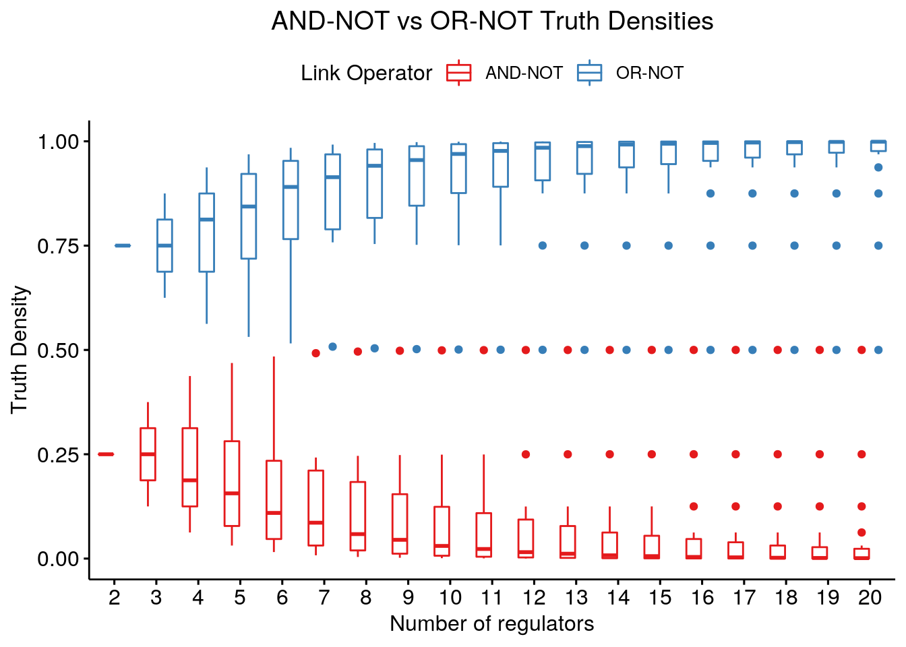
<p class="caption">(\#fig:fig-and-or-not)AND-NOT vs OR-NOT Truth Densities across all possible activators and inhibitors combinations up to 20 regulators</p>
</div>

:::{.green-box}
- **The more regulators** there are, the more likely it is that the `AND-NOT` link operator in the boolean equation will result in an **inhibited** target and that the `OR-NOT` link operator in an **active** target.
- For $n>6$, the points outside the boxplots (with a truth density of $\frac{1}{2}, \frac{1}{4}, 1-\frac{1}{4},\frac{1}{8},1-\frac{1}{8},...$) correspond to the **long-term behaviour** of the truth density formulas shown above, but where there is also **large imbalance between the number of activators and inhibitors**.
:::

We can also check the relation between TD and number of activators and inhibitors in each case.
The following two figures show us why **the number of inhibitors** are more decisive in the `AND-NOT` case:

```r
ggscatter(data = stats %>% rename(`#Regulators` = num_reg), x = "num_inh", 
  y = "td_and_not", color = "#Regulators",
  ylab = "Truth Density", xlab = "Number of Inhibitors", 
  title = "AND-NOT TD vs Number of Inhibitors") + 
  theme(plot.title = element_text(hjust = 0.5))

ggscatter(data = stats %>% rename(`#Regulators` = num_reg), x = "num_act", 
  y = "td_and_not", color = "#Regulators",
  ylab = "Truth Density", xlab = "Number of Activators", 
  title = "AND-NOT TD vs Number of Activators") + 
  theme(plot.title = element_text(hjust = 0.5))
```

<div class="figure">
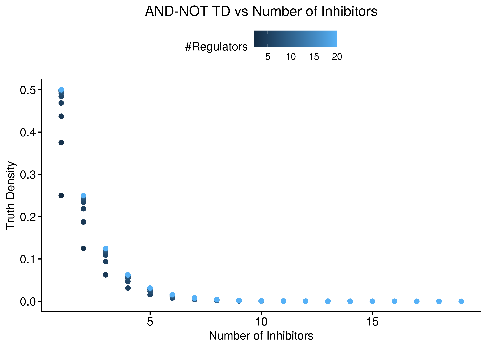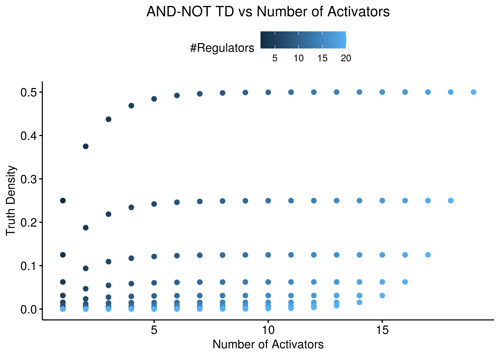
<p class="caption">(\#fig:and-not-reg-plot)AND-NOT TD vs Number of Activators and Inhibitors</p>
</div>

In the `OR-NOT` case the number of activators is more important:

```r
ggscatter(data = stats %>% rename(`#Regulators` = num_reg), x = "num_inh", 
  y = "td_or_not", color = "#Regulators",
  ylab = "Truth Density", xlab = "Number of Inhibitors", 
  title = "OR-NOT TD vs Number of Inhibitors") + 
  theme(plot.title = element_text(hjust = 0.5))

ggscatter(data = stats %>% rename(`#Regulators` = num_reg), x = "num_act", 
  y = "td_or_not", color = "#Regulators",
  ylab = "Truth Density", xlab = "Number of Activators", 
  title = "OR-NOT TD vs Number of Activators") + 
  theme(plot.title = element_text(hjust = 0.5))
```

<div class="figure">
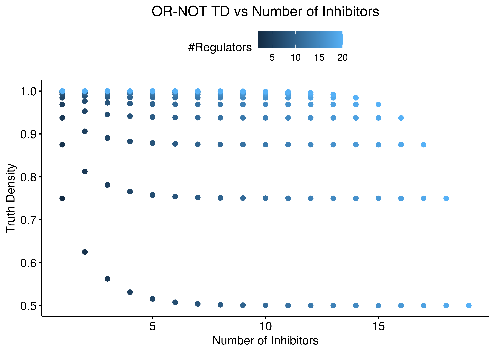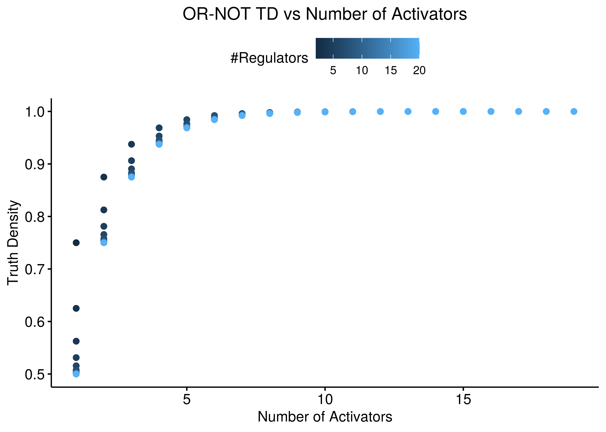
<p class="caption">(\#fig:or-not-reg-plot)OR-NOT TD vs Number of Activators and Inhibitors</p>
</div>

### *BalanceOp1* TD {-}

If we add the `BalanceOp1` formulas's TD results to the first plot we have:

```r
# tidy up data
stats_and_or_balance = pivot_longer(data = stats, cols = c(td_and_not, td_or_not, td_balance_op), 
  names_to = "lo", values_to = "td") %>%
  select(num_reg, lo, td) %>%
  mutate(lo = replace(x = lo, list = lo == "td_and_not", values = "AND-NOT")) %>%
  mutate(lo = replace(x = lo, list = lo == "td_or_not", values = "OR-NOT")) %>%
  mutate(lo = replace(x = lo, list = lo == "td_balance_op", values = "BalanceOp1")) %>%
  rename(`Link Operator` = lo)

ggboxplot(data = stats_and_or_balance, x = "num_reg", y = "td", 
  color = "Link Operator", palette = "Set1",
  title = "AND-NOT vs OR-NOT vs BalanceOp1 Truth Densities", 
  xlab = "Number of regulators", ylab = "Truth Density") +
  theme(plot.title = element_text(hjust = 0.5))
```

<div class="figure" style="text-align: center">
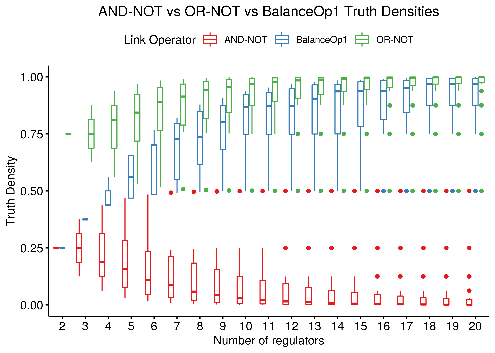
<p class="caption">(\#fig:fig-and-or-not-balanceop)AND-NOT vs OR-NOT vs BalanceOp1 Truth Densities across all possible activators and inhibitors combinations up to 20 regulators</p>
</div>

:::{.green-box}
- The `BalanceOp1` TD values are closer to the TD values of the `OR-NOT` formula compared to the `AND-NOT` one.
- The `BalanceOp1` is less *biased* compared to the `OR-NOT` link operator, but still for large $n$ (regulators) it practically **makes the target activated**.
:::

As we can see in the following two figures, the `BalanceOp1` shows a more balanced dependency between the number of activators and inhibitors:

```r
ggscatter(data = stats %>% rename(`#Regulators` = num_reg), x = "num_inh", 
  y = "td_balance_op", color = "#Regulators",
  ylab = "Truth Density", xlab = "Number of Inhibitors", 
  title = "BalanceOp1 TD vs Number of Inhibitors") + 
  theme(plot.title = element_text(hjust = 0.5))

ggscatter(data = stats %>% rename(`#Regulators` = num_reg), x = "num_act", 
  y = "td_balance_op", color = "#Regulators",
  ylab = "Truth Density", xlab = "Number of Activators", 
  title = "BalanceOp1 TD vs Number of Activators") + 
  theme(plot.title = element_text(hjust = 0.5))
```

<div class="figure">
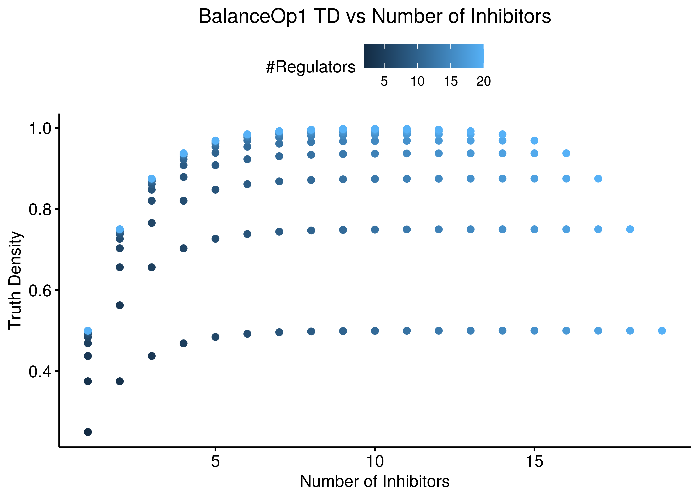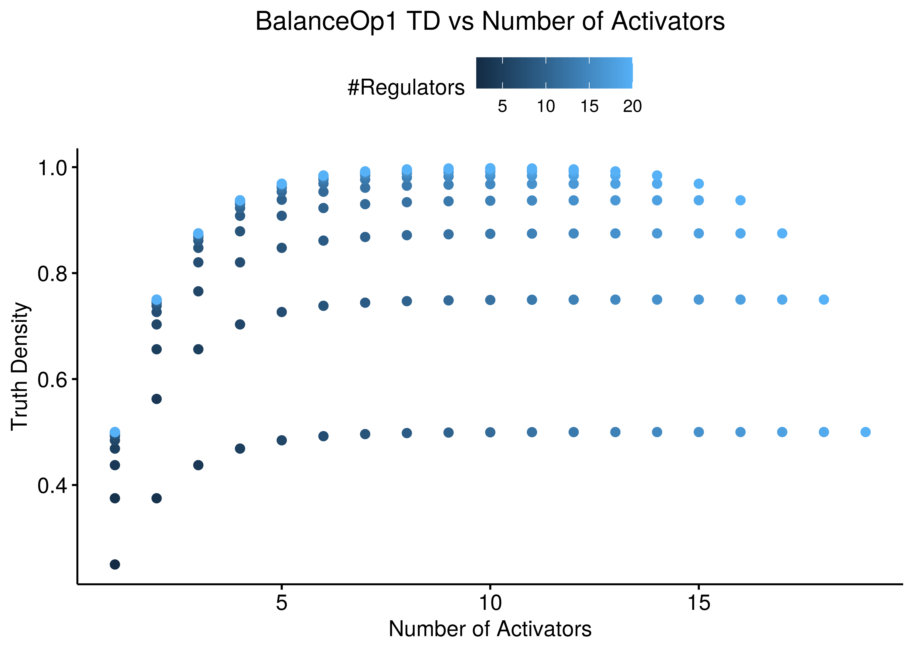
<p class="caption">(\#fig:balanceOp1-reg-plot)BalanceOp1 TD vs Number of Activators and Inhibitors</p>
</div>

### Threshold Functions TD {-}

In contrast, if we check the truth density of the $f_{act-win}(x,y)$ and $f_{inh-win}(x,y)$ boolean functions we have:

```r
# tidy up data
stats_functions = pivot_longer(data = stats, cols = c(td_exp_act, td_exp_inh), 
  names_to = "fun", values_to = "td") %>%
  select(num_reg, fun, td) %>%
  mutate(fun = replace(x = fun, list = fun == "td_exp_act", values = "Activators Win")) %>%
  mutate(fun = replace(x = fun, list = fun == "td_exp_inh", values = "Inhibitors Win")) %>%
  rename(`Equation Formula` = fun)

ggboxplot(data = stats_functions, x = "num_reg", y = "td",
  color = "Equation Formula", palette = "lancet",
  title = TeX("Truth Densities of $f_{act-win}(x,y)$ and $f_{inh-win}(x,y)$"),
  xlab = "Number of regulators", ylab = "Truth Density") +
  theme(plot.title = element_text(hjust = 0.5))
```

<div class="figure" style="text-align: center">
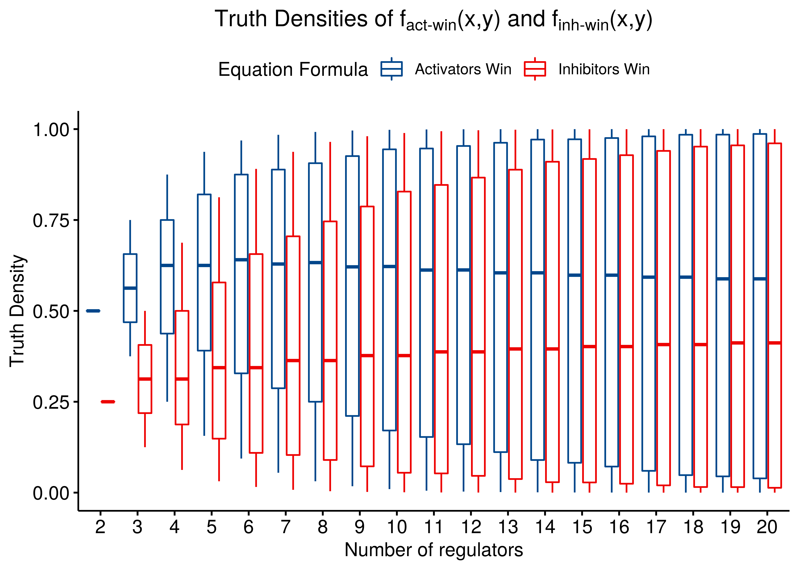
<p class="caption">(\#fig:fig-two-bool-formulas)Truth Desities of two robust boolean formulas across all possible activators and inhibitors combinations up to 20 regulators</p>
</div>

:::{.green-box}
- Both boolean functions have a **large variance of truth densities** irrespective of the number of regulators.
- The median values seem to converge to $0.5$ for both formulas.
- The median value of truth density for the $f_{act-win}(x,y)$ is always larger than the $f_{inh-win}(x,y)$ (as expected).
:::

### TD Data Distance {-}

We check how close are the truth density values of the different proposed BBRs, also compared to the **proportion of activators**, e.g. if a BBR has 1 activator and 5 inhibitors (resp. 5 activators and 1 inhibitor) I would expect my regulatory function's output to be statistically more inhibited (resp. activated).
We find the *euclidean distance* between the different truth density values and show them in a table and dendrogram format:


```r
act_prop = stats %>% mutate(act_prop = num_act/num_reg) %>% pull(act_prop)
td_and_not = stats %>% pull(td_and_not)
td_or_not = stats %>% pull(td_or_not)
td_balance_op = stats %>% pull(td_balance_op)
td_exp_act = stats %>% pull(td_exp_act)
td_exp_inh = stats %>% pull(td_exp_inh)

d = dist(rbind(act_prop, td_and_not, td_or_not, td_balance_op, td_exp_act, td_exp_inh))
```


```r
# color `act_prop` column
breaks = quantile(unname(as.matrix(d)[, "act_prop"]), probs = seq(.05, .95, .05), na.rm = TRUE)
col = round(seq(255, 40, length.out = length(breaks) + 1), 0) %>%
  {paste0("rgb(255,", ., ",", ., ")")} # red

caption.title = "Euclidean Distances between vectors of truth density values (Symmetric)"
DT::datatable(data = d %>% as.matrix(), options = list(dom = "t", scrollX = TRUE),
  caption = htmltools::tags$caption(caption.title, style="color:#dd4814; font-size: 18px")) %>% 
  formatRound(1:6, digits = 3) %>%
  formatStyle(columns = c("act_prop"), backgroundColor = styleInterval(breaks, col))
```

<!--html_preserve--><div id="htmlwidget-45d649106a7f6598f031" style="width:100%;height:auto;" class="datatables html-widget"></div>
<script type="application/json" data-for="htmlwidget-45d649106a7f6598f031">{"x":{"filter":"none","caption":"<caption style=\"color:#dd4814; font-size: 18px\">Euclidean Distances between vectors of truth density values (Symmetric)<\/caption>","data":[["act_prop","td_and_not","td_or_not","td_balance_op","td_exp_act","td_exp_inh"],[0,6.2357551189418,6.2357551189418,6.23071307451427,2.37324587183497,2.37324587183497],[6.2357551189418,0,11.5854262787016,10.842296589664,7.82178323744214,6.7696332482574],[6.2357551189418,11.5854262787016,0,2.49443825784938,6.7696332482574,7.82178323744214],[6.23071307451427,10.842296589664,2.49443825784938,0,7.12290730774761,7.92299559783636],[2.37324587183497,7.82178323744214,6.7696332482574,7.12290730774761,0,1.86374127113628],[2.37324587183497,6.7696332482574,7.82178323744214,7.92299559783636,1.86374127113628,0]],"container":"<table class=\"display\">\n  <thead>\n    <tr>\n      <th> <\/th>\n      <th>act_prop<\/th>\n      <th>td_and_not<\/th>\n      <th>td_or_not<\/th>\n      <th>td_balance_op<\/th>\n      <th>td_exp_act<\/th>\n      <th>td_exp_inh<\/th>\n    <\/tr>\n  <\/thead>\n<\/table>","options":{"dom":"t","scrollX":true,"columnDefs":[{"targets":1,"render":"function(data, type, row, meta) { return DTWidget.formatRound(data, 3, 3, \",\", \".\"); }"},{"targets":2,"render":"function(data, type, row, meta) { return DTWidget.formatRound(data, 3, 3, \",\", \".\"); }"},{"targets":3,"render":"function(data, type, row, meta) { return DTWidget.formatRound(data, 3, 3, \",\", \".\"); }"},{"targets":4,"render":"function(data, type, row, meta) { return DTWidget.formatRound(data, 3, 3, \",\", \".\"); }"},{"targets":5,"render":"function(data, type, row, meta) { return DTWidget.formatRound(data, 3, 3, \",\", \".\"); }"},{"targets":6,"render":"function(data, type, row, meta) { return DTWidget.formatRound(data, 3, 3, \",\", \".\"); }"},{"className":"dt-right","targets":[1,2,3,4,5,6]},{"orderable":false,"targets":0}],"order":[],"autoWidth":false,"orderClasses":false,"rowCallback":"function(row, data) {\nvar value=data[1]; $(this.api().cell(row, 1).node()).css({'background-color':isNaN(parseFloat(value)) ? '' : value <= 0.5933 ? \"rgb(255,255,255)\" : value <= 1.1866 ? \"rgb(255,244,244)\" : value <= 1.7799 ? \"rgb(255,232,232)\" : value <= 2.3732 ? \"rgb(255,221,221)\" : value <= 2.3732 ? \"rgb(255,210,210)\" : value <= 2.3732 ? \"rgb(255,198,198)\" : value <= 2.3732 ? \"rgb(255,187,187)\" : value <= 2.3732 ? \"rgb(255,176,176)\" : value <= 3.3376 ? \"rgb(255,164,164)\" : value <= 4.302 ? \"rgb(255,153,153)\" : value <= 5.2663 ? \"rgb(255,142,142)\" : value <= 6.2307 ? \"rgb(255,131,131)\" : value <= 6.232 ? \"rgb(255,119,119)\" : value <= 6.2332 ? \"rgb(255,108,108)\" : value <= 6.2345 ? \"rgb(255,97,97)\" : value <= 6.2358 ? \"rgb(255,85,85)\" : value <= 6.2358 ? \"rgb(255,74,74)\" : value <= 6.2358 ? \"rgb(255,63,63)\" : value <= 6.2358 ? \"rgb(255,51,51)\" : \"rgb(255,40,40)\"});\n}"}},"evals":["options.columnDefs.0.render","options.columnDefs.1.render","options.columnDefs.2.render","options.columnDefs.3.render","options.columnDefs.4.render","options.columnDefs.5.render","options.rowCallback"],"jsHooks":[]}</script><!--/html_preserve-->


```r
plot(hclust(dist(d)), main = "Distance Dendogram of Thruth Densities",
  ylab = "Euclidean Distance", sub = "BBR Truth Densities", xlab = "")
```

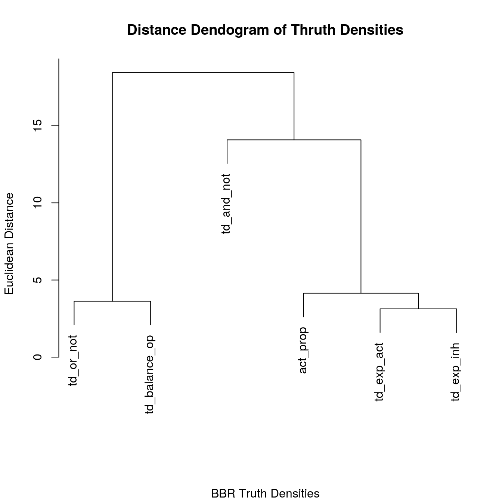

:::{.green-box}
- The **threshold functions** have truth densities values that are **closer to the proportion of activators** for a varying number of regulators, compared to the `AND-NOT` and `OR-NOT` formulas.
As such they represent more realistic candidates for regulatory functions from a statistical point of view.
- The TD values of `OR-NOT` and `BalanceOp1` are in general very close (as we've also seen in previous Figure)
:::

### Correlation {-}

We will now check the *correlation* between each pair of operators/proposed functions, as well as the number of regulators, inhibitors and activators:

```r
M = cor(stats, method = "kendall")
res = cor.mtest(stats, method = "kendall")
corrplot(corr = M, type = "upper", p.mat = res$p, sig.level = c(.001, .01, .05), 
  pch.cex = 1, pch.col = "white", insig = "label_sig", tl.col = "black", tl.srt = 45)
```

<div class="figure" style="text-align: center">
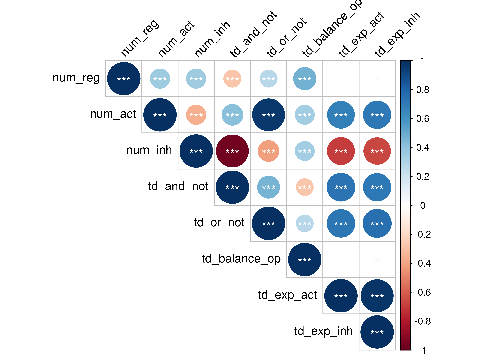
<p class="caption">(\#fig:cor-plot)Correlation Matrix of Truth Densities and number of regulators</p>
</div>

:::{.green-box}
- The two functions results $f_{act-win}(x,y), f_{inh-win}(x,y)$ are highly correlated as expected
- Lower `AND-NOT` TD values highly correlate with *higher* number of inhibitors
- Higher `OR-NOT` TD values highly correlate with *higher* number of activators
:::

# CASCADE 1.0 Analysis (All models) {-}

## Network Properties {-}

:::{.blue-box}
In this section we demonstrate the **scale-free properties of the CASCADE 1.0 network**.
We show that both in- and out-degree distributions are asymptotically power-law.
:::

Use the script [get_distribution_stats.R](https://github.com/bblodfon/balance-paper/blob/master/scripts/get_distribution_stats.R) to generate the degree distribution stats.
We load the results:


```r
dd_stats = readRDS(file = "data/dd_stats.rds")
```


```r
dd_stats %>% group_by(in_degree) %>% tally() %>%
  ggplot(aes(x = in_degree, y = n)) +
  geom_bar(stat = "identity", fill = "steelblue", width = 0.7) + 
  geom_smooth(aes(color = "red"), se = FALSE, show.legend = FALSE) + 
  theme_classic() +
  labs(title = "In-Degree Distribution (CASCADE 1.0)", x = "In Degree", y = "Number of Nodes")
```

<div class="figure" style="text-align: center">
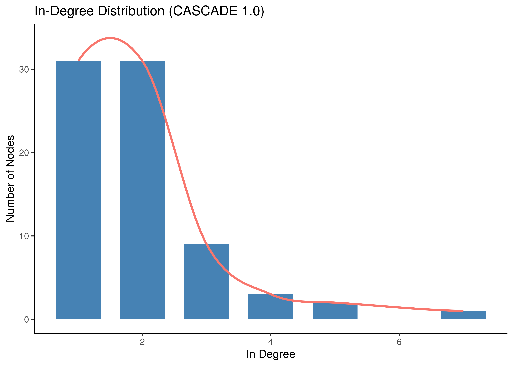
<p class="caption">(\#fig:in-degree-fig)In Degree Distribution (CASCADE 1.0)</p>
</div>


```r
dd_stats %>% group_by(out_degree) %>% tally() %>%
  ggplot(aes(x = out_degree, y = n)) +
  geom_bar(stat = "identity", fill = "steelblue") + 
  geom_smooth(aes(color = "red"), se = FALSE, span = 0.58, show.legend = FALSE) + 
  theme_classic() +
  labs(title = "Out-Degree Distribution (CASCADE 1.0)", x = "Out Degree", y = "Number of Nodes")
```

<div class="figure" style="text-align: center">
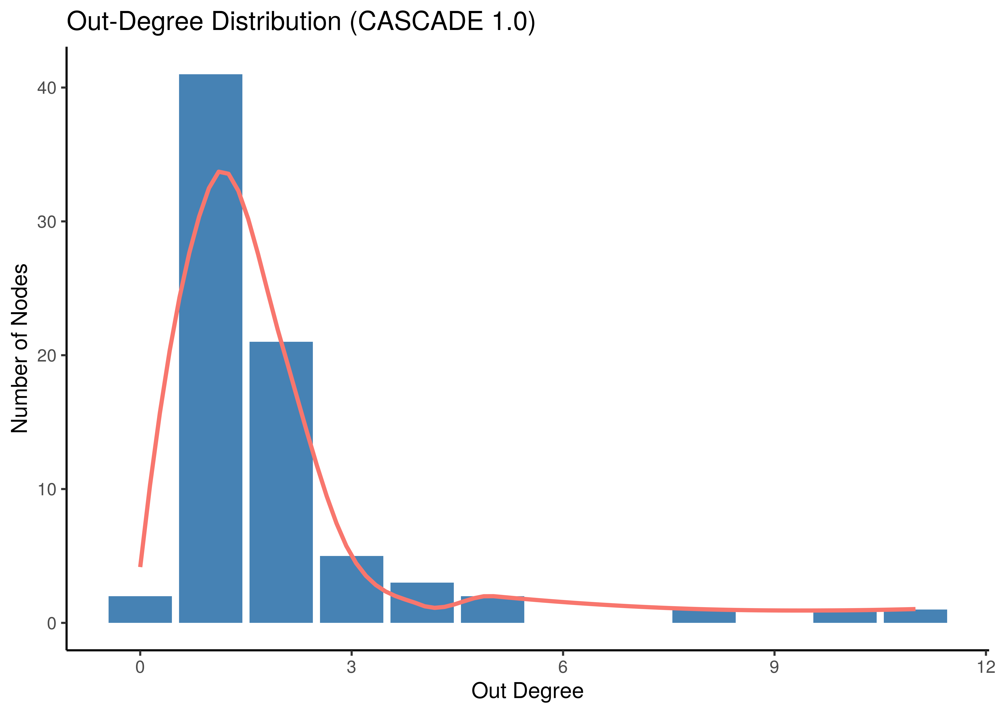
<p class="caption">(\#fig:out-degree-fig)Out Degree Distribution (CASCADE 1.0)</p>
</div>

## Model Stable State Statistics {-}

Using [abmlog](https://github.com/druglogics/abmlog) we generated all $2^{23} = 8388608$ possible link operator mutated models for the CASCADE 1.0 topology.
The models are stored in both `.gitsbe` and `.bnet` files in the Zenodo dataset [](https://doi.org/10.5281/zenodo.4022783). 
The `gitsbe` files include also the fixpoint attractors.
Thus we can find the *frequency distribution* of the number of fixpoints across all produced models (use the script [count_models_ss.R](https://github.com/bblodfon/balance-paper/blob/master/scripts/count_models_ss.R)).
The model stable state (fixpoint) statistics are as follows:


```r
models_ss_stats = readRDS(file = "data/models_ss_stats.rds")

models_ss_stats %>% group_by(ss_num) %>% tally() %>%
  ggplot(aes(x = ss_num, y = n, fill = as.factor(ss_num))) +
  geom_bar(stat = "identity", show.legend = FALSE) + 
  geom_text(aes(label = n), vjust = -0.5) +
  geom_text(aes(label = paste0(100 * round(n/nrow(models_ss_stats), digits = 2), "%")), size = 10, vjust = c(2.5, 2.5, -2)) +
  theme_classic2() +
  theme(plot.title = element_text(hjust = 0.5)) +
  labs(title = "Stable States Distribution", x = "Number of Stable States", y = "Number of models")
```

<div class="figure" style="text-align: center">
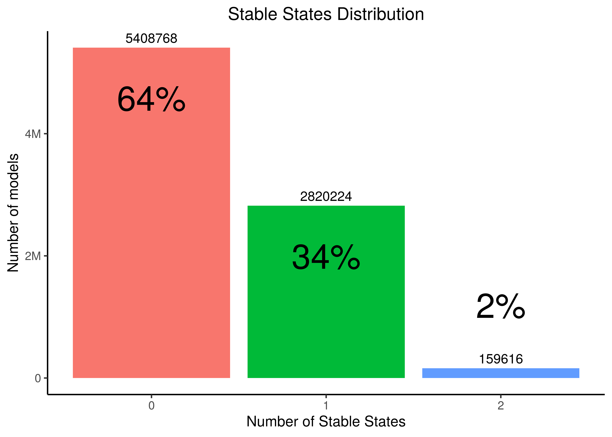
<p class="caption">(\#fig:ss-stats-all)Stable States Distribution across all link-operator parameterized models (CASCADE 1.0)</p>
</div>

:::{.green-box}
Less than $50\%$ of the total possible parameterized models have a single fixpoint attractor which corresponds to a single stable phenotype behaviour.
:::

## Stable States Data {-}

:::{.note}
To load the stable state data for the models that have **1 stable state** use the Zenodo dataset [](https://doi.org/10.5281/zenodo.4022783) and the script [get_ss_data.R](https://github.com/bblodfon/balance-paper/blob/master/scripts/get_ss_data.R)
:::

## Parameterization vs #fixpoints {-}

:::{.blue-box}
In this subsection we identify the **key nodes** whose parameterization affects the *change of dynamics* of the CASCADE 1.0 network, i.e. are responsible for the **change in the number of fixpoint attractors (0,1 and 2)** across all link-operator mutated models.
:::

We will use several statistical methods, in each of the sub-sections below.

:::{.orange-box}
The training data is a **link-operator matrix**, where rows are models ($2^{23}$), columns/features/variables are link-operator nodes ($23$ in total) and the parameterization values correspond to $0$ (`AND-NOT`) or $1$ (`OR-NOT`). 
The ternary response for each model is a number denoting the number of fixpoints ($0,1$ or $2$).
:::

The matrix we can generate with the script [get_lo_mat.R](https://github.com/bblodfon/balance-paper/blob/master/scripts/get_lo_mat.R) and the response is part of the previously generated data from the script [count_model_ss.R](https://github.com/bblodfon/balance-paper/blob/master/scripts/count_model_ss.R).

### Glmnet {-}

Use the script [param_ss_glmnet.R](https://github.com/bblodfon/balance-paper/blob/master/scripts/param_ss_glmnet.R) to fit a **multinomial LASSO model** for the data [@Friedman2010].
We now simply load the result object:

```r
fit_a1 = readRDS(file = "data/fit_a1.rds")
plot(fit_a1, xvar = "dev", type.coef = "2norm")
```


```r
plot(fit_a1, xvar = "lambda", type.coef = "2norm")
```


As we can see there is no $\lambda$ that could explain more than $44\%$ of the deviance and there are a lot of non-zero coefficients associated with smaller values of $\lambda$.
For example, choosing  $\lambda = 0.0142$ (tested prediction accuracy $\approx 0.72$ on a random subset of the data), we have the following coefficients, shown in a heatmap:

```r
# choose a lambda
lambda1 = fit_a1$lambda[32]

fit_a1_coef = coef(fit_a1, s = lambda1) %>%
  lapply(as.matrix) %>%
  Reduce(cbind, x = .) %>% t()
rownames(fit_a1_coef) = names(coef(fit_a1, s = lambda1)) # 0, 1 and 2 stable states

imp_nodes_colors = rep("black", length(colnames(fit_a1_coef)))
names(imp_nodes_colors) = colnames(fit_a1_coef)
imp_nodes_colors[names(imp_nodes_colors) %in% c("MEK_f", "PTEN", "MAPK14")] = "green4"

ComplexHeatmap::Heatmap(matrix = fit_a1_coef, name = "Coef", row_title = "Number of Fixpoints", 
  row_names_side = "right", row_dend_side = "right", row_title_side = "right",
  column_title = "Glmnet Coefficient Scores (λ = 0.0142)",
  column_dend_height = unit(20, "mm"), column_names_gp = gpar(col = imp_nodes_colors))
```

<div class="figure" style="text-align: center">
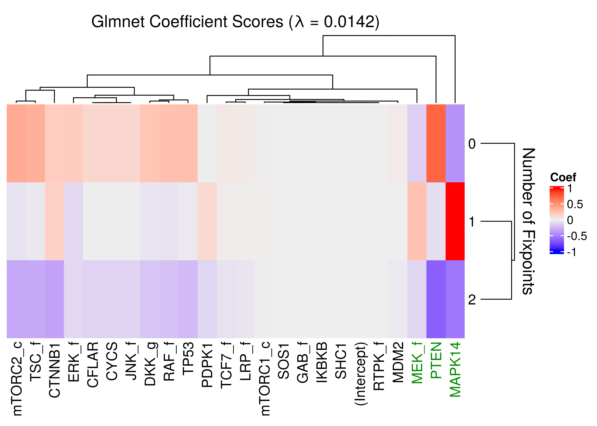
<p class="caption">(\#fig:param-ss-glmnet-2)Heatmap of coefficients of multinomial model (glmnet)</p>
</div>

```r
# check accuracy
# lo_mat = readRDS(file = "data/lo_mat.rds")
# models_ss_stats = readRDS(file = "data/models_ss_stats.rds")
# ss_num = models_ss_stats %>% pull(ss_num)
# set.seed(42)
# model_indexes = sample(x = 1:nrow(lo_mat), size = 100000)
# pred = predict(object = fit_a1, newx = lo_mat[model_indexes, ],
#   type = "class", s = lambda1) %>% as.integer()
# acc = sum(pred == ss_num[model_indexes])/length(pred)
# print(acc) # should be ~ 0.72
```

:::{.green-box}
Even thought the *glmnet* classifier might not be accurate enough, we still find that the nodes `PTEN` and `MAPK14` are the **most important (larger coefficients)** for distinguishing between the models with different number of fixpoints.
Additional nodes (like `MEK_f` and `CTNNB1`) are likely to be important as well.
:::

If we cross-validate the regularization parameter $\lambda$ (using the same script, we randomly selected smaller model samples - $100000$, $20$ times in total), and choose the $\lambda_{1se}$ for each different run to get the coefficients, the results can be visualized as follows:

```r
cvfit_data = readRDS(file = "data/cvfit_data.rds")
cvfit_mat_list = lapply(cvfit_data, function(cvfit) {
  co = coef(cvfit) %>% 
    lapply(as.matrix) %>%
    Reduce(cbind, x = .) %>% 
    t()
  rownames(co) = names(coef(cvfit)) # 0,1 and 2 stable states
  return(co)
})

cvfit_mat = do.call(rbind, cvfit_mat_list)
```


```r
imp_nodes_colors = rep("black", length(colnames(cvfit_mat)))
names(imp_nodes_colors) = colnames(cvfit_mat)
imp_nodes_colors[names(imp_nodes_colors) %in% c("MEK_f", "PTEN", "MAPK14", "CTNNB1", "mTORC1_c")] = "green4"

ComplexHeatmap::Heatmap(matrix = cvfit_mat, name = "Coef", row_title = "Number of Fixpoints", 
  row_dend_side = "right", row_title_side = "left",
  column_title = "Glmnet Coefficient Scores", row_km = 3, row_km_repeats = 10, 
  show_row_names = FALSE, column_dend_height = unit(20, "mm"),
  column_names_gp = gpar(col = imp_nodes_colors),
  left_annotation = rowAnnotation(foo = anno_block(
    labels = c("2", "1", "0"), # with `show_row_names = TRUE` you can check this
    labels_gp = gpar(col = "black", fontsize = 12))))
```

<div class="figure" style="text-align: center">
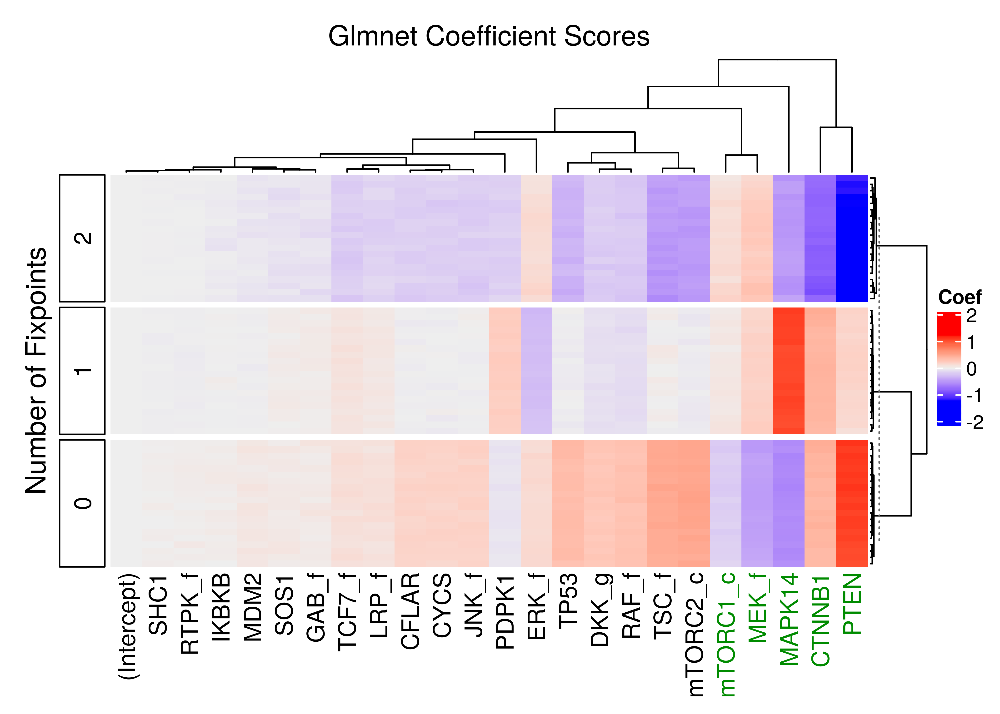
<p class="caption">(\#fig:param-ss-glmnet-cv-fig)Heatmap of coefficients of multinomial model (glmnet - 20 CV models)</p>
</div>

:::{.green-box}
The top 5 most important nodes are seen in green in the above heatmap: `MAPK14`, `PTEN`, `CTNNB1`, `MEK_f` and `mTORC1_c`.
:::

### Random Forest {-}

We used the [param_ss_randf.R](https://github.com/bblodfon/balance-paper/blob/master/scripts/param_ss_randf.R) script to tune and train a random forest classifier on the dataset [@Liaw2002].
First we tuned the `mtry` parameter, the number of variables randomly selected at each tree split:

```r
mtry_data = readRDS(file = "data/mtry_data.rds")

mtry_data %>%
  ggplot(aes(x = mtry, y = OOBError, group = mtry)) +
  geom_boxplot(fill = "green4") +
  labs(title = "Tuning Random Forest mtry parameter") +
  theme_classic(base_size = 14) + theme(plot.title = element_text(hjust = 0.5))
```

<div class="figure" style="text-align: center">

<p class="caption">(\#fig:param-ss-rf-mtry)Random Forest Tuning (mtry)</p>
</div>

:::{.green-box}
A value between $14-18$ for `mtry` seems to minimize the Out-Of-Bag Error, so we choose $16$ for the rest of the analysis.
For the number of trees parameter, we stayed with the default value ($500$) as we observed that they were more than enough after a few test runs.
:::

Next, we randomly selected $100000$ models from the dataset - a total of $20$ times - to train the random forest classifier and find the **importance score of each node**.
We load the result data and tidy up a bit:

```r
rf_imp_data = readRDS(file = "data/rf_imp_data.rds")

# make a list of tibbles
tbl_list = lapply(rf_imp_data, function(mat) {
  nodes = rownames(mat)
  tibble::as_tibble(mat) %>% mutate(nodes = nodes)
})

# OneForAll
imp_res = dplyr::bind_rows(tbl_list)

# Get the importance stats
imp_stats = imp_res %>% 
  group_by(nodes) %>% 
  summarise(mean_acc  = mean(MeanDecreaseAccuracy), 
            sd_acc    = sd(MeanDecreaseAccuracy), 
            mean_gini = mean(MeanDecreaseGini), 
            sd_gini   = sd(MeanDecreaseGini), 
            .groups = 'keep') %>% 
  ungroup()
```

The importance scores for each node were the **mean decrease in accuracy and node impurity** (Gini Index).
We calculate the mean importance and standard deviation scores across all random samples for both measures of importance:

```r
# color first 5 nodes in x axis
imp_col = c(rep("green4", 5), rep("grey30", nrow(imp_stats)-5))
imp_stats %>%
  mutate(nodes = forcats::fct_reorder(nodes, desc(mean_acc))) %>%
  ggplot(aes(x = nodes, y = mean_acc, fill = mean_acc)) +
  geom_bar(stat = "identity", show.legend = FALSE) +
  scale_fill_gradient(low = "steelblue", high = "red") +
  geom_errorbar(aes(ymin=mean_acc-sd_acc, ymax=mean_acc+sd_acc), width = 0.2) +
  theme_classic(base_size = 14) + 
  theme(axis.text.x = element_text(angle = 90, colour = imp_col)) +
  labs(title = "Random Forest Variable Importance (Accuracy)", 
    x = "Nodes", y = "Mean Decrease Accuracy")
```

<div class="figure" style="text-align: center">
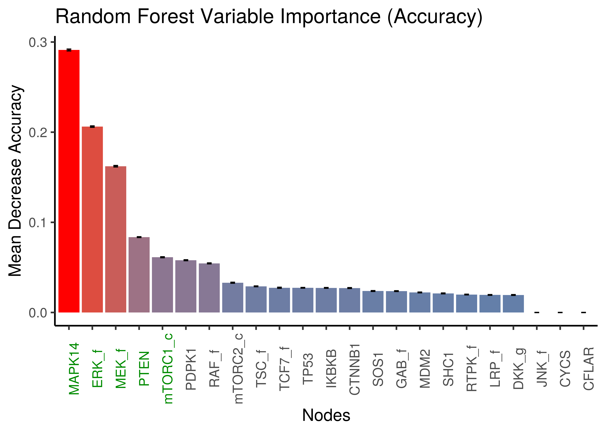
<p class="caption">(\#fig:param-ss-rf-imp-fig)Random Forest: Mean Decrease Accuracy per node</p>
</div>


```r
imp_stats %>%
  mutate(nodes = forcats::fct_reorder(nodes, desc(mean_gini))) %>%
  ggplot(aes(x = nodes, y = mean_gini, fill = mean_gini)) +
  geom_bar(stat = "identity", show.legend = FALSE) +
  scale_fill_gradient(low = "steelblue", high = "red") +
  geom_errorbar(aes(ymin = mean_gini-sd_gini, ymax = mean_gini+sd_gini), width = 0.2) +
  theme_classic(base_size = 14) + 
  theme(axis.text.x = element_text(angle = 90, colour = imp_col)) +
  labs(title = "Random Forest Variable Importance (Gini Index)", 
    x = "Nodes", y = "Mean Decrease in Node Impurity")
```

<div class="figure" style="text-align: center">
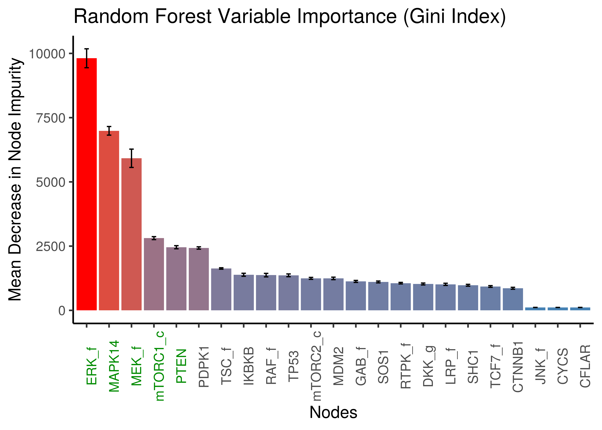
<p class="caption">(\#fig:param-ss-rf-imp-fig2)Random Forest: Mean Decrease in Node Impurity (Gini Index)</p>
</div>

:::{.green-box}
The top 5 important nodes by any of the two importance measures using random forests, include the nodes found as important with the LASSO method: `MAPK14`, `ERK_f`, `MEK_f`, `PTEN`, `mTORC1_c`.
:::

Same results we get when using a faster, more memory efficient and with multi-thread support, random forest R package, namely `ranger` [@Wright2017].
Use the script [param_ss_ranger.R](https://github.com/bblodfon/balance-paper/blob/master/scripts/param_ss_ranger.R) to reproduce the results ($4000000$ - almost half of the models are used for training and the importance measure calculated was the mean decrease in the Gini index across all trees in the forest):

```r
ranger_res = readRDS(file = "data/ranger_res.rds")
imp_res = tibble(nodes = names(ranger_res$variable.importance), 
  gini_index = ranger_res$variable.importance)

imp_res %>% 
  mutate(nodes = forcats::fct_reorder(nodes, desc(gini_index))) %>%
  ggplot(aes(x = nodes, y = gini_index, fill = gini_index)) +
    geom_bar(stat = "identity", show.legend = FALSE) +
    scale_fill_gradient(low = "steelblue", high = "red") +
    theme_classic(base_size = 14) + 
    theme(axis.text.x = element_text(angle = 90, colour = imp_col)) +
    labs(title = "Random Forest (Ranger) Variable Importance (Gini Index)", 
      x = "Nodes", y = "Mean Decrease in Node Impurity")
```

<div class="figure" style="text-align: center">

<p class="caption">(\#fig:param-ss-rf-imp-fig3)Random Forest (ranger): Mean Decrease in Node Impurity (Gini Index)</p>
</div>

### Parameterization Map {-}

We use UMAP [@McInnes2018a] to **reduce the dimensionality of our dataset** from $23$ (number of nodes with link operators) to $2$ and visualize it to see if there is any apparent *visual relation* between the models parameterization and number of fixpoints.
Note that because of memory restrictions (we had a total of 16GB available) we couldn't run UMAP on the whole dataset.

We used the [param_ss_umap.R](https://github.com/bblodfon/balance-paper/blob/master/scripts/param_ss_umap.R) script to run the UMAP implementation offered by the `uwot` R package.
We make the plots afterwards using the result data with the [param_ss_umap_vis.R](https://github.com/bblodfon/balance-paper/blob/master/scripts/param_ss_umap_vis.R) script.

#### Unsupervised UMAP {-}

First, we randomly choose a subset of our dataset ($6000000$ rows, so $\approx 71\%$ of the link operator models) and applied **unsupervised UMAP** (no *a priori* knowledge of the number of fixpoints per model provided or of any other information/label per model for that matter).

UMAP is given a subset of all binary numbers from $0$ ($23$ $0$'s) to $2^{23}-1$ ($23$ $1$'s) representing each possible link operator mutated model ($0$'s map to `AND-NOT`, $1$'s to `OR-NOT`) and places them in the 2D plane.
The following figure show us the models, **colored by their decimal (base-10) number** (converted from the binary link-operator model representation):

```r
knitr::include_graphics(path = "img/umap_unsupervised_model_num.png")
```

<div class="figure">
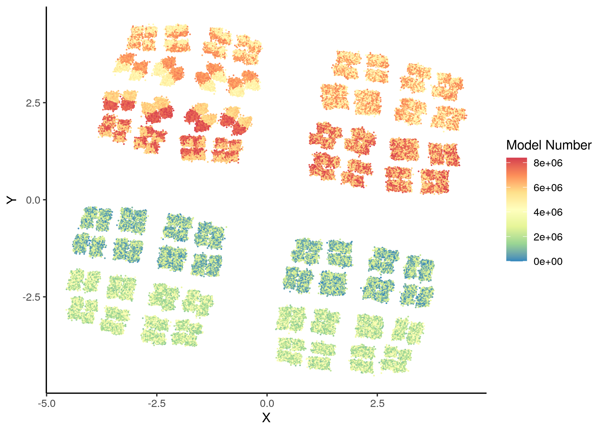
<p class="caption">(\#fig:umap-unsup-model-num-fig)UMAP: Parameterization vs Numerical Model Representation</p>
</div>

:::{.green-box}
UMAP has found **neighboorhoods of similarly parameterized models**.

We used the *manhattan* distance metric in the UMAP algorithm and as such, a model number that can be more than a thousands of numbers away on the decimal system from another model number, might actually be very close to it if we check the corresponding distance of their binary representations (e.g. the manhattan distance between $000...00_2=0$ $100...00_2=2^{22}=4194304$ is 1).
:::

Same models, same 2D placement, only now colored by their number of fixpoints:

```r
knitr::include_graphics(path = "img/umap_unsupervised.png")
```

<div class="figure">

<p class="caption">(\#fig:umap-unsup-fig)UMAP: Parameterization vs Number of fixpoints</p>
</div>

:::{.green-box}
Models with **similar parameterization seem to also have the same number of fixpoints**.
We also notice specific subareas being completely covered by such same-structure, same-fixpoint-number models ($0$ or $1$-fixpoint model clusters) showing us that some parameterization families are eligible to the same attractor fate.

The $2$-fixpoint models seem to always lie next to similarly parameterized $1$-fixpoint models (they are like a subcategory of those and not like a separate one) and not in clusters of their own.
As such, they can be found across all the areas of the parameterization map.
:::

#### Supervised UMAP {-}

Next, we randomly choose $1/3=33\%$ of our dataset and applied **UMAP in supervised mode** (the association between each model and the corresponding fixpoint group was given as input to UMAP):

```r
knitr::include_graphics(path = "img/umap_supervised.png")
```

<div class="figure">

<p class="caption">(\#fig:umap-sup-fig)UMAP Supervised: Parameterization vs Number of fixpoints</p>
</div>

:::{.green-box}
We observe that the $2$-fixpoint model structures are spread out in the Y dimension much less than the corresponding $0$ and $1$-fixpoint models.
Also, the X dimension can clearly be used to **distinguish between the 3 attractor classes**.

So, it seems that the more complex are the models (here we mean dynamical complexity - i.e. more attractors) the more spread out are in the parameterization map and form many more distinct clusters.
:::

If we **retain the above fixpoint-class 2D model placement** and color it according to the models numerical representation, we can see the existence of small closely-parameterized clusters within each super-cluster as well as the fact that the models in each super-cluster are spread throughout the parameterization landscape:

```r
knitr::include_graphics(path = "img/umap_supervised_model_num.png")
```

<div class="figure">
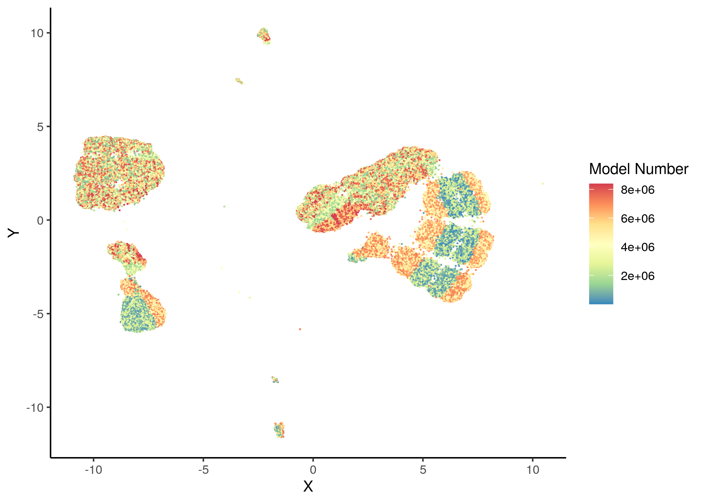
<p class="caption">(\#fig:umap-sup-fig-2)UMAP Supervised: Parameterization vs Numerical Model Representation</p>
</div>

### Embedding Important Nodes in the Map {-}

Using random forest and regularized LASSO method, we found important nodes whose parameterization affects the change of dynamics (number of fixpoints).
Using (supervised) UMAP we took a sample of the dataset ($33\%$ of the models) and placed it to the 2D plane, linking closely parameterized models in clusters.

We will now color the [supervised UMAP-generated map](#supervised-umap) with the link-operator values of the top 5 most important nodes found from the aforementioned methods as well the least important node reported with random forests (use the [param_ss_umap_sup_imp_nodes.R](https://github.com/bblodfon/balance-paper/blob/master/scripts/param_ss_umap_sup_imp_nodes.R) script).

The 3 most important nodes:

```r
knitr::include_graphics(path = "img/umap_supervised_MAPK14.png")
knitr::include_graphics(path = "img/umap_supervised_MEK_f.png")
knitr::include_graphics(path = "img/umap_supervised_ERK_f.png")
```

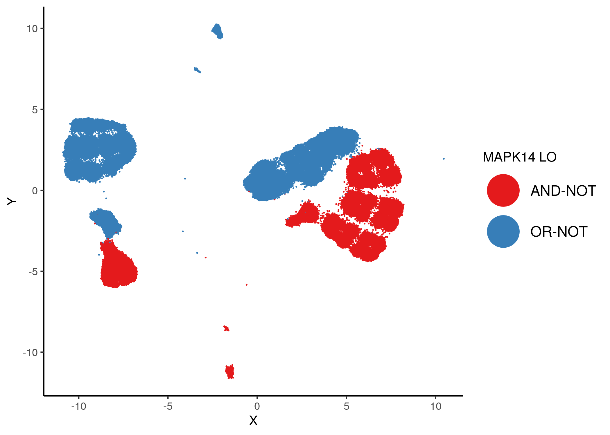

The next 2 most important nodes:

```r
knitr::include_graphics(path = "img/umap_supervised_mTORC1_c.png")
knitr::include_graphics(path = "img/umap_supervised_PTEN.png")
```

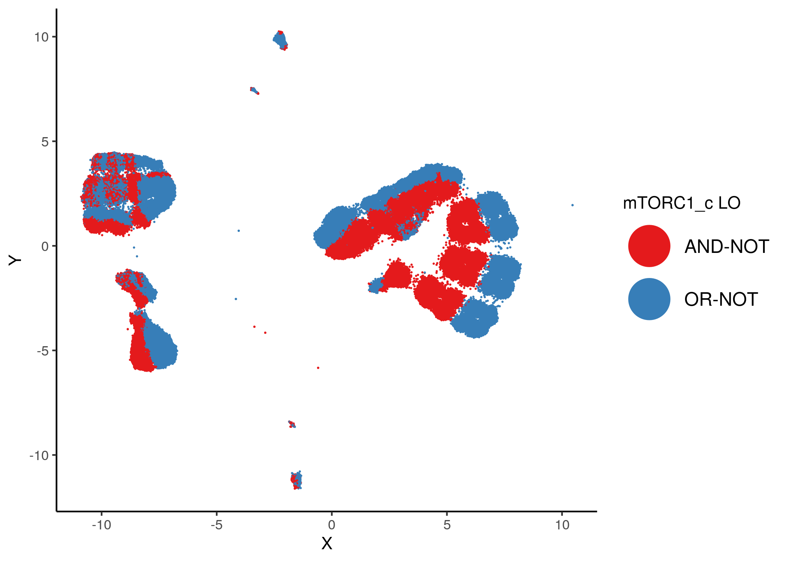

`CFLAR` was the **least important node** for assessing the number of fixpoints of a model from its parameterization:

```r
knitr::include_graphics(path = "img/umap_supervised_CFLAR.png")
```

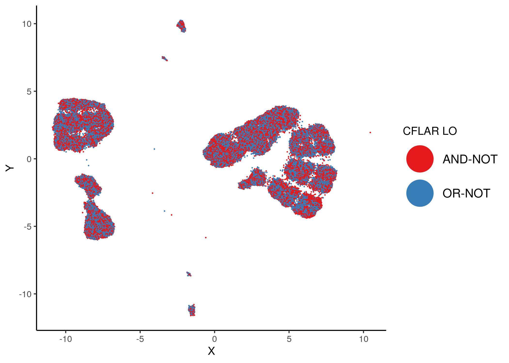

:::{.green-box}
We can see a **visual link** between node importance (related to #fixpoints) and link operator assignment: **the less important a node is, the more randomly distributed (chaotically) it's link-operator values are across the parameterization map**.

The important nodes can be used to more accurately define **families of closely parameterized models**.
:::

# CASCADE 1.0 Analysis (1 ss models) {-}

:::{.orange-box}
In the second part of this analysis, **only the models that have 1 stable state** will be used (see [Stable States Data]).
All variables of interest (stable state, link-operator parameterization, fitness to steady state, performance MCC score, etc.) will relate only to the 1 stable state models from now on.
:::

## Parameterization and Stable State Agreement {-}

We calculate the `node_stats` tibble object using the [get_node_stats.R](https://github.com/bblodfon/balance-paper/blob/master/scripts/get_node_stats.R) script.
This object includes the agreement statistics information for each node that has a link operator (i.e. it is targeted by both activators and inhibitors).

Load the `node_stats`:

```r
node_stats = readRDS(file = "data/node_stats.rds")
```

:::{.note}
We are interested in two variables of interest:

- **Parameterization** of a link operator node: `AND-NOT` (0) vs `OR-NOT` (1)
- **Stable State** of a node: *inhibited* (0) vs *active* (1)

There exist are 4 different possibilities related to 2 cases:

1. `0-0`, `1-1` => parameterization and stable state match (e.g. node was parameterized with `AND-NOT` and it's state was inhibited or it had `OR-NOT` and its state was active)
2. `1-0`, `0-1` => parameterization and stable state differ (e.g. node had `OR-NOT` and its state was inhibited, or `AND-NOT` and it's state was active)
:::

In the next Figure we show the **total observed proportionate agreement** for each node, which is the number of models for which parameterization and stable state matched (case 1 above) divided by the total amount of models:

```r
node_stats %>% mutate(node = forcats::fct_reorder(node, desc(num_reg))) %>% 
  ggplot(aes(x = node, y = obs_prop_agreement, fill = as.factor(num_reg))) +
    geom_bar(stat = "identity") +
    scale_y_continuous(labels=scales::percent) +
    labs(title = "Agreement between Link Operator Parameterization and Stable State Activity", x = "Target Nodes with both activating and inhibiting regulators", y = "Observed Proportionate Agreement") +
    theme_classic() + theme(axis.text.x = element_text(angle = 90)) +
    scale_fill_brewer(guide = guide_legend(reverse=TRUE, title = "#Regulators"), palette = "Set1") +
    geom_hline(yintercept = 0.5, linetype = 'dashed')
```

<div class="figure" style="text-align: center">
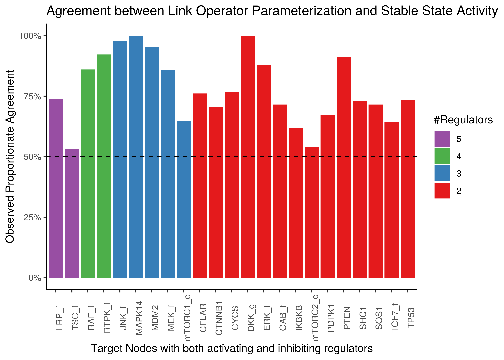
<p class="caption">(\#fig:ss-lo-agreement-prop)Parameterization and Stable State activity agreement</p>
</div>

:::{.green-box}
The total barplot area covered (i.e. the **total agreement score** so to speak) is **77.7294779%**.

The above score means that the is a higher probability than chance to assign a node the `AND-NOT` (resp. `OR-NOT`) link operator in its respective boolean equation and that node at the same time having an inhibited (resp. activated) stable state of 0 (.resp 1) in any CASCADE 1.0 link operator parameterized model.
**This suggests that the corresponding boolean formula used is biased** and the previous analysis in this report showed that for larger networks this behaviour will become statistically more prevalent.

As such, even though the number of regulators are **less than 6**, we find that there is **strong agreement** between *link operator* and *stable state activity* across all the nodes that have both types of regulators (activators and inhibitors).
This agreement is stronger for some nodes than others.
:::

Next, we calculate per node, the proportion of link operator assignments that retained their expected (i.e. keeping the same digit) stable state activity (e.g. the proportion of models corresponding to the cases `0-0`/(`0-0` + `0-1`) for the `AND-NOT` link operator - similar for `OR-NOT`):

```r
node_stats %>% 
  mutate(and_not_0ss_prop = and_not_0ss_agreement/(and_not_0ss_agreement + and_not_1ss_disagreement)) %>% 
  mutate(or_not_1ss_prop  = or_not_1ss_agreement/(or_not_1ss_agreement + or_not_0ss_disagreement)) %>%
  select(node, num_reg, and_not_0ss_prop, or_not_1ss_prop, active_prop) %>%
  rename(`AND-NOT` = and_not_0ss_prop, `OR-NOT` = or_not_1ss_prop) %>%
  mutate(node = forcats::fct_reorder(node, desc(num_reg))) %>%
  pivot_longer(cols = c(`AND-NOT`, `OR-NOT`)) %>%
  ggplot(aes(x = node, y = value, fill = name)) +
    geom_bar(position = "dodge", stat = "identity") +
    scale_y_continuous(labels=scales::percent) +
    labs(title = "Link Operator Parameterization Agreement with Stable State Activity", 
      x = "Target Nodes with both activating and inhibiting regulators", 
      y = "Observed Proportionate Agreement") +
    theme_classic() + theme(axis.text.x = element_text(angle = 90)) + 
    scale_fill_brewer(guide = guide_legend(title = "Link Operator"), palette = "Set1") + 
    geom_line(aes(y = active_prop, color = active_prop), group = 1, size = 1.2) +
    scale_color_gradient(labels=scales::percent, low="grey", high="green", 
      name = "%Models:active node", limits = c(0,1)) + 
    theme(legend.title = element_text(size = 10))
```

<div class="figure" style="text-align: center">

<p class="caption">(\#fig:ss-comp-agreement-props)Parameterization and Stable State activity agreement 2</p>
</div>

:::{.green-box}
- Higher proportional activity for a node correlates with higher `OR-NOT`-activated state agreement.
- `LRP_f` has 4 activators and 1 inhibitor and from the previous statistical analysis with found that $TD_{AND-NOT,4+1}=0.469$, $TD_{OR-NOT,4+1}=0.969$, numbers which correspond really well with the proportionate agreement scores found across all the CASCADE 1.0 models.
- `TSC_f` has 1 activator and 4 inhibitors (which corresponds well to it's total inhibition profile in all the models).
- `TSC_f` and `mTORC2_c` are always found inhibited and thus the agreement with the `AND-NOT`-inhibited state is perfect and the `OR-NOT`-activated state agreement zero.
:::

In the above Figure, wherever there is less than **0.5 disagreement**, we can always explain it with the *activity* proportion value and the number of activators being more (or less resp.) than the number of inhibitors - see following table:


```r
caption.title = "Link Operator Statistics"
DT::datatable(data = node_stats %>% select(node, num_reg, num_act, num_inh), 
  caption = htmltools::tags$caption(caption.title, style="color:#dd4814; font-size: 18px"),
  options = list(order = list(list(2, "desc")))) %>% 
  formatRound(5:6, digits = 3)
```

<!--html_preserve--><div id="htmlwidget-966e2761aee85155056b" style="width:100%;height:auto;" class="datatables html-widget"></div>
<script type="application/json" data-for="htmlwidget-966e2761aee85155056b">{"x":{"filter":"none","caption":"<caption style=\"color:#dd4814; font-size: 18px\">Link Operator Statistics<\/caption>","data":[["1","2","3","4","5","6","7","8","9","10","11","12","13","14","15","16","17","18","19","20","21","22","23"],["mTORC2_c","JNK_f","MAPK14","RTPK_f","MEK_f","SHC1","PTEN","SOS1","ERK_f","RAF_f","mTORC1_c","GAB_f","PDPK1","IKBKB","TSC_f","TP53","MDM2","CYCS","CFLAR","LRP_f","CTNNB1","TCF7_f","DKK_g"],[2,3,3,4,3,2,2,2,2,4,3,2,2,2,5,2,3,2,2,5,2,2,2],[1,2,2,2,2,1,1,1,1,1,2,1,1,1,1,1,2,1,1,4,1,1,1],[1,1,1,2,1,1,1,1,1,3,1,1,1,1,4,1,1,1,1,1,1,1,1]],"container":"<table class=\"display\">\n  <thead>\n    <tr>\n      <th> <\/th>\n      <th>node<\/th>\n      <th>num_reg<\/th>\n      <th>num_act<\/th>\n      <th>num_inh<\/th>\n    <\/tr>\n  <\/thead>\n<\/table>","options":{"order":[[2,"desc"]],"columnDefs":[{"targets":5,"render":"function(data, type, row, meta) { return DTWidget.formatRound(data, 3, 3, \",\", \".\"); }"},{"targets":6,"render":"function(data, type, row, meta) { return DTWidget.formatRound(data, 3, 3, \",\", \".\"); }"},{"className":"dt-right","targets":[2,3,4]},{"orderable":false,"targets":0}],"autoWidth":false,"orderClasses":false}},"evals":["options.columnDefs.0.render","options.columnDefs.1.render"],"jsHooks":[]}</script><!--/html_preserve-->


## Parameterization and Stable State Agreement (Cascade 2.0) {-}

:::{.blue-box}
We will perform the same analysis as in the previous section, only now for a **randomly selected sample of models from CASCADE 2.0**.
CASCADE 2.0 represents a larger topology/network and as such we expect to see even more agreement between stable state activity and link operator assignment (which leads us to link operator bias).
:::

:::{.note}
The dataset used was generated for [another analysis](https://bblodfon.github.io/gitsbe-model-analysis/cascade/random-model-ss/main.html) and we are going to use part of it, i.e. the models that had 1 stable state (see [get_node_stats_cascade_2.R](https://github.com/bblodfon/balance-paper/blob/master/scripts/get_node_stats_cascade_2.R) script).
The dataset is stored in Zenodo [](https://doi.org/10.5281/zenodo.3932382)
:::

Load the CASCADE 2.0 `node_stats`:

```r
node_stats = readRDS(file = "data/node_stats_cascade2.rds")
```

The next Figure shows the **total observed proportionate agreement** for each link operator node in CASCADE 2.0 (a total of $52$ nodes), which is the number of models for which parameterization and stable state matched divided by the total amount of models ($20672$):

```r
node_stats %>% mutate(node = forcats::fct_reorder(node, desc(num_reg))) %>% 
  ggplot(aes(x = node, y = obs_prop_agreement, fill = as.factor(num_reg))) +
    geom_bar(stat = "identity") +
    scale_y_continuous(labels=scales::percent) +
    labs(title = "Agreement between Link Operator Parameterization and Stable State Activity", x = "Target Nodes with both activating and inhibiting regulators", y = "Observed Proportionate Agreement") +
    theme_classic() + theme(axis.text.x = element_text(angle = 90)) +
    scale_fill_brewer(guide = guide_legend(reverse=TRUE, title = "#Regulators"), palette = "Spectral") +
    geom_hline(yintercept = 0.5, linetype = 'dashed')
```

<div class="figure" style="text-align: center">
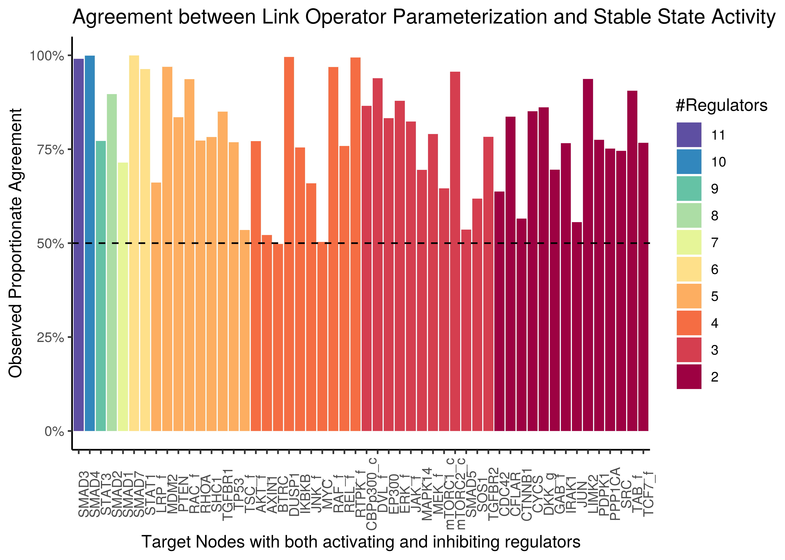
<p class="caption">(\#fig:ss-lo-prop-aggreement-cascade2)Parameterization and Stable State activity agreement (CASCADE 2.0)</p>
</div>

:::{.green-box}
The total barplot area covered (i.e. the **total agreement score** so to speak) is **78.6334916%**.

The nodes with number of regulators $>5$ have always an observed agreement $\geq 70\%$ between stable state activity and link operator parameterization.
The above results provide evidence that the statistics-based conclusion we reached in a [previous section](#stand-eq-bias) is correct, i.e. that the **standardized boolean formula is biased for larger number of regulators**.
:::


## 2D Model Parameterization Maps {-}

In this section we present the results of using UMAP [@McInnes2018a] on the link-operator parameterization data of the CASCADE 1.0 models with 1 stable state.
We created several such *parameterization maps* by adjusting the *n_neighbors* parameter input (from $2$ to $20$), which is responsible for the **size of the local neighborhood** (in terms of number of neighboring sample points) used for the manifold approximation.
As the documentation says, larger values result in **more global views** of the manifold, while smaller values result in **more local data** being preserved.
To get these map images and the reduced dimensionality dataset, use the script [1ss_models_umap.R](https://github.com/bblodfon/balance-paper/blob/master/scripts/1ss_models_umap.R) for more details.

:::{.blue-box}
Note that in all these mappings to the 2D space, **models that share similar link-operator parameterization will reside in the same area/cluster in the map**.
The larger the *n_neighbors* is, the more the smaller clusters merge into larger ones.
The images for $\ge 14$ *n_neighbors* are almost exactly the same.
:::

We present some of these maps below:

```r
knitr::include_graphics(path = "img/1ss_umap/1ss_umap_unsup_2.png")
knitr::include_graphics(path = "img/1ss_umap/1ss_umap_unsup_3.png")
```

<div class="figure">
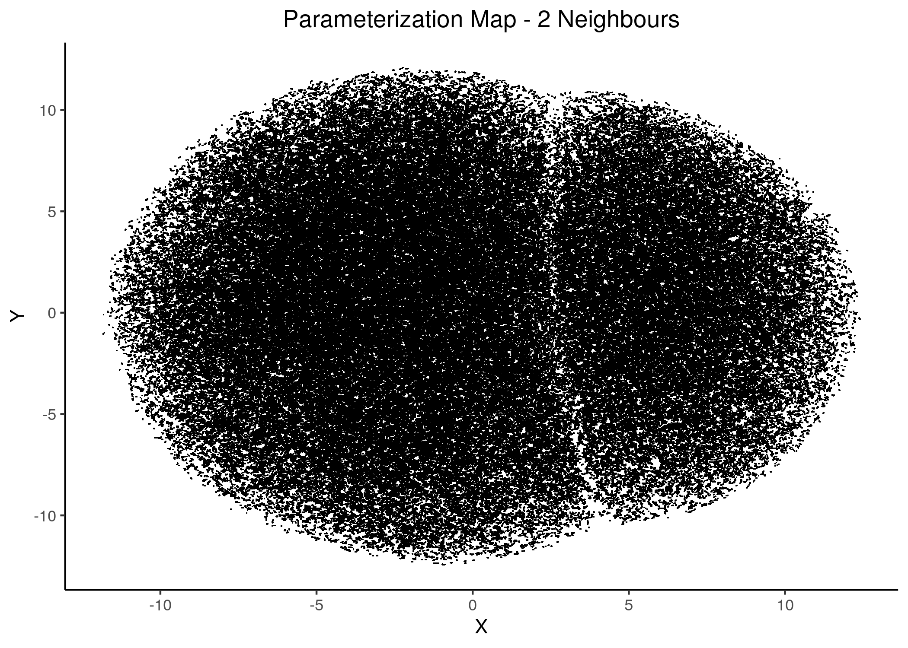
<p class="caption">(\#fig:param-maps-1ss-models-1)2D Parameterization map for 1 stable state models (2 and 3 neighbors)</p>
</div>


```r
knitr::include_graphics(path = "img/1ss_umap/1ss_umap_unsup_4.png")
knitr::include_graphics(path = "img/1ss_umap/1ss_umap_unsup_5.png")
```

<div class="figure">
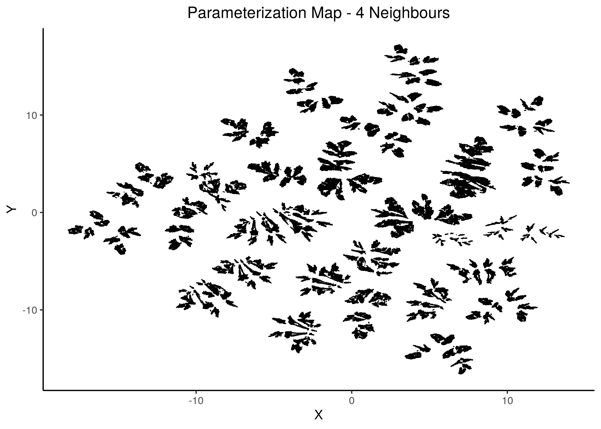
<p class="caption">(\#fig:param-maps-1ss-models-2)2D Parameterization map for 1 stable state models (4 and 5 neighbors)</p>
</div>


```r
knitr::include_graphics(path = "img/1ss_umap/1ss_umap_unsup_6.png")
knitr::include_graphics(path = "img/1ss_umap/1ss_umap_unsup_8.png")
```

<div class="figure">
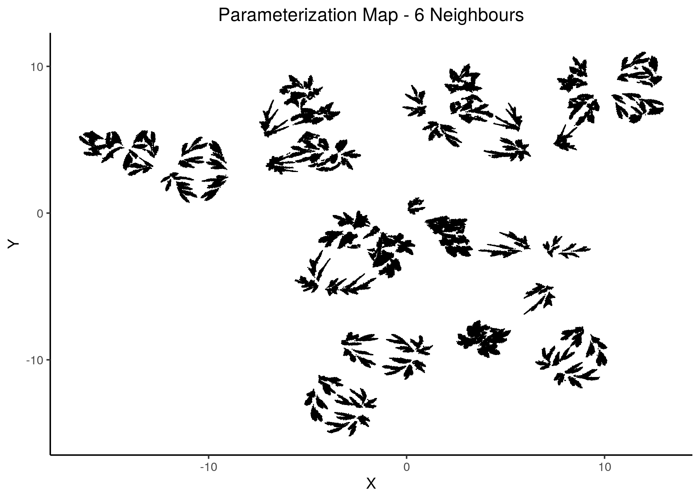
<p class="caption">(\#fig:param-maps-1ss-models-3)2D Parameterization map for 1 stable state models (6 and 8 neighbors)</p>
</div>


```r
knitr::include_graphics(path = "img/1ss_umap/1ss_umap_unsup_9.png")
knitr::include_graphics(path = "img/1ss_umap/1ss_umap_unsup_11.png")
```

<div class="figure">
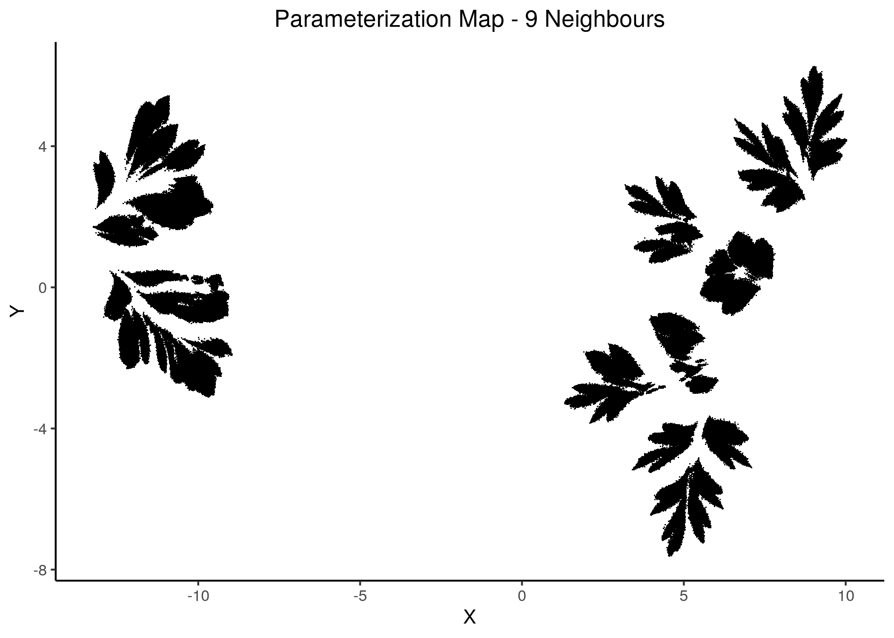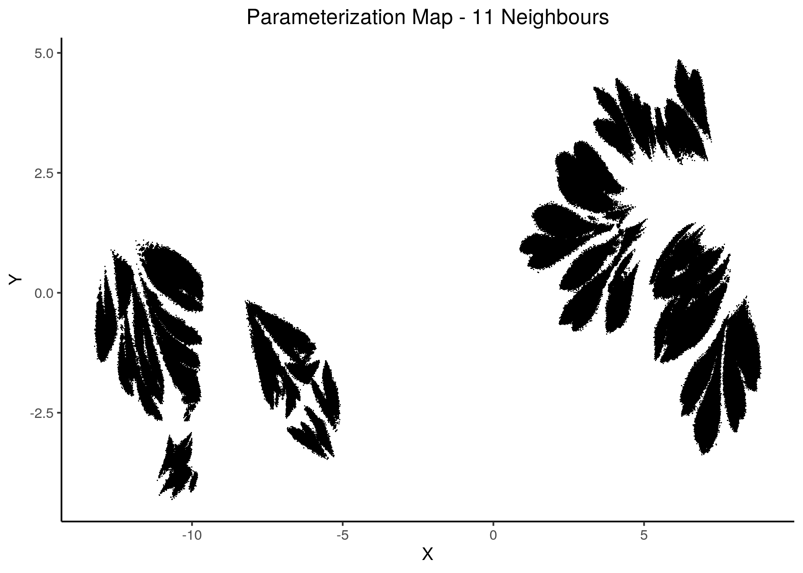
<p class="caption">(\#fig:param-maps-1ss-models-4)2D Parameterization map for 1 stable state models (9 and 11 neighbors)</p>
</div>


```r
knitr::include_graphics(path = "img/1ss_umap/1ss_umap_unsup_12.png")
knitr::include_graphics(path = "img/1ss_umap/1ss_umap_unsup_15.png")
```

<div class="figure">
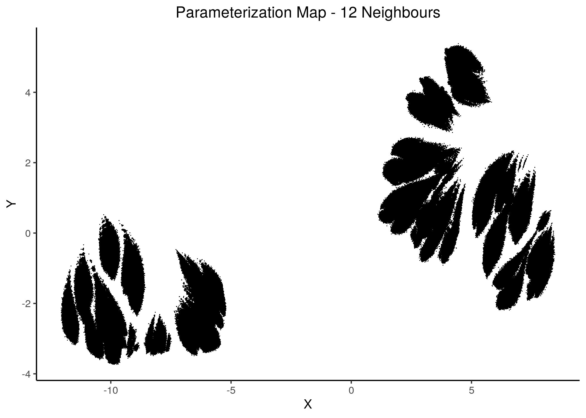
<p class="caption">(\#fig:param-maps-1ss-models-5)2D Parameterization map for 1 stable state models (12 and 15 neighbors)</p>
</div>

:::{.green-box}
We observe the existence of **two large families (superclusters) of parameterization models**, especially for more *global* views of the dataset ($\text{n_neighbors}\ge 8$).

**Distinct smaller sub-clusters of closely parameterized models** also manifest for different number of neighbors, which suggests that there is some order in the parameterization of the 1 stable state models (as exemplified by the UMAP method) across multiple visualization scales.
:::

## Gitsbe Models on the Map {-}

[Gitsbe](https://druglogics.github.io/druglogics-doc/gitsbe.html) uses a genetic algorithm approach to produce boolean models that are fitted to basal, biomarker training data.

We used Gitsbe and tested the produced models performance (ensemble-wise drug combination predictions) against synergy data from [@Flobak2015] in [another report](https://bblodfon.github.io/ags-paper-1/cascade-1-0-analysis.html).
The calibrated models performed very well in terms of both ROC and PR-AUC.

:::{.blue-box}
Here we want to check whether models produced by a method such as a genetic algorithm-based one **have similar parameterization** - i.e. they belong in the same neighbourhood in the parameterization map.
:::

We will use models from $1000$ gitsbe simulations, calibrated to steady state (a total of $3000$ models, choosing the best-fit models from each simulation).
The results are provided in [this data file](https://github.com/bblodfon/balance-paper/blob/master/data/cascade_1.0_ss_1000sim_fixpoints_hsa.tar.gz) and to reproduce them, follow the instructions [here](https://bblodfon.github.io/ags-paper-1/reproduce-data-simulation-results.html), keeping the default configuration options for CASCADE 1.0 and changing only the number of simulations to $1000$).

All the Gitsbe models had a large fitness to the steady state AGS data (their stable states fitting almost exactly the states of the manually-curated 24 nodes), as it can be seen from the next figure (see [gitsbe_models_fit.R](https://github.com/bblodfon/balance-paper/blob/master/scripts/gitsbe_models_fit.R)):

```r
knitr::include_graphics(path = "img/gitsbe_fit_density.png")
```

<div class="figure">
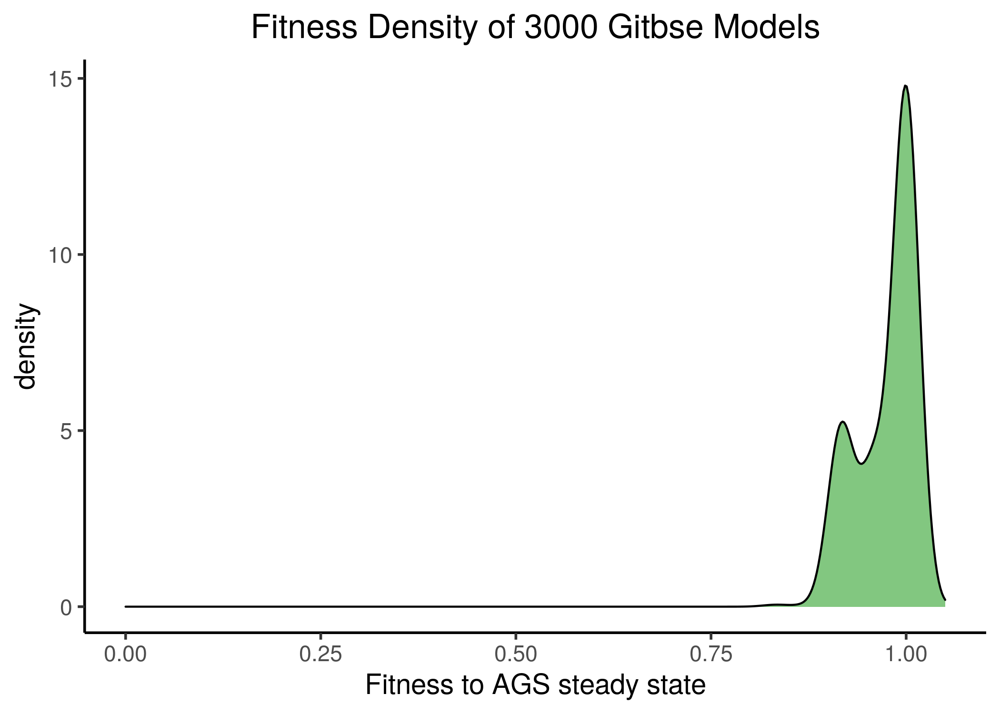
<p class="caption">(\#fig:gitbse-fit-fig)Gitsbe model fitness to AGS steady state</p>
</div>

To generate the next figures (same map, same gitsbe models, different number of neighbors) use the [gitsbe_model_embedding.R](https://github.com/bblodfon/balance-paper/blob/master/scripts/gitsbe_model_embedding.R):


```r
knitr::include_graphics(path = "img/gitsbe_umaps/2nn.png")
knitr::include_graphics(path = "img/gitsbe_umaps/4nn.png")
```

<div class="figure">
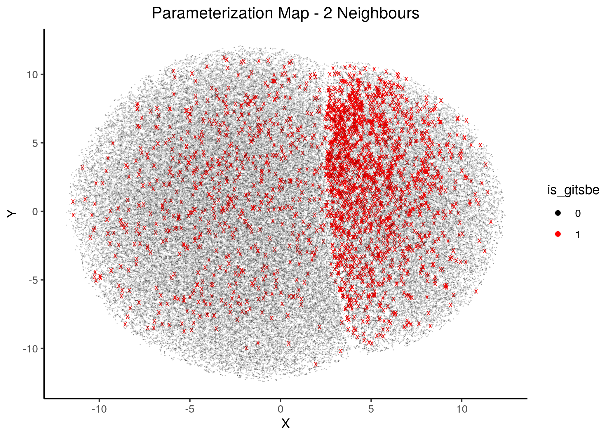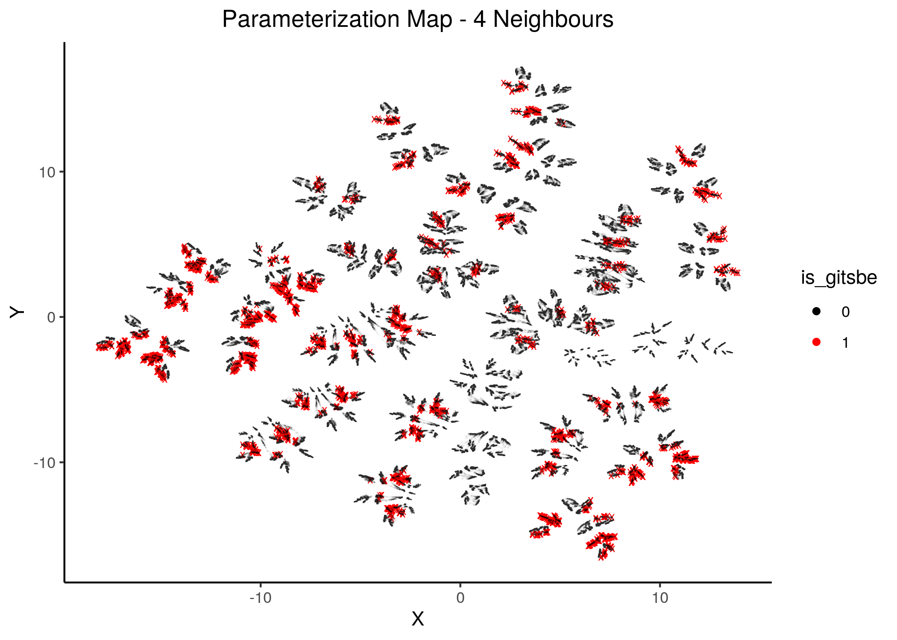
<p class="caption">(\#fig:gitsbe-maps-1)Gitsbe models in Parameterization map (2 and 4 neighbors)</p>
</div>


```r
knitr::include_graphics(path = "img/gitsbe_umaps/6nn.png")
knitr::include_graphics(path = "img/gitsbe_umaps/8nn.png")
```

<div class="figure">
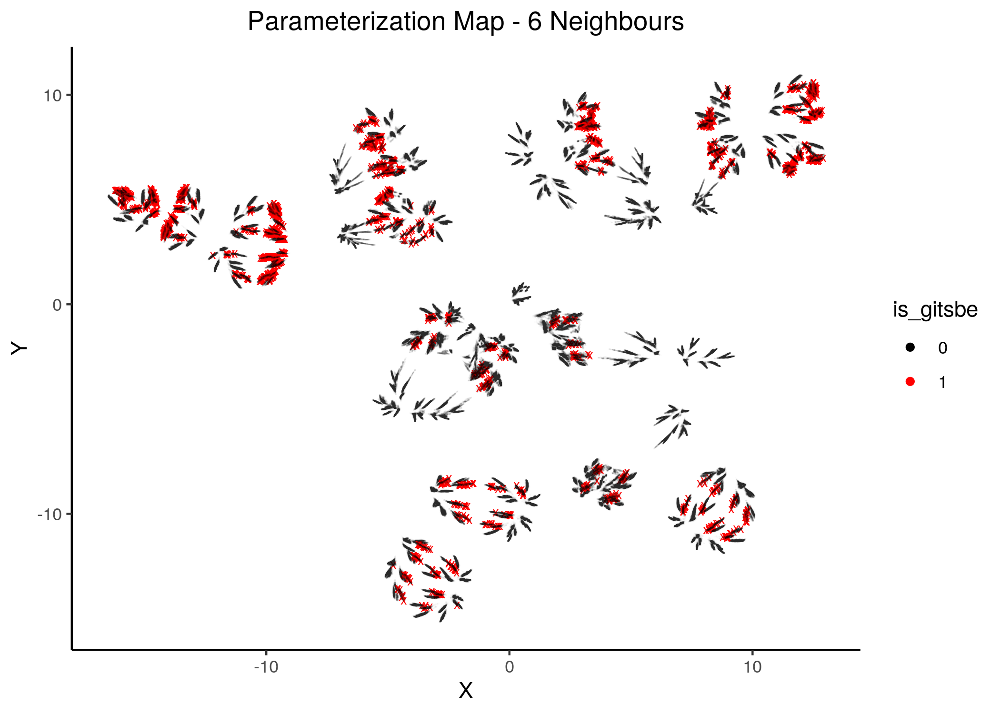
<p class="caption">(\#fig:gitsbe-maps-2)Gitsbe models in Parameterization map (6 and 8 neighbors)</p>
</div>


```r
knitr::include_graphics(path = "img/gitsbe_umaps/11nn.png")
knitr::include_graphics(path = "img/gitsbe_umaps/14nn.png")
```

<div class="figure">
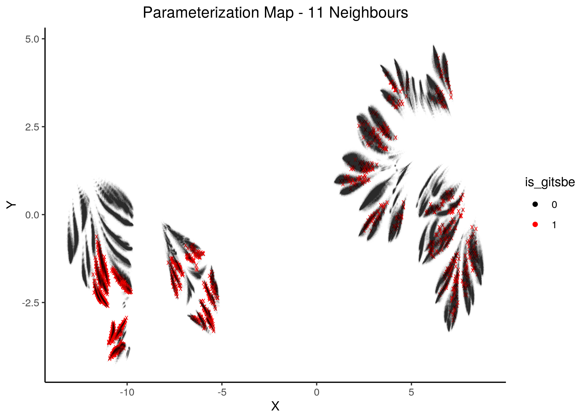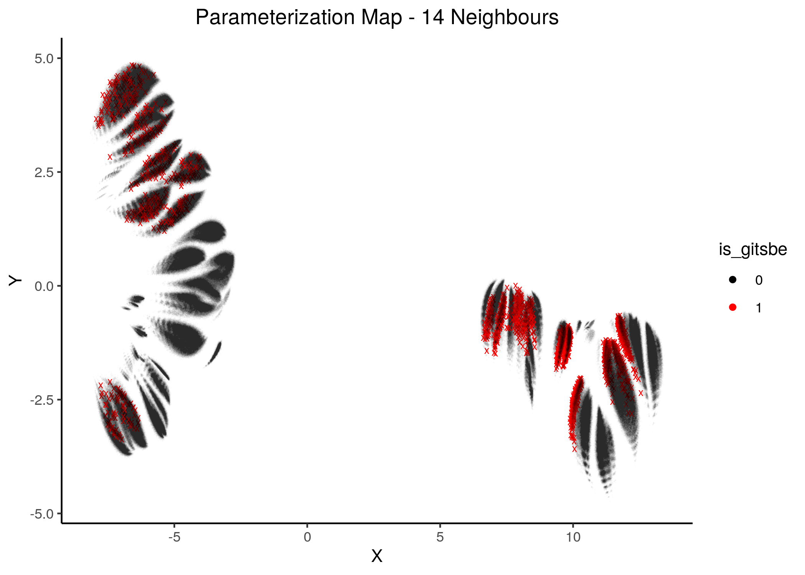
<p class="caption">(\#fig:gitsbe-maps-3)Gitsbe models in Parameterization map (11 and 14 neighbors)</p>
</div>

:::{.green-box}
Gitsbe-generated models that fit the basal biomarker steady state data for the AGS cell line have a **diverse structure that spans across the parameterization map** but nonetheless appear to gather in **smaller parameterization-specific sub-clusters** (better seen in the Figure with 14 neighbors which gives a more global view of the dataset).

Observing the distribution of the gitsbe models in the parameterization map, we see that most of them are being **placed at one of the two superclusters**.
:::

Of course, there are areas in the map that Gitsbe models do not cover, which may as well be high-performance model areas.
Since we have generated all possible link-operator models with CASCADE 1.0, we can proceed to generate a performance map atop the parameterization one and cross-check if the gitsbe models fall into high-performance areas or not.

## Performance Maps {-}

Every model generated via `abmlog` ([Model Stable State Statistics]) was tested against the synergy dataset of [@Flobak2015].
Among $21$ drug combinations, $4$ were found synergistic in that dataset, namely:
  

```r
obs_syn = emba::get_observed_synergies(file = "data/observed_synergies_cascade_1.0")
usefun::pretty_print_vector_values(obs_syn, vector.values.str = "synergies")
```

> 4 synergies: PI-PD, PI-5Z, PD-AK, AK-5Z

:::{.blue-box}
Using the [drabme](https://druglogics.github.io/druglogics-doc/drabme.html) software module, we tested every CASCADE 1.0 model against this dataset and got each model's predictions for each drug combination.
The *HSA* rule was used to define if a model is synergistic for a particular combination.
The results are available in the Zenodo dataset [](https://doi.org/10.5281/zenodo.4022783), file `cascade_1.0_hsa_fixpoints.tar.gz`.
As previously said, we are going to use the 1 stable state model predictions only.
:::

We used the emba R package [@Zobolas2020] to perform a biomarker analysis on the 1 stable state models dataset and their predictions from `drabme` (see script [emba_analysis.R](https://github.com/bblodfon/balance-paper/blob/master/scripts/emba_analysis.R)).
Part of the results from the emba analysis is the calculation of the **Matthews correlation coefficient (MCC) performance score** for each model.
We use these MCC model scores to draw the next figures (see [mcc_figures.R](https://github.com/bblodfon/balance-paper/blob/master/scripts/mcc_figures.R) script)

Splitting all the 1 stable state models to $4$ MCC classes we can see that **a lot of models have performance close to random prediction or even worse**:


```r
knitr::include_graphics(path = "img/mcc_hist.png")
knitr::include_graphics(path = "img/mcc_hist2.png")
```

<div class="figure">
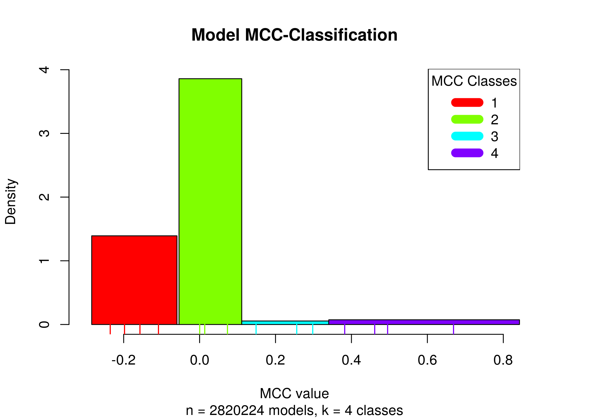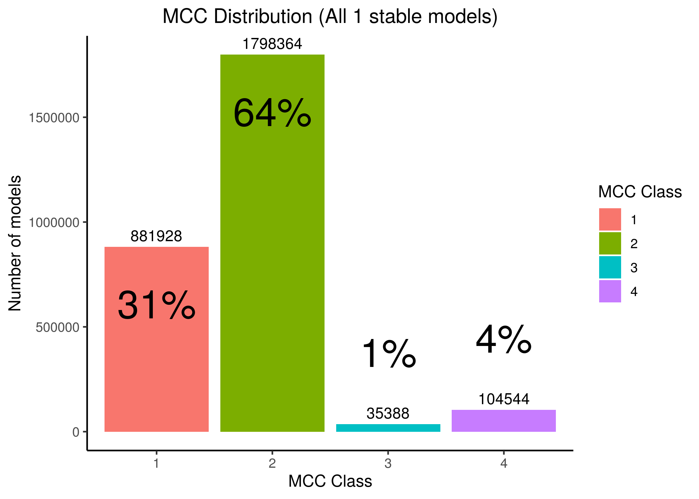
<p class="caption">(\#fig:mcc-histogram)MCC Classes Histograms</p>
</div>

:::{.green-box}
Most of the 1 stable state models have MCC performance close to random or worse, making it thus difficult for any algorithm to find the *best* performance models (i.e. the 3-4th MCC class models, which amounts to only $5\%$ of the total number of models with 1 stable state, given the standardized boolean equation parameterization inspired by [@Mendoza2006]).
:::

### Unsupervised UMAP {-}

If we draw the parameterization maps for different number of neighbors and **color the points/models according to their MCC score**, we get these images:


```r
knitr::include_graphics(path = "img/mcc_maps/2nn.png")
knitr::include_graphics(path = "img/mcc_maps/4nn.png")
```

<div class="figure">
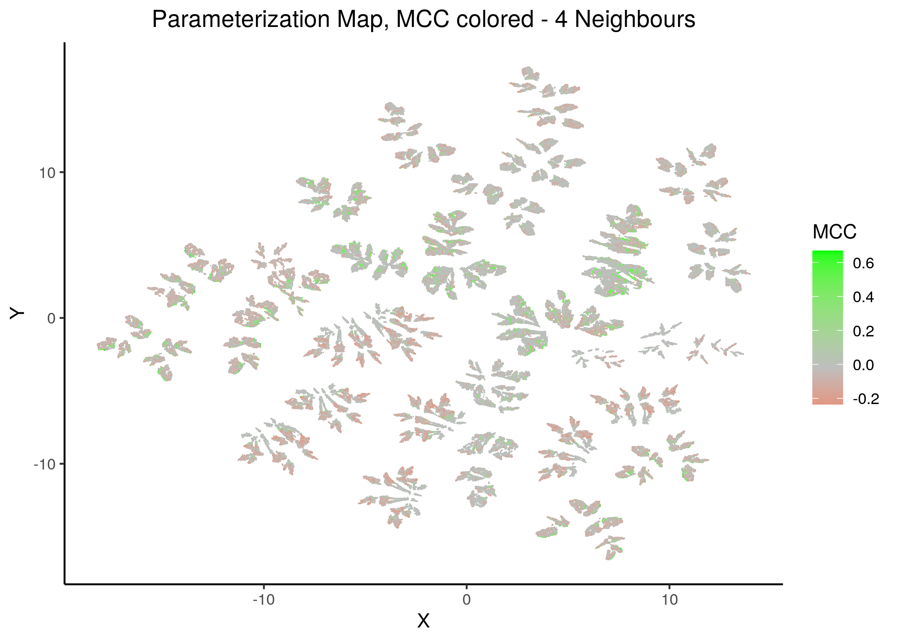
<p class="caption">(\#fig:mcc-maps-1)MCC Parameterization map (2 and 4 neighbors)</p>
</div>


```r
knitr::include_graphics(path = "img/mcc_maps/6nn.png")
knitr::include_graphics(path = "img/mcc_maps/8nn.png")
```

<div class="figure">
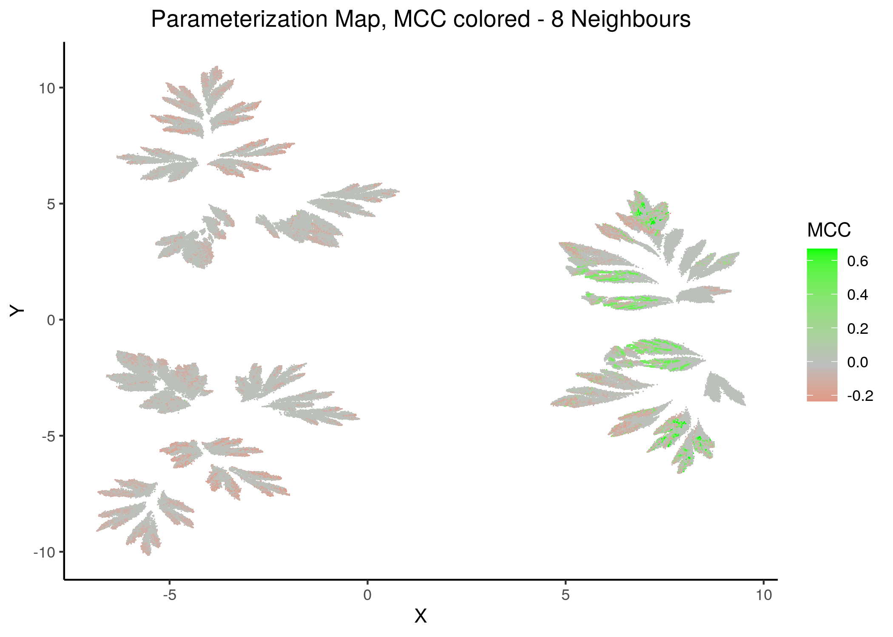
<p class="caption">(\#fig:mcc-maps-2)MCC Parameterization map (6 and 8 neighbors)</p>
</div>


```r
knitr::include_graphics(path = "img/mcc_maps/11nn.png")
knitr::include_graphics(path = "img/mcc_maps/14nn.png")
```

<div class="figure">
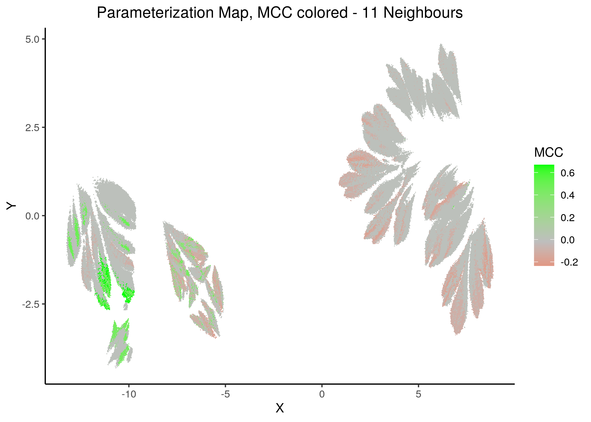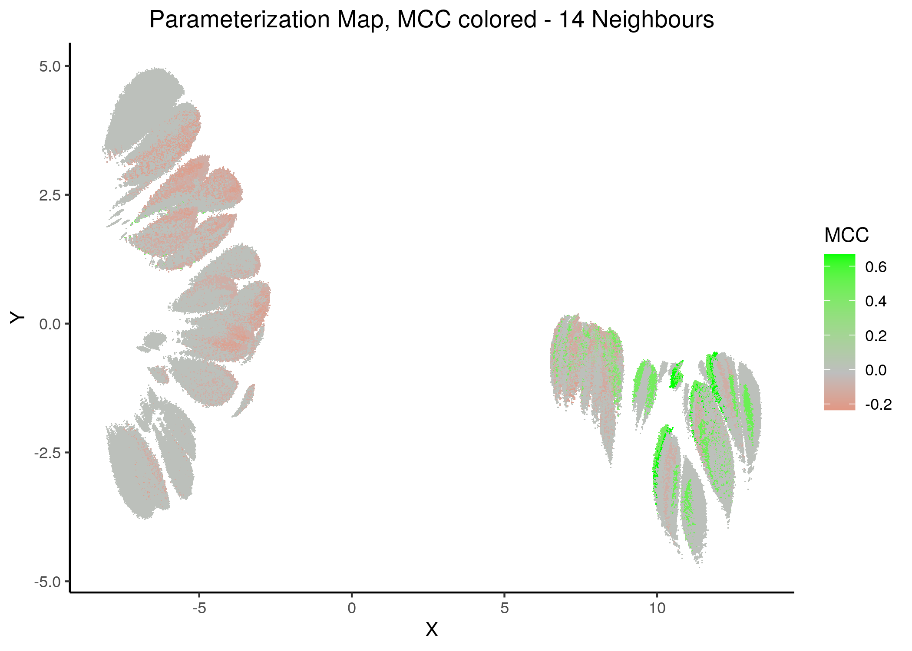
<p class="caption">(\#fig:mcc-maps-3)MCC Parameterization map (11 and 14 neighbors)</p>
</div>

:::{.green-box}
We observe that the two large parameterization superclusters (especially outlined by the figures with $2$ and $\ge 8$ neighbors) are closely related with the MCC performance metric.
Specifically, these **2 superclusters dichotomize the models performance landscape** into 2 areas, where only one of them has the majority of good performance models (i.e. those that have an MCC score $>0$).

Also, we observe that closely parameterized models tend to have same performance (**existence of smaller parameterization clusters of same performance models**).
:::

:::{.orange-box}
Comparing the corresponding **Gitsbe parameterization maps with the MCC maps**, we can clearly verify now that the Gitsbe models **might not always be the best performing ones** (in terms of MCC score) since they appear in both superclusters (and that's only a first-fine measure for determining performance based on structure) - but at least they **tend to be more in the higher performance supercluster**.

Reasons why the gitsbe models are not always on the high-performance supercluster can be justified by:

- The nature of the genetic algorithm, which is a *heuristic* method and as such produces *local* optima
- The training dataset does not provide enough *constraints* for the optimization problem, i.e. more steady state nodes are needed to be fitted in the models stable state which will result in models with more strict parameterization patterns
- A combination of the two above
:::

### Supervised UMAP {-}

:::{.blue-box}
We perform **supervised dimension reduction** using UMAP on the 1 stable state model dataset. 
The only difference with the previous performance maps is that we provide UMAP (as an input) the information of the models performance (the MCC score) and not just overlay it (via coloring) afterwards.

The main thing we want to answer here is **if UMAP can do a better job placing the models on the map**, given additional information about their performance.
:::

We tried UMAP with different *number of neighbors* (from local to a more global view of the dataset), *target weight* (weighting factor between data topology ($0$) and target/response topology ($1$) or somewhere in between) and setting the response either to the MCC score as a continuous, numeric value or to the MCC classes (discrete variable) as [shown above](#fig:mcc-histogram).
See script [mcc_sumap.R](https://github.com/bblodfon/balance-paper/blob/master/scripts/mcc_sumap.R) for more details.

First, we show some maps, where the response **MCC was treated as a continuous variable**:

```r
knitr::include_graphics(path = "img/mcc_sumaps/4nn_0w.png")
knitr::include_graphics(path = "img/mcc_sumaps/4nn_0.5w.png")
knitr::include_graphics(path = "img/mcc_sumaps/4nn_1w.png")
```

<div class="figure">
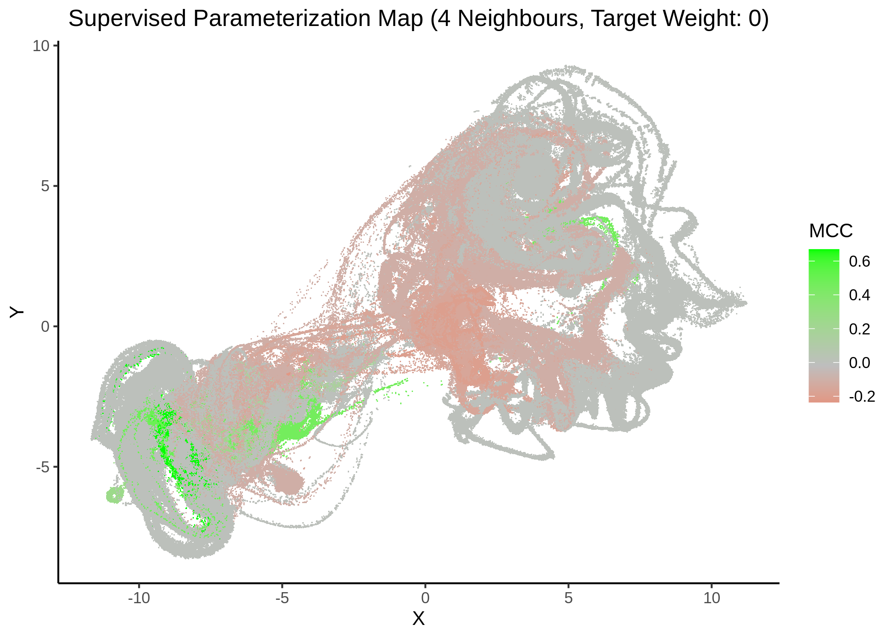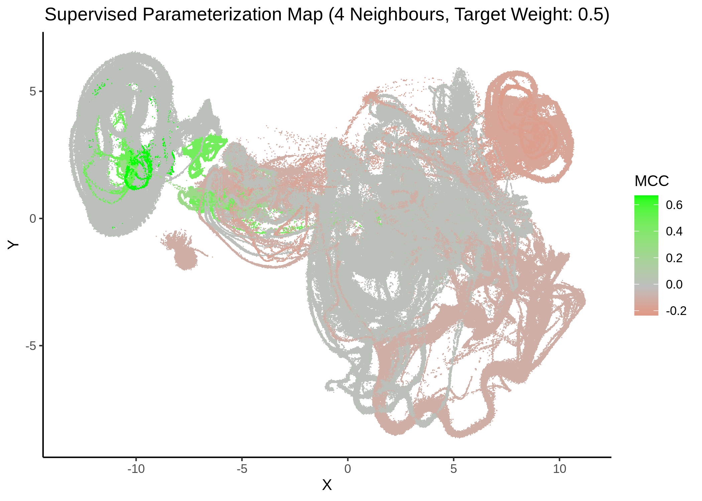
<p class="caption">(\#fig:mcc-sumaps-1)MCC Parameterization map (4 neighbors, MCC continuous)</p>
</div>


```r
knitr::include_graphics(path = "img/mcc_sumaps/14nn_0.5w.png")
knitr::include_graphics(path = "img/mcc_sumaps/14nn_1w.png")
```

<div class="figure">
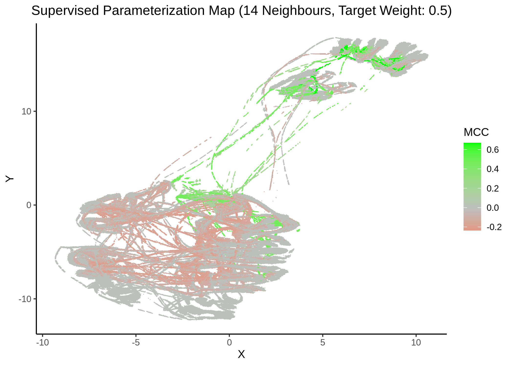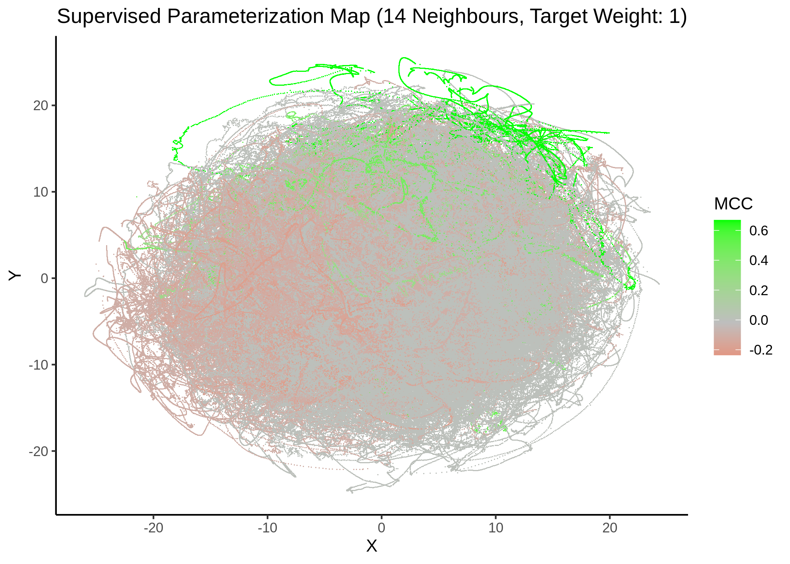
<p class="caption">(\#fig:mcc-sumaps-2)MCC Parameterization map (14 neighbors, MCC continuous)</p>
</div>


```r
knitr::include_graphics(path = "img/mcc_sumaps/20nn_0.5w.png")
knitr::include_graphics(path = "img/mcc_sumaps/20nn_1w.png")
```

<div class="figure">
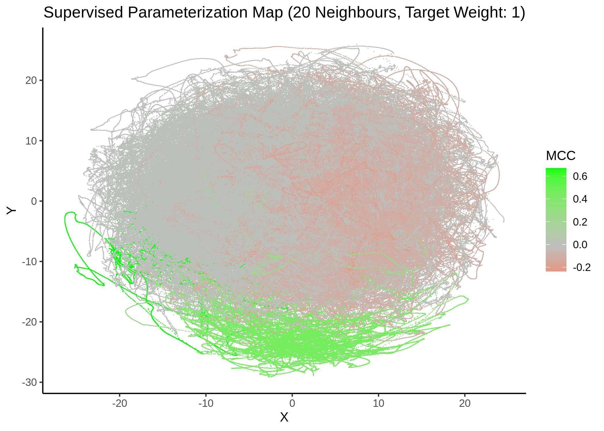
<p class="caption">(\#fig:mcc-sumaps-3)MCC Parameterization map (20 neighbors, MCC continuous)</p>
</div>

:::{.green-box}
Very artistic and knotty figures!
UMAP achieves some sort of distinction between the different MCC values, especially when the topology is heavily based on the response MCC value (*target weight* is $1$)
:::

Next, we show some maps, where the response **MCC was treated as a categorical variable**, denoting the MCC class the models belong to (higher the better):

```r
knitr::include_graphics(path = "img/mcc_sumaps/class/4nn_0.5w_class.png")
knitr::include_graphics(path = "img/mcc_sumaps/class/6nn_0.5w_class.png")
```

<div class="figure">
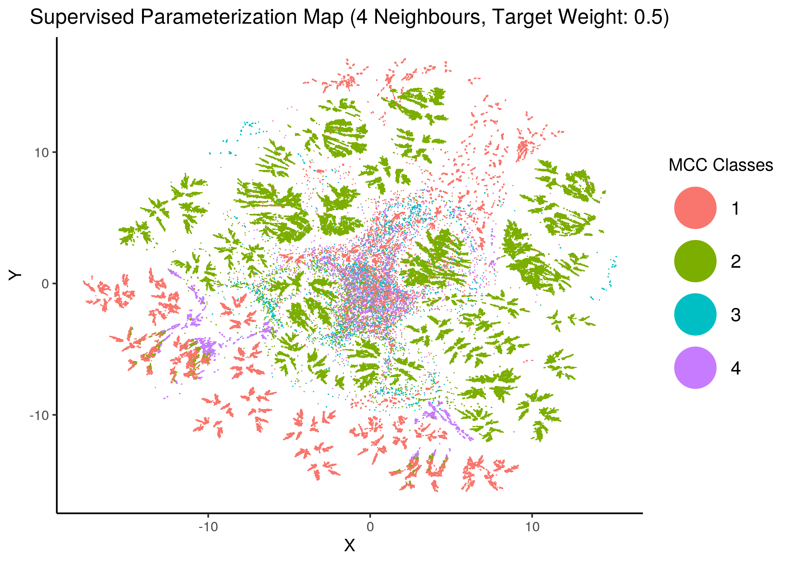
<p class="caption">(\#fig:mcc-sumaps-4)MCC Parameterization map (4 and 6 neighbors, MCC Classes)</p>
</div>


```r
knitr::include_graphics(path = "img/mcc_sumaps/class/8nn_0.5w_class.png")
knitr::include_graphics(path = "img/mcc_sumaps/class/10nn_0.5w_class.png")
```

<div class="figure">
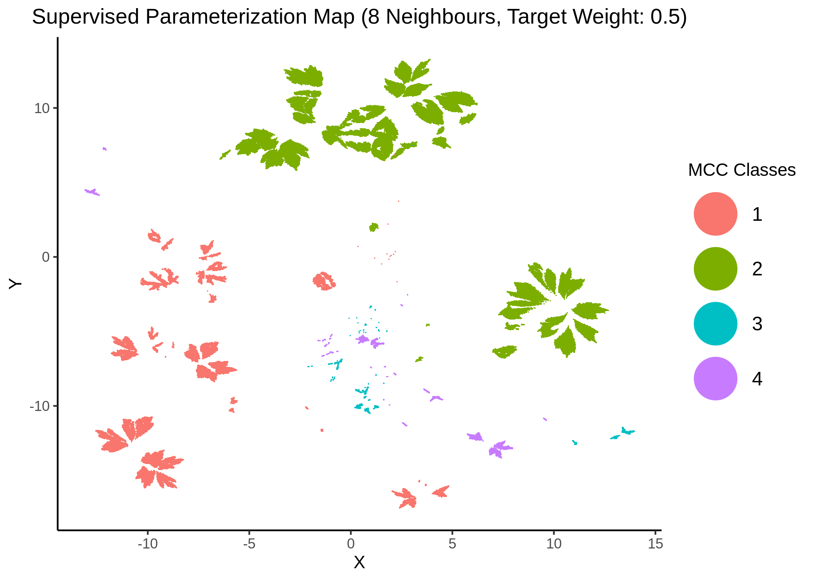
<p class="caption">(\#fig:mcc-sumaps-5)MCC Parameterization map (8 and 10 neighbors, MCC Classes)</p>
</div>


```r
knitr::include_graphics(path = "img/mcc_sumaps/class/14nn_0w_class.png")
knitr::include_graphics(path = "img/mcc_sumaps/class/14nn_0.5w_class.png")
knitr::include_graphics(path = "img/mcc_sumaps/class/14nn_1w_class.png")
```

<div class="figure">

<p class="caption">(\#fig:mcc-sumaps-6)MCC Parameterization map (14 neighbors, MCC Classes)</p>
</div>

:::{.green-box}
We observe that the higher the number of neighbors is ($\ge 10$), the better UMAP classifies the models to distinct (super-) clusters representing the different MCC classes.
:::

## Performance vs Fitness {-}

:::{.blue-box}
We try to see if there is any correlation between **performance (MCC)** and **fitness to the AGS steady state** ($24$ nodes) for the 1 stable state CASCADE 1.0 models.

Use the [fit_figures.R](https://github.com/bblodfon/balance-paper/blob/master/scripts/fit_figures.R) script to reproduce the figures.
:::

First, we check that the fitness density of all 1 stable state models covers the whole *fitness spectrum*.
As we can see in the figure below, most of the models have **at least half of the nodes** in the same state as in the AGS steady state:

```r
knitr::include_graphics(path = "img/1ss_models_fit_density.png")
```

<div class="figure">

<p class="caption">(\#fig:1ss-models-fit-density-fig)All 1 stable state models fitness to AGS steady state</p>
</div>

We follow the same classification scheme as [above](#fig:mcc-histogram), i.e. splitting the 1 stable models to $4$ MCC classes and comparing the fitness scores between these classes:

```r
knitr::include_graphics(path = "img/mcc_vs_fit.png")
```

<div class="figure">

<p class="caption">(\#fig:fit-vs-perf-fig)MCC performance vs Fitness to AGS steady state (All 1 stable state models)</p>
</div>

:::{.green-box}
The last MCC class has a **statistically significant higher median fitness** to the AGS steady state compared to all other lower MCC classes, even though the correlation between fitness and performance is not linear and most of the models have a fitness higher than $0.5$.

The last two figures points us to the fact that more constraints are needed for the fitness calculation of the Gitsbe genetic algorithm or any other for that matter (i.e. more nodes in the AGS steady state - now only $24/77=31\%$ is included) in order to define more restrictive parameterized models that would allow a much more *uniform* fitness density spectrum (or at least **not skewed towards the higher fitness values**).
Such fitness spectrum would (hopefully) allow for more granularity in the corresponding performance behaviour between the different MCC classes, and thus more distinctive correlation.
:::

## Fitness Maps {-}

If we draw the parameterization maps for different number of neighbors and **color the points/models according to their fitness to the AGS steady state**, we get these images (see [fit_figures.R](https://github.com/bblodfon/balance-paper/blob/master/scripts/fit_figures.R) script):


```r
knitr::include_graphics(path = "img/fit_maps/2nn.png")
knitr::include_graphics(path = "img/fit_maps/4nn.png")
```

<div class="figure">

<p class="caption">(\#fig:fit-maps-1)Fitness Parameterization map (2 and 4 neighbors)</p>
</div>


```r
knitr::include_graphics(path = "img/fit_maps/6nn.png")
knitr::include_graphics(path = "img/fit_maps/8nn.png")
```

<div class="figure">

<p class="caption">(\#fig:fit-maps-2)Fitness Parameterization map (6 and 8 neighbors)</p>
</div>


```r
knitr::include_graphics(path = "img/fit_maps/11nn.png")
knitr::include_graphics(path = "img/fit_maps/14nn.png")
```

<div class="figure">

<p class="caption">(\#fig:fit-maps-3)Fitness Parameterization map (11 and 14 neighbors)</p>
</div>

:::{.green-box}
Higher fitness models manifest in both superclusters, suggesting again the need for more nodes in the training data (AGS steady state).
Also, closely parameterized models tend to have same fitness (**existence of smaller parameterization clusters of same fitness models**).

No apparent correlation can be observed between fitness and performance (MCC) maps.
:::

## Performance biomarkers {-}

:::{.blue-box}
We assess **important nodes (biomarkers)** whose *activity* and/or link-operator (*parameterization*) affects the models performance in terms of the achieved MCC score.
:::

### emba biomarkers {-}

We use the `emba` results with $4$ MCC classes (see script [emba_analysis.R](https://github.com/bblodfon/balance-paper/blob/master/scripts/emba_analysis.R) and MCC classification histograms [above](#fig:mcc-histogram)).
What emba [@Zobolas2020] does is to group the models to $4$ MCC Classes and compare the average stable state activities and link operator values for each node between **every possible pair of MCC classes**.
Nodes that have **higher average differences** (either positively or negatively and between any comparison pair) are considered as **more important** and are thus annotated as *biomarkers* based on a given threshold.

In the next heatmap, a positive (resp. negative) state difference for a node denotes that its activity value was larger (resp. lower) in the higher MCC class of the corresponding comparison pair:

```r
mcc_res = readRDS(file = "data/emba_mcc_res/mcc_4_res.rds")

# color some important nodes and lower the threshold
activity_biomarkers = emba::get_biomarkers(mcc_res$diff.state.mcc.mat, threshold = 0.48)

imp_nodes_colors = rep("black", ncol(mcc_res$diff.state.mcc.mat))
names(imp_nodes_colors) = colnames(mcc_res$diff.state.mcc.mat)
imp_nodes_colors[names(imp_nodes_colors) %in% activity_biomarkers$biomarkers.pos] = "green4"
imp_nodes_colors[names(imp_nodes_colors) %in% activity_biomarkers$biomarkers.neg] = "red4"

# define coloring function of state differences
col_fun = circlize::colorRamp2(c(min(mcc_res$diff.state.mcc.mat), 0, max(mcc_res$diff.state.mcc.mat)), 
  c("red", "white", "green"))

set.seed(42)
state_heat = ComplexHeatmap::Heatmap(matrix = mcc_res$diff.state.mcc.mat, 
  name = "State Difference", col = col_fun,
  row_title = "MCC Classes Pairs", row_names_side = "left", 
  row_title_side = "left", row_dend_side = "right",
  column_title = "Average State Differences between MCC Classes", 
  column_names_gp = gpar(fontsize = 6, col = imp_nodes_colors),
  heatmap_legend_param = list(direction = "horizontal"))

biomarkers_legend = Legend(title = "Activity State Biomarkers",
  labels = c("Active", "Inhibited"),
  legend_gp = gpar(fill = c("green4", "red4")))

draw(state_heat, annotation_legend_list = biomarkers_legend, 
  heatmap_legend_side = "bottom", annotation_legend_side = "bottom", 
  merge_legend = TRUE)
```

<div class="figure" style="text-align: center">

<p class="caption">(\#fig:emba-activity-biomarkers)Heatmap of Average State Differences (emba, 4 MCC Classes)</p>
</div>

So, the following nodes are identified as *active* biomarkers (they tend to be active in the higher performance models):

```r
usefun::pretty_print_vector_values(activity_biomarkers$biomarkers.pos)
```

> 7 nodes: MAP3K7, GRAP2, MAP2K7, MAP2K3, TAB_f, ERK_f, NLK

and the following as *inhibited* biomarkers:

```r
usefun::pretty_print_vector_values(activity_biomarkers$biomarkers.neg)
```

> 1 node: MAPK14

Note that some nodes tend to have either no actual state differences between the MCC classes (so they are not important) or they take both negative and positive differences between the different MCC class pair comparisons (without surpassing the given threshold, so also not important for us here).


```r
# color some important nodes and lower the threshold
param_biomarkers = emba::get_biomarkers(mcc_res$diff.link.mcc.mat, threshold = 0.48)

imp_nodes_colors = rep("black", ncol(mcc_res$diff.link.mcc.mat))
names(imp_nodes_colors) = colnames(mcc_res$diff.link.mcc.mat)
imp_nodes_colors[names(imp_nodes_colors) %in% param_biomarkers$biomarkers.pos] = "green4"
imp_nodes_colors[names(imp_nodes_colors) %in% param_biomarkers$biomarkers.neg] = "red4"

# define coloring function of state differences
col_fun = circlize::colorRamp2(c(min(mcc_res$diff.link.mcc.mat), 0, max(mcc_res$diff.link.mcc.mat)), 
  c("red", "white", "green"))

set.seed(42)
state_heat = ComplexHeatmap::Heatmap(matrix = mcc_res$diff.link.mcc.mat, 
  name = "LO Difference", col = col_fun,
  row_title = "MCC Classes Pairs", row_names_side = "left", 
  row_title_side = "left", row_dend_side = "right",
  column_title = "Average Link Operator Differences between MCC Classes", 
  column_names_gp = gpar(fontsize = 11, col = imp_nodes_colors),
  heatmap_legend_param = list(direction = "horizontal"))

biomarkers_legend = Legend(title = "Link Operator Biomarkers",
  labels = c("OR-NOT (1)", "AND-NOT (0)"),
  legend_gp = gpar(fill = c("green4", "red4")))

draw(state_heat, annotation_legend_list = biomarkers_legend, 
  heatmap_legend_side = "bottom", annotation_legend_side = "bottom", 
  merge_legend = TRUE)
```

<div class="figure" style="text-align: center">

<p class="caption">(\#fig:emba-lo-biomarkers)Heatmap of Average Link Operator Differences (emba, 4 MCC Classes)</p>
</div>

:::{.green-box}
We observe that `ERK_f` will have the `OR-NOT` link operator in most of the higher performance models and the `MAPK14` the `AND-NOT` link operator.
This of course relates to the fact that these nodes were found also as *active* and *inhibited* biomarkers respectively and that they have a very large observed agreement between stable state activity value and link operator parameterization (see [Figure above](#fig:ss-lo-agreement-prop)).

Interestingly, these two nodes (`ERK_f` and `MAPK14`) were 2 of the top most important nodes influencing the change of dynamics (number of attractors) in the link operator parameterization space of the CASCADE 1.0 network.
:::

### Random Forest biomarkers {-}

We use the `ranger` R package [@Wright2017] to find **important nodes/variables** that determine the difference in performance (MCC score) between the input models.
Both the stable state data as well the link operator parameterization data will be used as training sets (see the script [perf_biomarkers_ranger.R](https://github.com/bblodfon/balance-paper/blob/master/scripts/perf_biomarkers_ranger.R)).


```r
ranger_ss_mcc_res = readRDS(file = "data/ss_mcc_ranger_res.rds")

imp_ss_rf = tibble(nodes = names(ranger_ss_mcc_res$variable.importance), 
  gini_index = ranger_ss_mcc_res$variable.importance)

# color first 12 nodes in x axis
imp_col = c(rep("green4", 14), rep("grey30", nrow(imp_ss_rf) - 14))

imp_ss_rf %>% 
  mutate(nodes = forcats::fct_reorder(nodes, desc(gini_index))) %>%
  ggplot(aes(x = nodes, y = gini_index, fill = gini_index)) +
    geom_bar(stat = "identity", show.legend = FALSE) +
    scale_fill_gradient(low = "steelblue", high = "red") +
    theme_classic(base_size = 14) + 
    theme(axis.text.x = element_text(angle = 90, size = 7, colour = imp_col)) +
    labs(title = "RF Importance for MCC Classification (stable states)", 
      x = "Nodes", y = "Mean Decrease in Node Impurity")
```

<div class="figure" style="text-align: center">

<p class="caption">(\#fig:rf-mcc-state-imp)Random Forest Important Nodes for Performance Classification (MCC) based on stable state data</p>
</div>

:::{.green-box}
We observe a lot of common important activity biomarkers (important nodes) between the random forest results and the `emba` results: `ERK_f`,`MAP3K7`,`MAP2K7`,`NLK`,`TAB_f` to name a few.
:::


```r
ranger_lo_mcc_res = readRDS(file = "data/lo_mcc_ranger_res.rds")

imp_lo_rf = tibble(nodes = names(ranger_lo_mcc_res$variable.importance), 
  gini_index = ranger_lo_mcc_res$variable.importance)

# color first 8 nodes in x axis
imp_col = c(rep("green4", 8), rep("grey30", nrow(imp_lo_rf) - 8))

imp_lo_rf %>% 
  mutate(nodes = forcats::fct_reorder(nodes, desc(gini_index))) %>%
  ggplot(aes(x = nodes, y = gini_index, fill = gini_index)) +
    geom_bar(stat = "identity", show.legend = FALSE) +
    scale_fill_gradient(low = "steelblue", high = "red") +
    theme_classic(base_size = 14) + 
    theme(axis.text.x = element_text(angle = 90, size = 12, colour = imp_col)) +
    labs(title = "RF Importance for MCC Classification (parameterization)", 
      x = "Nodes", y = "Mean Decrease in Node Impurity")
```

<div class="figure" style="text-align: center">

<p class="caption">(\#fig:rf-mcc-param-imp)Random Forest Important Nodes for Performance Classification (MCC) based on link operator data)</p>
</div>

:::{.green-box}
`ERK_f` is a major link operator biomarker in both `emba` and random forest results
:::

### emba vs RF Results {-}

We check the correlation between `emba` (sum of absolute state differences for all comparison pairs per node, i.e. summing up the absolute values of the columns in the heatmaps above) and random forest (Gini Index) results:

```r
# compute total emba importance
imp_ss_emba = mcc_res$diff.state.mcc.mat %>% abs() %>% colSums()
imp_lo_emba = mcc_res$diff.link.mcc.mat %>% abs() %>% colSums()

# make sure it's in the same order
imp_ss_emba = imp_ss_emba[imp_ss_rf %>% pull(nodes)]
imp_lo_emba = imp_lo_emba[imp_lo_rf %>% pull(nodes)]

imp_ss_rf %>% add_column(emba_score = imp_ss_emba) %>%
  ggplot(aes(x = emba_score, y = gini_index)) +
    geom_point() +
    geom_smooth(formula = y ~ x, method = "lm") + 
    ggpubr::stat_cor(method = "kendall", cor.coef.name = "tau") +
    theme_classic() +
    labs(title = "Random Forest vs emba variable importance results (Activity State)",
      x = "emba (Sum of absolute state differences)", y = "RF (Gini Index)")

imp_lo_rf %>% add_column(emba_score = imp_lo_emba) %>%
  ggplot(aes(x = emba_score, y = gini_index)) +
    geom_point() +
    geom_smooth(formula = y ~ x, method = "lm") + 
    ggpubr::stat_cor(method = "kendall", cor.coef.name = "tau") +
    theme_classic() +
    labs(title = "Random Forest vs emba variable importance results (Parameterization)",
      x = "emba (Sum of absolute link operator differences)", y = "RF (Gini Index)")
```

<div class="figure">

<p class="caption">(\#fig:cor-emba-rf)Correlation between emba and Random Forest Importance Results</p>
</div>

:::{.green-box}
- We use the non-parametric Kendall correlation method and it's rank-based correlation coefficient, $\tau$.
- There is **a correlation between the importance results from the two different methods**, even though the `emba` results are more *artificially-made* (like adding up absolute coefficient scores from linear models as a measure of importance) compared to the impurity metric which is a *built-in* feature of the tree-based algorithms such as random forests.
As a result for example, we observe a much greater granularity of the importance measurements in the activity state correlation figure.
- `emba` results are **more verbose** though in the sense that they allow *directionality* in their interpretation: we get which nodes must be activated or inhibited in the higher performance models or which should be parameterized with `OR-NOT` or `AND-NOT`, information which the random forests do not provide.
- **Larger correlation** is observed **for the activity state** compared to the parameterization results.
:::

### Embedding Link Operator Biomarkers in the Map {-}

:::{.blue-box}
Using as a base the **performance parameterization maps (supervised and unsupervised)** for the 1 stable state models, we color the points (models) according to the **link operator value** of some of the **performance biomarker** that we found in the previous analysis using `emba` and random forests.
:::

We give some examples of how the distribution of link-operator values looks like in the parameterization maps for the more important nodes (e.g. `ERK_f`, `MAPK14`) but also for the least important ones (e.g. `CYCS`, `CFLAR`).
See the script [perf_biomarkers_embedding.R](https://github.com/bblodfon/balance-paper/blob/master/scripts/perf_biomarkers_embedding.R) for more details.
All the produced images by the script are accessible [here](https://github.com/bblodfon/balance-paper/blob/master/img/nodes_lo_maps).

Using as a base the **unsupervised parameterization MAP with 14 neighbors**, we have:

```r
knitr::include_graphics(path = "img/nodes_lo_maps/unsup_MAPK14.png")
knitr::include_graphics(path = "img/nodes_lo_maps/unsup_ERK_f.png")
knitr::include_graphics(path = "img/nodes_lo_maps/unsup_CFLAR.png")
knitr::include_graphics(path = "img/nodes_lo_maps/unsup_CYCS.png")
```

<div class="figure">

<p class="caption">(\#fig:nodes-lo-maps-1)MCC Unsupervised Parameterization maps colored by link-operator values of different performance biomarkers</p>
</div>

Using as a base the **supervised parameterization MAP with 14 neighbors (MCC as continuous variable)**, we have:

```r
knitr::include_graphics(path = "img/nodes_lo_maps/sup_cont_MAPK14.png")
knitr::include_graphics(path = "img/nodes_lo_maps/sup_cont_ERK_f.png")
knitr::include_graphics(path = "img/nodes_lo_maps/sup_cont_CFLAR.png")
knitr::include_graphics(path = "img/nodes_lo_maps/sup_cont_CYCS.png")
```

<div class="figure">

<p class="caption">(\#fig:nodes-lo-maps-2)MCC Supervised Parameterization maps (MCC continuous) colored by link-operator values of different performance biomarkers</p>
</div>

Using as a base the **supervised parameterization MAP with 14 neighbors (MCC as discrete class variable)**, we have:

```r
knitr::include_graphics(path = "img/nodes_lo_maps/sup_MAPK14.png")
knitr::include_graphics(path = "img/nodes_lo_maps/sup_ERK_f.png")
knitr::include_graphics(path = "img/nodes_lo_maps/sup_CFLAR.png")
knitr::include_graphics(path = "img/nodes_lo_maps/sup_CYCS.png")
```

<div class="figure">

<p class="caption">(\#fig:nodes-lo-maps-3)MCC Supervised Parameterization maps (MCC discrete) colored by link-operator values of different performance biomarkers</p>
</div>

:::{.green-box}
We observe that both in the unsupervised parameterization maps and the MCC-supervised ones (especially the continuous one), **the less important a node is, the more chaotically it's link operator value manifests across the map**.
:::

## Synergy Maps {-}

As stated in a [previous section](#performance-maps), the CASCADE 1.0 models produced by `abmlog` were tested for synergy against the drug combination dataset in @Flobak2015.
Using the *HSA* method to define a drug combination as synergistic or not (antagonistic), we first present some useful statistics:

```r
knitr::include_graphics(path = 'img/synergy_stats.png')
```

<div class="figure">

<p class="caption">(\#fig:syn-stats)Synergy Statistics across all CASCADE 1.0 models with 1 stable state</p>
</div>

:::{.orange-box}
For the 'NA' models, either one of the two single-drug perturbed models or the double-perturbed model, did not have any fixpoint attractors.
:::

We observe that **only a very few models** (compared to the total parameterization space) can predict the observed drug combinations as *synergistic*.
This can be visualized also in the next synergy maps:


```r
knitr::include_graphics(path = "img/synergy_maps/AK-5Z_2nn.png")
knitr::include_graphics(path = "img/synergy_maps/AK-5Z_14nn.png")
```

<div class="figure">

<p class="caption">(\#fig:syn-maps-1)AK-PZ Synergy Parameterization Maps</p>
</div>


```r
knitr::include_graphics(path = "img/synergy_maps/PD-AK_2nn.png")
knitr::include_graphics(path = "img/synergy_maps/PD-AK_14nn.png")
```

<div class="figure">

<p class="caption">(\#fig:syn-maps-2)PD-AK Synergy Parameterization Maps</p>
</div>


```r
knitr::include_graphics(path = "img/synergy_maps/PI-PD_2nn.png")
knitr::include_graphics(path = "img/synergy_maps/PI-PD_14nn.png")
```

<div class="figure">

<p class="caption">(\#fig:syn-maps-3)PI-PD Synergy Parameterization Maps</p>
</div>


```r
knitr::include_graphics(path = "img/synergy_maps/PI-5Z_2nn.png")
knitr::include_graphics(path = "img/synergy_maps/PI-5Z_14nn.png")
```

<div class="figure">

<p class="caption">(\#fig:syn-maps-4)PI-PZ Synergy Parameterization Maps</p>
</div>

:::{.green-box}
As we have seen, the UMAP results with higher number of neighbors cluster the similarly parameterized models better.
This makes it easier to spot the **small clusters** which include models that can predict each of the respective observed synergies as synergistic.

We note that all of these **synergistic sub-clusters** are part of the **high-performance supercluster** (right one in the images above).
:::

## Synergy Biomarkers {-}

# R session info {-}


```r
xfun::session_info()
```

```
R version 3.6.3 (2020-02-29)
Platform: x86_64-pc-linux-gnu (64-bit)
Running under: Ubuntu 18.04.5 LTS

Locale:
  LC_CTYPE=en_US.UTF-8       LC_NUMERIC=C              
  LC_TIME=en_US.UTF-8        LC_COLLATE=en_US.UTF-8    
  LC_MONETARY=en_US.UTF-8    LC_MESSAGES=en_US.UTF-8   
  LC_PAPER=en_US.UTF-8       LC_NAME=C                 
  LC_ADDRESS=C               LC_TELEPHONE=C            
  LC_MEASUREMENT=en_US.UTF-8 LC_IDENTIFICATION=C       

Package version:
  abind_1.4-5               assertthat_0.2.1         
  backports_1.1.9           base64enc_0.1.3          
  BH_1.72.0.3               bibtex_0.4.2.2           
  bookdown_0.20             boot_1.3.25              
  broom_0.7.0               callr_3.4.4              
  car_3.0-9                 carData_3.0-4            
  cellranger_1.1.0          circlize_0.4.10          
  Ckmeans.1d.dp_4.3.3       cli_2.0.2                
  clipr_0.7.0               clue_0.3-57              
  cluster_2.1.0             codetools_0.2-16         
  colorspace_1.4-1          compiler_3.6.3           
  ComplexHeatmap_2.4.2      conquer_1.0.2            
  corrplot_0.84             cowplot_1.1.0            
  cpp11_0.2.1               crayon_1.3.4             
  crosstalk_1.1.0.1         curl_4.3                 
  data.table_1.13.0         desc_1.2.0               
  digest_0.6.25             dplyr_1.0.2              
  dqrng_0.2.1               DT_0.15                  
  ellipsis_0.3.1            emba_0.1.7               
  evaluate_0.14             fansi_0.4.1              
  farver_2.0.3              FNN_1.1.3                
  forcats_0.5.0             foreach_1.5.0            
  foreign_0.8-75            gbRd_0.4-11              
  generics_0.0.2            GetoptLong_1.0.2         
  ggplot2_3.3.2             ggpubr_0.4.0             
  ggrepel_0.8.2             ggsci_2.9                
  ggsignif_0.6.0            glmnet_4.0-2             
  GlobalOptions_0.1.2       glue_1.4.2               
  graphics_3.6.3            grDevices_3.6.3          
  grid_3.6.3                gridExtra_2.3            
  gtable_0.3.0              gtools_3.8.2             
  haven_2.3.1               highr_0.8                
  hms_0.5.3                 htmltools_0.5.0          
  htmlwidgets_1.5.1         igraph_1.2.5             
  irlba_2.3.3               isoband_0.2.2            
  iterators_1.0.12          jsonlite_1.7.1           
  knitr_1.29                labeling_0.3             
  later_1.1.0.1             latex2exp_0.4.0          
  lattice_0.20-41           lazyeval_0.2.2           
  lifecycle_0.2.0           lme4_1.1.23              
  magrittr_1.5              maptools_1.0.2           
  markdown_1.1              MASS_7.3.53              
  Matrix_1.2-18             MatrixModels_0.4.1       
  matrixStats_0.56.0        methods_3.6.3            
  mgcv_1.8.33               mime_0.9                 
  minqa_1.2.4               munsell_0.5.0            
  nlme_3.1.149              nloptr_1.2.2.2           
  nnet_7.3.14               openxlsx_4.1.5           
  parallel_3.6.3            pbkrtest_0.4.8.6         
  pillar_1.4.6              pkgbuild_1.1.0           
  pkgconfig_2.0.3           pkgload_1.1.0            
  png_0.1-7                 polynom_1.4.0            
  praise_1.0.0              prettyunits_1.1.1        
  processx_3.4.4            progress_1.2.2           
  promises_1.1.1            ps_1.3.4                 
  purrr_0.3.4               quantreg_5.67            
  R6_2.4.1                  randomForest_4.6-14      
  ranger_0.12.1             RColorBrewer_1.1-2       
  Rcpp_1.0.5                RcppAnnoy_0.0.16         
  RcppArmadillo_0.9.900.3.0 RcppEigen_0.3.3.7.0      
  RcppProgress_0.4.2        Rdpack_1.0.0             
  readr_1.3.1               readxl_1.3.1             
  rematch_1.0.1             rio_0.5.16               
  rje_1.10.16               rjson_0.2.20             
  rlang_0.4.7               rmarkdown_2.3            
  rprojroot_1.3.2           RSpectra_0.16.0          
  rstatix_0.6.0             rstudioapi_0.11          
  scales_1.1.1              shape_1.4.5              
  sitmo_2.0.1               sp_1.4.2                 
  SparseM_1.78              splines_3.6.3            
  statmod_1.4.34            stats_3.6.3              
  stringi_1.5.3             stringr_1.4.0            
  survival_3.2-3            testthat_2.3.2           
  tibble_3.0.3              tidyr_1.1.2              
  tidyselect_1.1.0          tinytex_0.25             
  tools_3.6.3               usefun_0.4.8             
  utf8_1.1.4                utils_3.6.3              
  uwot_0.1.8                vctrs_0.3.4              
  viridisLite_0.3.0         visNetwork_2.0.9         
  withr_2.2.0               xfun_0.17                
  yaml_2.2.1                zip_2.1.1                
```

# References {-}
