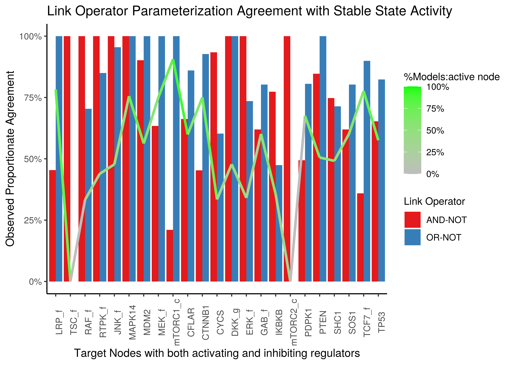

# Intro {-}

Several analyses/investigations relating to the balance logical operators paper.

Loading libraries:

```r
library(xfun)
library(knitr)
library(dplyr)
library(tidyr)
library(tibble)
library(corrplot)
library(latex2exp)
library(ggpubr)
library(DT)
library(usefun)
library(emba)
library(forcats)
library(scales)
```

# BBR Function Analysis {-}

## Balance Boolean Regulatory Functions (BBRs) {-}

:::{.green-box}
BBR => Balance Boolean Regulatory Functions
:::

Let $f$ be a boolean function $f(x,y):\{0,1\}^n \rightarrow \{0,1\}$, with $m$ **activators** $x=\{x_i\}_{i=1}^{m}$ and $k$ **inhibitors** $y=\{y_i\}_{i=1}^{k}$, that is a total of $n=m+k$ regulators.
A subset of BBRs have a non-DNF representation that puts the different category regulators in separate groups and a *link boolean operator* in between them.
As such, for a link operator to make sense, we have that $m,k \ge 1$ (at least one regulator in each category).
An example of such a function that has been used in the literature [@Mendoza2006] is the formula with the `AND-NOT` link operator: 

- `AND-NOT`: $$f(x,y) = \left(\bigvee_{i=1}^{m} x_i\right) \land \lnot \left(\bigvee_{i=1}^{k} y_i\right)$$

A **variant** of that one that shifts the balance in favor of the activators (as we will see the truth density significantly increases) is the function with the `OR-NOT` link operator:

- `OR-NOT`: $$f(x,y) = \left(\bigvee_{i=1}^{m} x_i\right) \lor \lnot \left(\bigvee_{i=1}^{k} y_i\right)$$

Another one of this type of functions is the next one:

- `BalanceOp1`: $$f(x,y) = \bigvee_{\forall (i,j)}^{m,k}(x_i\land \lnot y_j) = \left(\bigvee_{i=1}^{m} x_i\right) \land \left(\bigvee_{i=1}^{k} \lnot y_i\right)$$

Next, we introduce some **threshold functions** with *pseudo-Boolean constraints*:

- `exp_act_win`: $$f_{act-win}(x,y)=\begin{cases}
        1, & \text{for } \sum_{i=1}^{m} x_i \ge \sum_{i=1}^{k} y_i\\
        0, & \text{otherwise}
        \end{cases}$$
- `exp_inh_win`: $$f_{inh-win}(x,y)=\begin{cases}
        1, & \text{for } \sum_{i=1}^{m} x_i \gt \sum_{i=1}^{k} y_i\\
        0, & \text{otherwise}
        \end{cases}$$

Note that: $f_{inh-win}(x,y) = \lnot f_{act-win}(y,x)$.

I searched for an analytical formula for the two last functions (they get pretty big!).
More info and discussion about these 2 last formulas, see the [math.stackexchange question](https://math.stackexchange.com/questions/3767774/identify-boolean-function-that-satisfies-some-constrains/).

## Truth Density Data Analysis {-}

### Data {-}

:::{.blue-box}
*Truth Density (TD)* of a boolean equation/expression, given it's equivalent truth table, is the **number of rows that the expression is active** divided to **the total number of rows** $(2^n)$.
:::

I created every possible truth table for up to $20$ variables (variables here means *regulators* for us) and calculated the `AND-NOT`, `OR-NOT`, `BalanceOp1`, `exp_act_win`, `exp_inh_win` results for every possible configuration of the number of activators and inhibitors that added up to the number of regulators.
Then, from the truth tables I calculated the **truth density** of each operator in each particular configuration.
See part of the data below:

```r
stats = readRDS(file = "data/stats.rds")
stats[1:5,] %>% kable(caption = "Thuth Density Data", digits = 2)
```


Table: (\#tab:load-data)Thuth Density Data

| num_reg| num_act| num_inh| td_and_not| td_or_not| td_balance_op| td_exp_act| td_exp_inh|
|-------:|-------:|-------:|----------:|---------:|-------------:|----------:|----------:|
|       2|       1|       1|       0.25|      0.75|          0.25|       0.75|       0.25|
|       3|       1|       2|       0.12|      0.62|          0.38|       0.50|       0.12|
|       3|       2|       1|       0.38|      0.88|          0.38|       0.88|       0.50|
|       4|       1|       3|       0.06|      0.56|          0.44|       0.31|       0.06|
|       4|       2|       2|       0.19|      0.81|          0.56|       0.69|       0.31|

:::{.orange-box}
Use the [get_stats.R](https://github.com/bblodfon/balance-paper/blob/master/scripts/get_stats.R) script to reproduce this data.
:::

### Truth Density formulas {-}

Also, I have proved the exact formulas for the truth densities in the case of the `AND-NOT` and `OR-NOT` link operators (see [here](http://tiny.cc/link-proofs) for a proof sketch).
I write them here explicitly, as well as their long-term behaviour (for large $n$. number of regulators):

- `AND-NOT`: $$TD_{AND-NOT}=\frac{2^m-1}{2^n} \xrightarrow{n \text{ large}} \frac{1}{2^k}$$
- `OR-NOT`:  $$TD_{OR-NOT}=\frac{2^n-2^k}{2^n} \xrightarrow{n \text{ large}} 1-\frac{1}{2^m}$$

For large $n$, the $TD_{AND-NOT}$ depends only **on the number of inhibitors** while the $TD_{OR-NOT}$ depends only **on the number of activators**.

Also, again for large $n$, the extreme case of having a TD value equal to $0.5$ is a result of having **only one of the regulators being an inhibitor (activator)** of the `AND-NOT` (`OR-NOT`) equation.

We can use the data above to validate the formulas from the proof (up to $n=20$):

```r
# Validate AND-NOT Truth Density formula
formula_td_and_not = stats %>% 
  mutate(formula_td_and_not = (2^num_act - 1)/(2^num_reg)) %>%
  pull(formula_td_and_not)

all(stats %>% pull(td_and_not) == formula_td_and_not)
```

```
[1] TRUE
```

```r
# Validate OR-NOT Truth Density formula
formula_td_or_not = stats %>% 
  mutate(formula_td_or_not = (((2^num_act - 1) * (2^num_inh)) + 1)/(2^num_reg)) %>%
  pull(formula_td_or_not)

all(stats %>% pull(td_or_not) == formula_td_or_not)
```

```
[1] TRUE
```

### *AND-NOT* vs *OR-NOT* TD {-}

Comparing the `AND-NOT` and `OR-NOT` truth densities across the number of regulators:

```r
# tidy up data
stats_and_or = pivot_longer(data = stats, cols = c(td_and_not, td_or_not), 
  names_to = "lo", values_to = "td") %>%
  select(num_reg, lo, td) %>%
  mutate(lo = replace(x = lo, list = lo == "td_and_not", values = "AND-NOT")) %>%
  mutate(lo = replace(x = lo, list = lo == "td_or_not", values = "OR-NOT")) %>%
  rename(`Link Operator` = lo)

ggboxplot(data = stats_and_or, x = "num_reg", y = "td", 
  color = "Link Operator", palette = "Set1",
  title = "AND-NOT vs OR-NOT Truth Densities", 
  xlab = "Number of regulators", ylab = "Truth Density") +
  theme(plot.title = element_text(hjust = 0.5))
```

<div class="figure" style="text-align: center">

<p class="caption">(\#fig:fig-and-or-not)AND-NOT vs OR-NOT Truth Densities across all possible activators and inhibitors combinations up to 20 regulators</p>
</div>

:::{.green-box}
- **The more regulators** there are, the more likely it is that the `AND-NOT` link operator in the boolean equation will result in an **inhibited** target and that the `OR-NOT` link operator in an **active** target.
- For $n>6$, the points outside the boxplots (with a truth density of $\frac{1}{2}, \frac{1}{4}, 1-\frac{1}{4},\frac{1}{8},1-\frac{1}{8},...$) correspond to the **long-term behaviour** of the truth density formulas shown above, but where there is also **large imbalance between the number of activators and inhibitors**.
:::

We can also check the relation between TD and number of activators and inhibitors in each case.
The following two figures show us why **the number of inhibitors** are more decisive in the `AND-NOT` case:

```r
ggscatter(data = stats %>% rename(`#Regulators` = num_reg), x = "num_inh", 
  y = "td_and_not", color = "#Regulators",
  ylab = "Truth Density", xlab = "Number of Inhibitors", 
  title = "AND-NOT TD vs Number of Inhibitors") + 
  theme(plot.title = element_text(hjust = 0.5))

ggscatter(data = stats %>% rename(`#Regulators` = num_reg), x = "num_act", 
  y = "td_and_not", color = "#Regulators",
  ylab = "Truth Density", xlab = "Number of Activators", 
  title = "AND-NOT TD vs Number of Activators") + 
  theme(plot.title = element_text(hjust = 0.5))
```

<div class="figure">

<p class="caption">(\#fig:and-not-reg-plot)AND-NOT TD vs Number of Activators and Inhibitors</p>
</div>

In the `OR-NOT` case the number of activators is more important:

```r
ggscatter(data = stats %>% rename(`#Regulators` = num_reg), x = "num_inh", 
  y = "td_or_not", color = "#Regulators",
  ylab = "Truth Density", xlab = "Number of Inhibitors", 
  title = "OR-NOT TD vs Number of Inhibitors") + 
  theme(plot.title = element_text(hjust = 0.5))

ggscatter(data = stats %>% rename(`#Regulators` = num_reg), x = "num_act", 
  y = "td_or_not", color = "#Regulators",
  ylab = "Truth Density", xlab = "Number of Activators", 
  title = "OR-NOT TD vs Number of Activators") + 
  theme(plot.title = element_text(hjust = 0.5))
```

<div class="figure">

<p class="caption">(\#fig:or-not-reg-plot)OR-NOT TD vs Number of Activators and Inhibitors</p>
</div>

### *BalanceOp1* TD {-}

If we add the `BalanceOp1` formuls's TD results to the first plot we have:

```r
# tidy up data
stats_and_or_balance = pivot_longer(data = stats, cols = c(td_and_not, td_or_not, td_balance_op), 
  names_to = "lo", values_to = "td") %>%
  select(num_reg, lo, td) %>%
  mutate(lo = replace(x = lo, list = lo == "td_and_not", values = "AND-NOT")) %>%
  mutate(lo = replace(x = lo, list = lo == "td_or_not", values = "OR-NOT")) %>%
  mutate(lo = replace(x = lo, list = lo == "td_balance_op", values = "BalanceOp1")) %>%
  rename(`Link Operator` = lo)

ggboxplot(data = stats_and_or_balance, x = "num_reg", y = "td", 
  color = "Link Operator", palette = "Set1",
  title = "AND-NOT vs OR-NOT vs BalanceOp1 Truth Densities", 
  xlab = "Number of regulators", ylab = "Truth Density") +
  theme(plot.title = element_text(hjust = 0.5))
```

<div class="figure" style="text-align: center">

<p class="caption">(\#fig:fig-and-or-not-balanceop)AND-NOT vs OR-NOT vs BalanceOp1 Truth Densities across all possible activators and inhibitors combinations up to 20 regulators</p>
</div>

:::{.green-box}
- The `BalanceOp1` TD values are closer to the TD values of the `OR-NOT` formula compared to the `AND-NOT` one.
- The `BalanceOp1` is less *biased* compared to the `OR-NOT` link operator, but still for large $n$ (regulators) it practically **makes the target activated**.
:::

As we can see in the following two figures, the `BalanceOp1` shows a more balanced dependency between the number of activators and inhibitors:

```r
ggscatter(data = stats %>% rename(`#Regulators` = num_reg), x = "num_inh", 
  y = "td_balance_op", color = "#Regulators",
  ylab = "Truth Density", xlab = "Number of Inhibitors", 
  title = "BalanceOp1 TD vs Number of Inhibitors") + 
  theme(plot.title = element_text(hjust = 0.5))

ggscatter(data = stats %>% rename(`#Regulators` = num_reg), x = "num_act", 
  y = "td_balance_op", color = "#Regulators",
  ylab = "Truth Density", xlab = "Number of Activators", 
  title = "BalanceOp1 TD vs Number of Activators") + 
  theme(plot.title = element_text(hjust = 0.5))
```

<div class="figure">

<p class="caption">(\#fig:balanceOp1-reg-plot)BalanceOp1 TD vs Number of Activators and Inhibitors</p>
</div>

### Threshold Functions TD {-}

In contrast, if we check the truth density of the $f_{act-win}(x,y)$ and $f_{inh-win}(x,y)$ boolean functions we have:

```r
# tidy up data
stats_functions = pivot_longer(data = stats, cols = c(td_exp_act, td_exp_inh), 
  names_to = "fun", values_to = "td") %>%
  select(num_reg, fun, td) %>%
  mutate(fun = replace(x = fun, list = fun == "td_exp_act", values = "Activators Win")) %>%
  mutate(fun = replace(x = fun, list = fun == "td_exp_inh", values = "Inhibitors Win")) %>%
  rename(`Equation Formula` = fun)

ggboxplot(data = stats_functions, x = "num_reg", y = "td",
  color = "Equation Formula", palette = "lancet",
  title = TeX("Truth Densities of $f_{act-win}(x,y)$ and $f_{inh-win}(x,y)$"),
  xlab = "Number of regulators", ylab = "Truth Density") +
  theme(plot.title = element_text(hjust = 0.5))
```

<div class="figure" style="text-align: center">

<p class="caption">(\#fig:fig-two-bool-formulas)Truth Desities of two robust boolean formulas across all possible activators and inhibitors combinations up to 20 regulators</p>
</div>

:::{.green-box}
- Both boolean functions have a **large variance of truth densities** irrespective of the number of regulators.
- The median values seem to converge to $0.5$ for both formulas.
- The median value of truth density for the $f_{act-win}(x,y)$ is always larger than the $f_{inh-win}(x,y)$ (as expected).
:::

### TD Data Distance {-}

We check how close are the truth density values of the different proposed BBRs, also compared to the **proportion of activators**, e.g. if a BBR has 1 activator and 5 inhibitors (resp. 5 activators and 1 inhibitor) I would expect my regulatory function's output to be statistically more inhibited (resp. activated).
We find the *euclidean distance* between the different truth density values and show them in a table and dendrogram format:


```r
act_prop = stats %>% mutate(act_prop = num_act/num_reg) %>% pull(act_prop)
td_and_not = stats %>% pull(td_and_not)
td_or_not = stats %>% pull(td_or_not)
td_balance_op = stats %>% pull(td_balance_op)
td_exp_act = stats %>% pull(td_exp_act)
td_exp_inh = stats %>% pull(td_exp_inh)

d = dist(rbind(act_prop, td_and_not, td_or_not, td_balance_op, td_exp_act, td_exp_inh))
```


```r
# color `act_prop` column
breaks = quantile(unname(as.matrix(d)[, "act_prop"]), probs = seq(.05, .95, .05), na.rm = TRUE)
col = round(seq(255, 40, length.out = length(breaks) + 1), 0) %>%
  {paste0("rgb(255,", ., ",", ., ")")} # red

caption.title = "Table 1: Euclidean Distances between vectors of truth density values (Symmetric)"
DT::datatable(data = d %>% as.matrix(), options = list(dom = "t", scrollX = TRUE),
  caption = htmltools::tags$caption(caption.title, style="color:#dd4814; font-size: 18px")) %>% 
  formatRound(1:6, digits = 3) %>%
  formatStyle(columns = c("act_prop"), backgroundColor = styleInterval(breaks, col))
```

<!--html_preserve--><div id="htmlwidget-c2a931752ae4f30d7598" style="width:100%;height:auto;" class="datatables html-widget"></div>
<script type="application/json" data-for="htmlwidget-c2a931752ae4f30d7598">{"x":{"filter":"none","caption":"<caption style=\"color:#dd4814; font-size: 18px\">Table 1: Euclidean Distances between vectors of truth density values (Symmetric)<\/caption>","data":[["act_prop","td_and_not","td_or_not","td_balance_op","td_exp_act","td_exp_inh"],[0,6.2357551189418,6.2357551189418,6.23071307451427,2.37324587183497,2.37324587183497],[6.2357551189418,0,11.5854262787016,10.842296589664,7.82178323744214,6.7696332482574],[6.2357551189418,11.5854262787016,0,2.49443825784938,6.7696332482574,7.82178323744214],[6.23071307451427,10.842296589664,2.49443825784938,0,7.12290730774761,7.92299559783636],[2.37324587183497,7.82178323744214,6.7696332482574,7.12290730774761,0,1.86374127113628],[2.37324587183497,6.7696332482574,7.82178323744214,7.92299559783636,1.86374127113628,0]],"container":"<table class=\"display\">\n  <thead>\n    <tr>\n      <th> <\/th>\n      <th>act_prop<\/th>\n      <th>td_and_not<\/th>\n      <th>td_or_not<\/th>\n      <th>td_balance_op<\/th>\n      <th>td_exp_act<\/th>\n      <th>td_exp_inh<\/th>\n    <\/tr>\n  <\/thead>\n<\/table>","options":{"dom":"t","scrollX":true,"columnDefs":[{"targets":1,"render":"function(data, type, row, meta) { return DTWidget.formatRound(data, 3, 3, \",\", \".\"); }"},{"targets":2,"render":"function(data, type, row, meta) { return DTWidget.formatRound(data, 3, 3, \",\", \".\"); }"},{"targets":3,"render":"function(data, type, row, meta) { return DTWidget.formatRound(data, 3, 3, \",\", \".\"); }"},{"targets":4,"render":"function(data, type, row, meta) { return DTWidget.formatRound(data, 3, 3, \",\", \".\"); }"},{"targets":5,"render":"function(data, type, row, meta) { return DTWidget.formatRound(data, 3, 3, \",\", \".\"); }"},{"targets":6,"render":"function(data, type, row, meta) { return DTWidget.formatRound(data, 3, 3, \",\", \".\"); }"},{"className":"dt-right","targets":[1,2,3,4,5,6]},{"orderable":false,"targets":0}],"order":[],"autoWidth":false,"orderClasses":false,"rowCallback":"function(row, data) {\nvar value=data[1]; $(this.api().cell(row, 1).node()).css({'background-color':isNaN(parseFloat(value)) ? '' : value <= 0.5933 ? \"rgb(255,255,255)\" : value <= 1.1866 ? \"rgb(255,244,244)\" : value <= 1.7799 ? \"rgb(255,232,232)\" : value <= 2.3732 ? \"rgb(255,221,221)\" : value <= 2.3732 ? \"rgb(255,210,210)\" : value <= 2.3732 ? \"rgb(255,198,198)\" : value <= 2.3732 ? \"rgb(255,187,187)\" : value <= 2.3732 ? \"rgb(255,176,176)\" : value <= 3.3376 ? \"rgb(255,164,164)\" : value <= 4.302 ? \"rgb(255,153,153)\" : value <= 5.2663 ? \"rgb(255,142,142)\" : value <= 6.2307 ? \"rgb(255,131,131)\" : value <= 6.232 ? \"rgb(255,119,119)\" : value <= 6.2332 ? \"rgb(255,108,108)\" : value <= 6.2345 ? \"rgb(255,97,97)\" : value <= 6.2358 ? \"rgb(255,85,85)\" : value <= 6.2358 ? \"rgb(255,74,74)\" : value <= 6.2358 ? \"rgb(255,63,63)\" : value <= 6.2358 ? \"rgb(255,51,51)\" : \"rgb(255,40,40)\"});\n}"}},"evals":["options.columnDefs.0.render","options.columnDefs.1.render","options.columnDefs.2.render","options.columnDefs.3.render","options.columnDefs.4.render","options.columnDefs.5.render","options.rowCallback"],"jsHooks":[]}</script><!--/html_preserve-->


```r
plot(hclust(dist(d)), main = "Distance Dendogram of Thruth Densities",
  ylab = "Euclidean Distance", sub = "BBR Truth Densities", xlab = "")
```


:::{.green-box}
- The **threshold functions** have truth densities values that are **closer to the proportion of activators** for a varying number of regulators, compared to the `AND-NOT` and `OR-NOT` formulas.
As such they represent more realistic candidates for regulatory functions from a statistical point of view.
- The TD values of `OR-NOT` and `BalanceOp1` are in general very close (as we've also seen in previous Figure)
:::

### Correlation {-}

We will now check the *correlation* between each pair of operators/proposed functions, as well as the number of regulators, inhibitors and activators:

```r
M = cor(stats, method = "kendall")
res = cor.mtest(stats, method = "kendall")
corrplot(corr = M, type = "upper", p.mat = res$p, sig.level = c(.001, .01, .05), 
  pch.cex = 1, pch.col = "white", insig = "label_sig", tl.col = "black", tl.srt = 45)
```

<div class="figure" style="text-align: center">

<p class="caption">(\#fig:cor-plot)Correlation Matrix of Truth Densities and number of regulators</p>
</div>

:::{.green-box}
- The two functions results $f_{act-win}(x,y), f_{inh-win}(x,y)$ are highly correlated as expected
- Lower `AND-NOT` TD values highly correlate with *higher* number of inhibitors
- Higher `OR-NOT` TD values highly correlate with *higher* number of activators
:::

# CASCADE 1.0 Analysis {-}

## Parameterization and Stable State Agreement {-}

To load the stable state data for the models that have 1 stable state use the Zenodo dataset (**TODO**) and the script [tidy_ss_data.R](https://github.com/bblodfon/balance-paper/blob/master/scripts/tidy_ss_data.R)

We calculate the `node_stats` tibble object using the [get_node_stats.R](https://github.com/bblodfon/balance-paper/blob/master/scripts/get_node_stats.R) script.
This object includes the agreement statistics information for each node that has a link operator (i.e. it is targeted by both activators and inhibitors).

Load the `node_stats`:

```r
node_stats = readRDS(file = "data/node_stats.rds")
```

---

We are interested in two variables of interest:

- **Parameterization** of a link operator node: `AND-NOT` (0) vs `OR-NOT` (1)
- **Stable State** of a node: *inhibited* (0) vs *active* (1)

There exist are 4 different possibilities related to 2 cases:

1. `0-0`, `1-1` => parameterization and stable state match (e.g. node had `OR-NOT` and its state was active)
2. `1-0`, `0-1` => parameterization and stable state differ (e.g. node had `AND-NOT` and its state was active)

In the next Figure we show the **total observed proportionate agreement** for each node, which is the number of models for which parameterization and stable state matched (case 1 above) divided by the total amount of models:

```r
node_stats %>% mutate(node = forcats::fct_reorder(node, desc(num_reg))) %>% 
  ggplot(aes(x = node, y = obs_prop_agreement, fill = as.factor(num_reg))) +
    geom_bar(stat = "identity") +
    scale_y_continuous(labels=scales::percent) +
    labs(title = "Agreement between Link Operator Parameterization and Stable State Activity", x = "Target Nodes with both activating and inhibiting regulators", y = "Observed Proportionate Agreement") +
    theme_classic() + theme(axis.text.x = element_text(angle = 90)) +
    scale_fill_brewer(guide = guide_legend(reverse=TRUE, title = "#Regulators"), palette = "Set1")
```

<div class="figure" style="text-align: center">

<p class="caption">(\#fig:ss-lo-agreement-prop)Parameterization and Stable State activity agreement</p>
</div>

:::{.green-box}
The total barplot area covered (i.e. the **total agreement score** so to speak) is **77.7294779%**.

The above score means that the is a higher probability than chance to assign a node the `AND-NOT` (resp. `OR-NOT`) link operator in its respective boolean equation and that node at the same time having an inhibited (resp. activated) stable state of 0 (.resp 1) in any CASCADE 1.0 link operator parameterized model.

As such, even though the number of regulators are **less than 6**, we find that there is **strong agreement** between *link operator* and *stable state activity* across all the nodes that have both types of regulators (activators and inhibitors).
This agreement can be seen stronger for some nodes than others.
:::

Next, we calculate per node, the proportion of link operator assignments that retained their expected (i.e. keeping the same digit) stable state activity (e.g. the proportion of models corresponding to the cases `0-0`/(`0-0` + `0-1`) for the `AND-NOT` link operator - similar for `OR-NOT`):

```r
node_stats %>% 
  mutate(and_not_0ss_prop = and_not_0ss_agreement/(and_not_0ss_agreement + and_not_1ss_disagreement)) %>% 
  mutate(or_not_1ss_prop  = or_not_1ss_agreement/(or_not_1ss_agreement + or_not_0ss_disagreement)) %>%
  select(node, num_reg, and_not_0ss_prop, or_not_1ss_prop, active_prop) %>%
  rename(`AND-NOT` = and_not_0ss_prop, `OR-NOT` = or_not_1ss_prop) %>%
  mutate(node = forcats::fct_reorder(node, desc(num_reg))) %>%
  pivot_longer(cols = c(`AND-NOT`, `OR-NOT`)) %>%
  ggplot(aes(x = node, y = value, fill = name)) +
    geom_bar(position = "dodge", stat = "identity") +
    scale_y_continuous(labels=scales::percent) +
    labs(title = "Link Operator Parameterization Agreement with Stable State Activity", 
      x = "Target Nodes with both activating and inhibiting regulators", 
      y = "Observed Proportionate Agreement") +
    theme_classic() + theme(axis.text.x = element_text(angle = 90)) + 
    scale_fill_brewer(guide = guide_legend(title = "Link Operator"), palette = "Set1") + 
    geom_line(aes(y = active_prop, color = active_prop), group = 1, size = 1.2) +
    scale_color_gradient(labels=scales::percent, low="grey", high="green", 
      name = "%Models:active node", limits = c(0,1)) + 
    theme(legend.title = element_text(size = 10))
```

<div class="figure" style="text-align: center">

<p class="caption">(\#fig:ss-comp-agreement-props)Parameterization and Stable State activity agreement 2</p>
</div>

:::{.green-box}
- Higher proportional activity for a node correlates with higher `OR-NOT`-activated state agreement.
- `LRP_f` has 4 activators and 1 inhibitor and from the previous statistical analysis with found that $TD_{AND-NOT,4+1}=0.469$, $TD_{OR-NOT,4+1}=0.969$, numbers which correspond really well with the proportionate agreement scores found across all the CASCADE 1.0 models.
- `TSC_f` has 1 activator and 4 inhibitors (which corresponds well to it's total inhibition profile in all the models).
- `TSC_f` and `mTORC2_c` are always found inhibited and thus the agreement with the `AND-NOT`-inhibited state is perfect and the `OR-NOT`-activated state agreement zero.
:::

In the above Figure, wherever there is less than **0.5 disagreement**, we can always explain it with the *activity* proportion value and the number of activators being more (or less resp.) than the number of inhibitors - see following table:


```r
caption.title = "Table 2: Link Operator Statistics"
DT::datatable(data = node_stats %>% select(node, num_reg, num_act, num_inh), 
  caption = htmltools::tags$caption(caption.title, style="color:#dd4814; font-size: 18px"),
  options = list(order = list(list(2, "desc")))) %>% 
  formatRound(5:6, digits = 3)
```

<!--html_preserve--><div id="htmlwidget-595affc4f25ab85bf888" style="width:100%;height:auto;" class="datatables html-widget"></div>
<script type="application/json" data-for="htmlwidget-595affc4f25ab85bf888">{"x":{"filter":"none","caption":"<caption style=\"color:#dd4814; font-size: 18px\">Table 2: Link Operator Statistics<\/caption>","data":[["1","2","3","4","5","6","7","8","9","10","11","12","13","14","15","16","17","18","19","20","21","22","23"],["mTORC2_c","JNK_f","MAPK14","RTPK_f","MEK_f","SHC1","PTEN","SOS1","ERK_f","RAF_f","mTORC1_c","GAB_f","PDPK1","IKBKB","TSC_f","TP53","MDM2","CYCS","CFLAR","LRP_f","CTNNB1","TCF7_f","DKK_g"],[2,3,3,4,3,2,2,2,2,4,3,2,2,2,5,2,3,2,2,5,2,2,2],[1,2,2,2,2,1,1,1,1,1,2,1,1,1,1,1,2,1,1,4,1,1,1],[1,1,1,2,1,1,1,1,1,3,1,1,1,1,4,1,1,1,1,1,1,1,1]],"container":"<table class=\"display\">\n  <thead>\n    <tr>\n      <th> <\/th>\n      <th>node<\/th>\n      <th>num_reg<\/th>\n      <th>num_act<\/th>\n      <th>num_inh<\/th>\n    <\/tr>\n  <\/thead>\n<\/table>","options":{"order":[[2,"desc"]],"columnDefs":[{"targets":5,"render":"function(data, type, row, meta) { return DTWidget.formatRound(data, 3, 3, \",\", \".\"); }"},{"targets":6,"render":"function(data, type, row, meta) { return DTWidget.formatRound(data, 3, 3, \",\", \".\"); }"},{"className":"dt-right","targets":[2,3,4]},{"orderable":false,"targets":0}],"autoWidth":false,"orderClasses":false}},"evals":["options.columnDefs.0.render","options.columnDefs.1.render"],"jsHooks":[]}</script><!--/html_preserve-->


# R session info {-}


```r
xfun::session_info()
```

```
R version 3.6.3 (2020-02-29)
Platform: x86_64-pc-linux-gnu (64-bit)
Running under: Ubuntu 18.04.5 LTS

Locale:
  LC_CTYPE=en_US.UTF-8       LC_NUMERIC=C              
  LC_TIME=en_US.UTF-8        LC_COLLATE=en_US.UTF-8    
  LC_MONETARY=en_US.UTF-8    LC_MESSAGES=en_US.UTF-8   
  LC_PAPER=en_US.UTF-8       LC_NAME=C                 
  LC_ADDRESS=C               LC_TELEPHONE=C            
  LC_MEASUREMENT=en_US.UTF-8 LC_IDENTIFICATION=C       

Package version:
  abind_1.4-5         assertthat_0.2.1    backports_1.1.8    
  base64enc_0.1.3     BH_1.72.0.3         bibtex_0.4.2.2     
  bookdown_0.20       boot_1.3.25         broom_0.5.6        
  callr_3.4.3         car_3.0-8           carData_3.0-4      
  cellranger_1.1.0    Ckmeans.1d.dp_4.3.2 cli_2.0.2          
  clipr_0.7.0         colorspace_1.4-1    compiler_3.6.3     
  corrplot_0.84       cowplot_1.0.0       crayon_1.3.4       
  crosstalk_1.1.0.1   curl_4.3            data.table_1.12.8  
  desc_1.2.0          digest_0.6.25       dplyr_1.0.0        
  DT_0.14             ellipsis_0.3.1      emba_0.1.7         
  evaluate_0.14       fansi_0.4.1         farver_2.0.3       
  forcats_0.5.0       foreign_0.8-75      gbRd_0.4-11        
  generics_0.0.2      ggplot2_3.3.2       ggpubr_0.4.0       
  ggrepel_0.8.2       ggsci_2.9           ggsignif_0.6.0     
  glue_1.4.1          graphics_3.6.3      grDevices_3.6.3    
  grid_3.6.3          gridExtra_2.3       gtable_0.3.0       
  haven_2.3.1         highr_0.8           hms_0.5.3          
  htmltools_0.5.0     htmlwidgets_1.5.1   igraph_1.2.5       
  isoband_0.2.2       jsonlite_1.7.0      knitr_1.29         
  labeling_0.3        later_1.1.0.1       latex2exp_0.4.0    
  lattice_0.20-41     lazyeval_0.2.2      lifecycle_0.2.0    
  lme4_1.1.23         magrittr_1.5        maptools_1.0.1     
  markdown_1.1        MASS_7.3.51.6       Matrix_1.2.18      
  MatrixModels_0.4.1  methods_3.6.3       mgcv_1.8.31        
  mime_0.9            minqa_1.2.4         munsell_0.5.0      
  nlme_3.1-148        nloptr_1.2.2.1      nnet_7.3.14        
  openxlsx_4.1.5      parallel_3.6.3      pbkrtest_0.4.8.6   
  pillar_1.4.4        pkgbuild_1.0.8      pkgconfig_2.0.3    
  pkgload_1.1.0       plyr_1.8.6          polynom_1.4.0      
  praise_1.0.0        prettyunits_1.1.1   processx_3.4.2     
  progress_1.2.2      promises_1.1.1      ps_1.3.3           
  purrr_0.3.4         quantreg_5.55       R6_2.4.1           
  RColorBrewer_1.1.2  Rcpp_1.0.4.6        RcppEigen_0.3.3.7.0
  Rdpack_1.0.0        readr_1.3.1         readxl_1.3.1       
  rematch_1.0.1       reshape2_1.4.4      rio_0.5.16         
  rje_1.10.16         rlang_0.4.6         rmarkdown_2.3      
  rprojroot_1.3.2     rstatix_0.6.0       rstudioapi_0.11    
  scales_1.1.1        sp_1.4.2            SparseM_1.78       
  splines_3.6.3       statmod_1.4.34      stats_3.6.3        
  stringi_1.4.6       stringr_1.4.0       testthat_2.3.2     
  tibble_3.0.1        tidyr_1.1.0         tidyselect_1.1.0   
  tinytex_0.24        tools_3.6.3         usefun_0.4.8       
  utf8_1.1.4          utils_3.6.3         vctrs_0.3.1        
  viridisLite_0.3.0   visNetwork_2.0.9    withr_2.2.0        
  xfun_0.15           yaml_2.2.1          zip_2.0.4          
```

# References {-}
